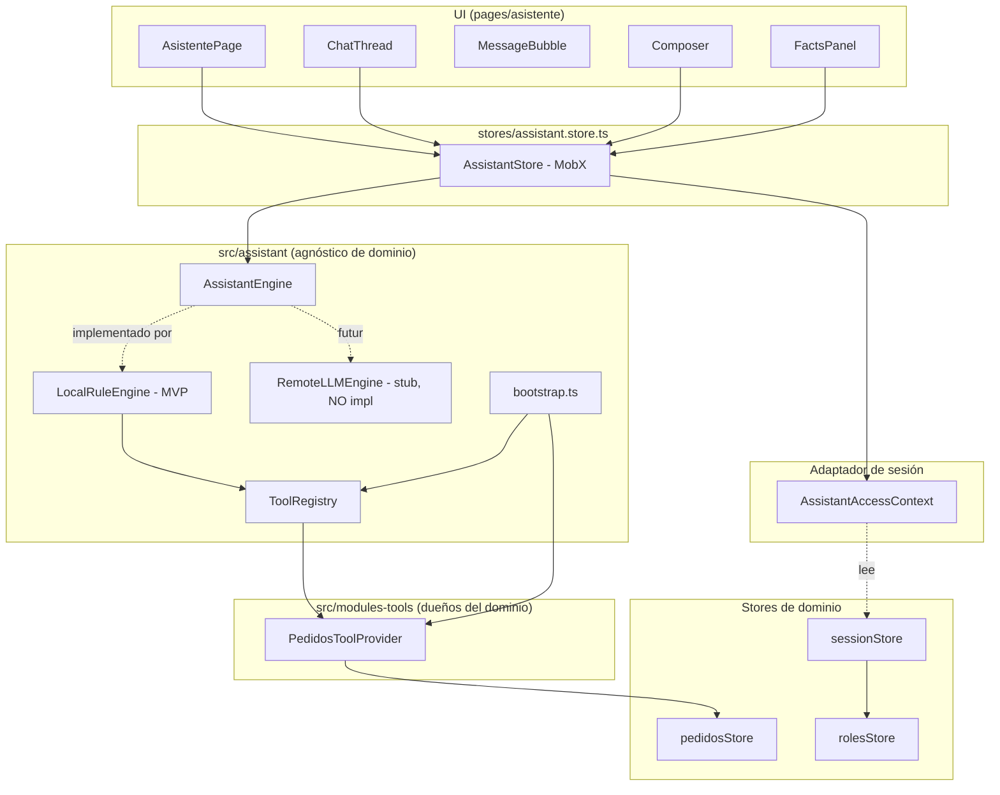
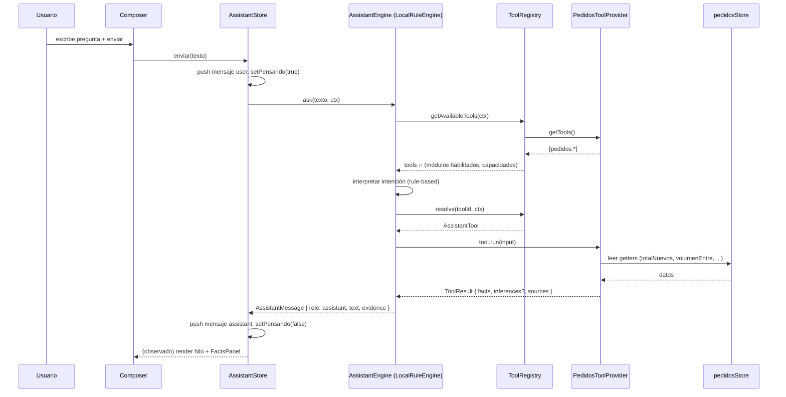
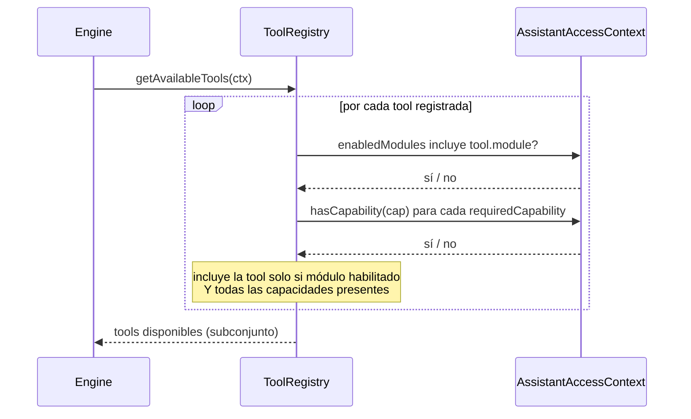

# Design Document: Asistente IA (Necto Intelligence)

## Overview

El módulo **Asistente** ("Necto Intelligence") añade a la app un asistente conversacional que responde preguntas sobre la operación consultando datos ya existentes en los stores de dominio. En esta fase es **100% frontend, sin backend, sin API key y sin LLM real**: todo corre en el navegador sobre datos mock (stores MobX). El motor del MVP es **rule-based local**, pero se implementa detrás de un contrato `AssistantEngine` para que en el futuro pueda sustituirse por un `RemoteLLMEngine` sin tocar la UI, el `ToolRegistry` ni los providers de módulos.

El asistente **combina varias tools** para identificar patrones y factores, pero distingue de forma estricta entre **HECHOS** (datos leídos de los stores) e **INFERENCIAS** (heurísticas). Nunca afirma causalidad cuando solo existe correlación o coincidencia. Las inferencias siempre se marcan con su tipo y su nivel de confianza.

El MVP es **solo consulta y análisis** (niveles `query` y `analyze`), sin acciones mutativas. Los contratos, no obstante, contemplan la evolución a `recommend` y `execute` (niveles 3 y 4) para no rediseñar el núcleo cuando lleguen. No hay RAG ni base vectorial en esta fase; los datos se obtienen por **tool-calling** sobre datos estructurados. El acceso al módulo se controla con una capacidad propia `assistant.use`, y las tools visibles dentro del asistente se calculan dinámicamente como la intersección de las tools de los módulos habilitados con las tools permitidas por las capacidades del usuario.

## Architecture

El núcleo del asistente (`src/assistant/**`) es **agnóstico de dominio**: no importa ningún store de negocio. Los módulos (empezando por Pedidos) aportan sus tools a través de un `AssistantToolProvider`, que es el único punto que conoce `pedidosStore`. La sesión y la autorización entran al núcleo por un **adaptador delgado** que traduce `sessionStore.accessContext` a un `AssistantAccessContext`, de modo que el núcleo tampoco importa `SessionStore`.



**Reglas de dependencia (invariantes de arquitectura):**

- **A1** — `src/assistant/**` NO importa ningún store de dominio (`pedidosStore`, etc.) ni `SessionStore`.
- **A2** — El único archivo que importa `pedidosStore` es `modules-tools/pedidos/pedidos.tool-provider.ts`.
- **A3** — La UI y el `AssistantStore` dependen SOLO de la interfaz `AssistantEngine`, nunca de `LocalRuleEngine` en concreto.
- **A4** — El `ToolRegistry` no conoce stores de dominio; solo orquesta providers y aplica el filtro módulos ∩ capacidades.
- **A5** — Sustituir `LocalRuleEngine` por `RemoteLLMEngine` no debe requerir cambios en UI, `ToolRegistry` ni providers.
- **A6** — Toda decisión de "¿puede usar el asistente?" pasa por `CapabilityGuard capacidad="assistant.use"`; toda tool declara sus `requiredCapabilities` y el registry las verifica.

## Sequence Diagrams

### Flujo principal: el usuario pregunta



### Filtro de autorización dentro del registry



## Components and Interfaces

### Núcleo del asistente (`src/assistant/`)

| Archivo | Responsabilidad |
|---|---|
| `contracts/tool.contract.ts` | Tipos de tools, resultados, hechos, inferencias, fuentes, niveles. |
| `contracts/engine.contract.ts` | Interfaz `AssistantEngine`, `AssistantMessage`, `EngineContext`. |
| `contracts/provider.contract.ts` | Interfaz `AssistantToolProvider`. |
| `registry/tool-registry.ts` | `ToolRegistry` + `AssistantAccessContext`; aplica filtro módulos ∩ capacidades. |
| `engine/local-rule-engine.ts` | `LocalRuleEngine` (MVP): interpreta intención y orquesta tools. |
| `engine/remote-llm-engine.ts` | `RemoteLLMEngine` (STUB documentado, NO implementar). |
| `bootstrap.ts` | Registra `PedidosToolProvider` en el `ToolRegistry`. |
| `index.ts` | Barrel del núcleo. |

### Store (`src/stores/assistant.store.ts`)

**Propósito**: Fuente de verdad del estado de UI del asistente (historial, estado "pensando", error) y orquestador que llama al `AssistantEngine`. Se reexporta desde `stores/index.ts`.

**Interfaz** (dependencia solo de la interfaz `AssistantEngine`, invariante A3):

```typescript
class AssistantStore {
  mensajes: AssistantMessage[]
  pensando: boolean
  error: string | null

  get puedeEnviar(): boolean
  enviar(texto: string): Promise<void>   // orquesta engine.ask()
  limpiar(): void
}
```

### UI (`src/pages/asistente/`)

| Componente | Responsabilidad |
|---|---|
| `AsistentePage.tsx` | Layout de la página; compone hilo + composer + panel de fuentes. |
| `views/ChatThread.tsx` | Renderiza la lista de mensajes (reutiliza patrón de burbujas del simulador). |
| `views/MessageBubble.tsx` | Una burbuja (usuario a la derecha, asistente a la izquierda). |
| `views/Composer.tsx` | Input HABILITADO + botón enviar (a diferencia del simulador). |
| `views/FactsPanel.tsx` | "Fuentes consultadas": separa visualmente Hechos de Inferencias con etiqueta de confianza. |
| `index.ts` | Barrel de la página. |

### Provider de dominio (`src/modules-tools/pedidos/pedidos.tool-provider.ts`)

**Propósito**: Único dueño de las tools de Pedidos y único punto que importa `pedidosStore`. Declara el catálogo de tools MVP y su lógica de lectura/análisis.

## Data Models

```typescript
// ─────────────────────────────────────────────────────────────────────────
// contracts/tool.contract.ts
// ─────────────────────────────────────────────────────────────────────────

import type { Modulo } from "@/stores/session.store";
import type { Capacidad } from "@/stores/roles.store";

/**
 * Nivel de capacidad de una tool. Determina cuánto "poder" ejerce.
 * MVP implementa solo "query" y "analyze"; "recommend" y "execute" quedan
 * reservados para fases futuras (interfaces listas, sin implementación).
 */
export type ToolCapabilityLevel = "query" | "analyze" | "recommend" | "execute";

/**
 * HECHO — dato objetivo leído de un store. Nunca es una interpretación.
 */
export interface Fact {
  label: string;
  value: number | string;
  unit?: string;
  /** Periodo al que aplica el dato (ej. "hoy", "2024-01-01..2024-01-07"). */
  period?: string;
}

/**
 * INFERENCIA — interpretación heurística. SIEMPRE marcada con su tipo y
 * confianza. NUNCA afirma causalidad: como mucho "correlation" o "pattern".
 */
export interface Inference {
  statement: string;
  kind: "correlation" | "pattern" | "hypothesis";
  confidence: "baja" | "media" | "alta";
  /** Labels de los Facts en los que se apoya la inferencia. */
  basedOn: string[];
}

/** Fuente consultada por una tool (para trazabilidad en el FactsPanel). */
export interface ToolSource {
  toolId: string;
  module: Modulo;
  /** Descripción legible de qué se consultó. */
  detail: string;
}

/** Resultado de ejecutar una tool: hechos, inferencias opcionales y fuentes. */
export interface ToolResult {
  facts: Fact[];
  inferences?: Inference[];
  sources: ToolSource[];
}

/** Especificación de un parámetro de entrada de una tool. */
export interface ToolParamSpec {
  name: string;
  type: "string" | "number" | "date" | "enum";
  required: boolean;
  description: string;
  /** Valores válidos cuando type === "enum". */
  options?: string[];
}

/** Una tool que un módulo expone al asistente. */
export interface AssistantTool {
  /** Namespaced por módulo, ej. "pedidos.getResumenHoy". */
  id: string;
  module: Modulo;
  name: string;
  description: string;
  level: ToolCapabilityLevel;
  /** Capacidades que el usuario debe tener para que la tool sea visible/ejecutable. */
  requiredCapabilities: Capacidad[];
  params: ToolParamSpec[];
  run(input: Record<string, unknown>): Promise<ToolResult>;
}
```

```typescript
// ─────────────────────────────────────────────────────────────────────────
// contracts/engine.contract.ts
// ─────────────────────────────────────────────────────────────────────────

import type { ToolResult } from "./tool.contract";
import type { AssistantAccessContext } from "../registry/tool-registry";

/** Un mensaje del hilo del asistente. */
export interface AssistantMessage {
  id: string;
  role: "user" | "assistant";
  text: string;
  /** Evidencia adjunta a una respuesta del asistente (para el FactsPanel). */
  evidence?: ToolResult;
  createdAt: string; // ISO
}

/** Contexto que la UI/store pasa al engine en cada pregunta. */
export interface EngineContext {
  access: AssistantAccessContext;
  /** Historial reciente, por si el engine quiere usarlo (el MVP puede ignorarlo). */
  history?: AssistantMessage[];
}

/**
 * Contrato del motor del asistente. La UI y el store dependen SOLO de esta
 * interfaz (invariante A3). Sustituir la implementación (Local → Remote) no
 * debe requerir cambios aguas arriba (invariante A5).
 */
export interface AssistantEngine {
  /** Identificador del motor, para diagnóstico. */
  readonly kind: string;
  ask(question: string, ctx: EngineContext): Promise<AssistantMessage>;
}
```

```typescript
// ─────────────────────────────────────────────────────────────────────────
// contracts/provider.contract.ts
// ─────────────────────────────────────────────────────────────────────────

import type { Modulo } from "@/stores/session.store";
import type { AssistantTool } from "./tool.contract";

/**
 * Un proveedor de tools. Cada módulo implementa el suyo y es dueño de su
 * lógica y sus datos. Es el ÚNICO lugar que puede importar el store del módulo.
 */
export interface AssistantToolProvider {
  module: Modulo;
  getTools(): AssistantTool[];
}
```

```typescript
// ─────────────────────────────────────────────────────────────────────────
// registry/tool-registry.ts  (tipos)
// ─────────────────────────────────────────────────────────────────────────

import type { Modulo } from "@/stores/session.store";
import type { Capacidad } from "@/stores/roles.store";

/**
 * Snapshot de autorización que el núcleo entiende. Se construye desde
 * sessionStore.accessContext en un adaptador delgado; el núcleo NO importa
 * SessionStore (invariante A1).
 */
export interface AssistantAccessContext {
  enabledModules: Modulo[];
  hasCapability(cap: Capacidad): boolean;
}
```

**Reglas de validación de datos:**

- Un `Fact.value` numérico no lleva interpretación: es el número tal cual sale del store.
- Toda `Inference` debe tener `basedOn` no vacío y referir labels de `Fact` presentes en el mismo `ToolResult`.
- `Inference.kind` nunca es "causa"/"causalidad": el vocabulario está deliberadamente limitado a `correlation | pattern | hypothesis`.
- `AssistantTool.id` es namespaced con el prefijo de su `module` (ej. `pedidos.*`).

## Algorithmic Pseudocode

### Filtro de tools disponibles (ToolRegistry)

```pascal
ALGORITHM getAvailableTools(ctx)
INPUT: ctx con ctx.access (AssistantAccessContext)
OUTPUT: lista de AssistantTool visibles

BEGIN
  resultado ← []
  FOR each provider IN providers DO
    // Filtro de módulo: solo módulos habilitados en la sesión.
    IF provider.module NOT IN ctx.access.enabledModules THEN
      CONTINUE
    END IF

    FOR each tool IN provider.getTools() DO
      permitida ← true
      FOR each cap IN tool.requiredCapabilities DO
        IF ctx.access.hasCapability(cap) = false THEN
          permitida ← false
          BREAK
        END IF
      END FOR

      IF permitida THEN
        resultado.add(tool)
      END IF
    END FOR
  END FOR

  RETURN resultado
END
```

**Preconditions:** `ctx.access` está construido desde una sesión válida.
**Postconditions:** Toda tool devuelta pertenece a un módulo habilitado Y el usuario tiene TODAS sus `requiredCapabilities`. Fail-closed: sin capacidades, lista vacía.
**Loop Invariants:** `resultado` contiene únicamente tools que pasaron ambos filtros.

### Resolución de intención (LocalRuleEngine, MVP)

```pascal
ALGORITHM ask(question, ctx)
INPUT: question (texto), ctx (EngineContext)
OUTPUT: AssistantMessage (role = "assistant")

BEGIN
  disponibles ← registry.getAvailableTools(ctx)

  IF disponibles is empty THEN
    RETURN mensajeAsistente(
      "No tengo herramientas disponibles con tus permisos actuales.",
      evidence = NONE)
  END IF

  // Interpretación rule-based: normalizar y matchear palabras clave a toolId.
  q ← normalizar(question)   // minúsculas, sin acentos
  toolId ← matchIntencion(q) // ej. "resumen"/"hoy" → "pedidos.getResumenHoy"

  IF toolId = NONE OR toolId NOT IN disponibles THEN
    RETURN mensajeAsistente(
      textoAyuda(disponibles),   // lista lo que SÍ puede responder
      evidence = NONE)
  END IF

  input ← extraerParametros(q, tool.params) // fechas, enums, etc.
  tool ← registry.resolve(toolId, ctx)
  ASSERT tool ≠ NONE

  result ← AWAIT tool.run(input)      // ToolResult { facts, inferences?, sources }
  texto ← redactarRespuesta(result)   // separa HECHOS de INFERENCIAS en el texto

  RETURN mensajeAsistente(texto, evidence = result)
END
```

**Preconditions:** `registry` inicializado por `bootstrap.ts`.
**Postconditions:** Devuelve un `AssistantMessage` con `role="assistant"`. Si hubo tool, adjunta `evidence`. El texto NUNCA afirma causalidad; las inferencias se presentan como tales.
**Loop Invariants:** N/A.

### Diagnóstico de desempeño (tool `analyze`, sin causalidad)

```pascal
ALGORITHM diagnosticoDesempeno(input)
OUTPUT: ToolResult

BEGIN
  // ── HECHOS (datos crudos) ──
  volumen  ← pedidosStore.volumenPorDia(7)
  ciclo    ← pedidosStore.tiempoPromedioCicloMin
  urgentes ← pedidosStore.urgentes.length

  facts ← [
    Fact("Volumen últimos 7 días", suma(volumen), period="7d"),
    Fact("Tiempo promedio de ciclo", ciclo, unit="min"),
    Fact("Pedidos urgentes ahora", urgentes)
  ]

  // ── INFERENCIAS (heurísticas, marcadas) ──
  inferences ← []
  IF urgentes > 0 AND ciclo > umbralAlto THEN
    inferences.add(Inference(
      statement = "El ciclo alto coincide con pedidos urgentes pendientes",
      kind = "correlation",          // NUNCA "causa"
      confidence = "media",
      basedOn = ["Tiempo promedio de ciclo", "Pedidos urgentes ahora"]))
  END IF

  sources ← [ ToolSource("pedidos.diagnosticoDesempeno", "pedidos",
                         "volumenPorDia, tiempoPromedioCicloMin, urgentes") ]

  RETURN ToolResult(facts, inferences, sources)
END
```

**Postconditions:** Toda inferencia usa `kind ∈ {correlation, pattern, hypothesis}` y su `basedOn` referencia labels presentes en `facts`. No se emite ninguna afirmación causal.

## Key Functions with Formal Specifications

### `ToolRegistry.register(provider)`

```typescript
register(provider: AssistantToolProvider): void
```
**Preconditions:** `provider.module` es un `Modulo` válido; `getTools()` devuelve tools con ids namespaced por ese módulo.
**Postconditions:** El provider queda registrado; sus tools serán consideradas por `getAvailableTools`. Idempotente por `module` (re-registrar reemplaza).

### `ToolRegistry.resolve(toolId, ctx)`

```typescript
resolve(toolId: string, ctx: { access: AssistantAccessContext }): AssistantTool | null
```
**Preconditions:** ninguna.
**Postconditions:** Devuelve la tool SOLO si aparece en `getAvailableTools(ctx)` (misma verificación de módulo + capacidades). En caso contrario `null` (fail-closed): resolver nunca elude el filtro de autorización.

### `LocalRuleEngine.ask(question, ctx)`

```typescript
ask(question: string, ctx: EngineContext): Promise<AssistantMessage>
```
**Preconditions:** `registry` inicializado.
**Postconditions:** Nunca lanza por intención no reconocida (responde con ayuda). Si ejecuta una tool, `message.evidence` es el `ToolResult`. Cumple la separación HECHO/INFERENCIA en el texto.

### `AssistantStore.enviar(texto)`

```typescript
enviar(texto: string): Promise<void>
```
**Preconditions:** `texto` no vacío tras `trim`.
**Postconditions:** Agrega el mensaje del usuario, marca `pensando=true`, llama `engine.ask`, agrega la respuesta, `pensando=false`. Ante error del engine, setea `error` y `pensando=false` sin romper el hilo.

## Example Usage

```typescript
// bootstrap.ts — registro de providers (arranque del módulo)
import { toolRegistry } from "@/assistant";
import { PedidosToolProvider } from "@/modules-tools/pedidos/pedidos.tool-provider";

toolRegistry.register(new PedidosToolProvider());

// adaptador de sesión → AssistantAccessContext (núcleo NO importa SessionStore)
import { sessionStore } from "@/stores";
import type { AssistantAccessContext } from "@/assistant";

export const buildAccessContext = (): AssistantAccessContext => ({
  enabledModules: sessionStore.accessContext.modulos,
  hasCapability: (cap) => sessionStore.hasPermission(cap),
});

// AssistantStore.enviar — orquestación
async enviar(texto: string) {
  const limpio = texto.trim();
  if (!limpio) return;
  this.mensajes.push(userMessage(limpio));
  this.pensando = true;
  try {
    const ctx = { access: buildAccessContext(), history: this.mensajes };
    const respuesta = await this.engine.ask(limpio, ctx);
    this.mensajes.push(respuesta);
  } catch (e) {
    this.error = "No pude procesar la pregunta.";
  } finally {
    this.pensando = false;
  }
}
```

```typescript
// pedidos.tool-provider.ts — ÚNICO import de pedidosStore
import { pedidosStore } from "@/stores";
import type { AssistantTool, AssistantToolProvider, ToolResult } from "@/assistant";

const getResumenHoy: AssistantTool = {
  id: "pedidos.getResumenHoy",
  module: "pedidos",
  name: "Resumen de hoy",
  description: "Nuevos, en curso, entregados hoy y programados.",
  level: "query",
  requiredCapabilities: ["orders.read"],
  params: [],
  async run(): Promise<ToolResult> {
    return {
      facts: [
        { label: "Nuevos", value: pedidosStore.totalNuevos },
        { label: "En curso", value: pedidosStore.totalEnCurso },
        { label: "Entregados hoy", value: pedidosStore.entregadosHoy },
        { label: "Programados", value: pedidosStore.totalProgramados },
      ],
      sources: [{ toolId: "pedidos.getResumenHoy", module: "pedidos", detail: "getters de KPIs" }],
    };
  },
};
```

## Catálogo inicial de tools de Pedidos (MVP)

Todas de solo lectura, requieren `orders.read`.

| Tool ID | Nivel | Getters/datos usados | Salida |
|---|---|---|---|
| `pedidos.getResumenHoy` | query | `totalNuevos`, `totalEnCurso`, `entregadosHoy`, `totalProgramados` | Facts de KPIs del día |
| `pedidos.getVentasPeriodo` | query | `volumenEntre(desde,hasta)`, `totalPedido` | Facts de volumen y monto |
| `pedidos.getCanalTop` | query | agregación por `origen` (`whatsapp`/`operador`) | Fact del canal líder |
| `pedidos.getTiempoCiclo` | query | `tiempoPromedioCicloMin` | Fact de minutos promedio |
| `pedidos.getCancelados` | query | conteo de estado `cancelado` | Fact de cancelados |
| `pedidos.getHoraPico` | query | `volumenPorHora(ymd)` | Fact de hora de mayor volumen |
| `pedidos.compararDias` | analyze | `entregadosEnDia`, `volumenPorDia` | Facts + Inference (patrón) |
| `pedidos.diagnosticoDesempeno` | analyze | `volumenPorDia` + `tiempoPromedioCicloMin` + `urgentes` | Facts + Inferences marcadas, **sin causalidad** |

## Correctness Properties

*A property is a characteristic or behavior that should hold true across all valid executions of a system-essentially, a formal statement about what the system should do. Properties serve as the bridge between human-readable specifications and machine-verifiable correctness guarantees.*

### Property 1: Autorización fail-closed

*For all* `AssistantAccessContext` y toda tool devuelta por `getAvailableTools(ctx)`, se cumple `tool.module ∈ ctx.access.enabledModules ∧ (∀ cap ∈ tool.requiredCapabilities, ctx.access.hasCapability(cap))`; en ausencia de capacidades, la lista es vacía.

**Validates: Requirements 2.1, 2.2, 2.3**

### Property 2: resolve respeta el filtro

*For all* `id` y `ctx`, si `resolve(id, ctx) ≠ null` entonces `∃ tool ∈ getAvailableTools(ctx)` con `tool.id = id`; en caso contrario `resolve` devuelve `null` (fail-closed).

**Validates: Requirements 2.4, 2.5**

### Property 3: No causalidad

*For all* `inf ∈ ToolResult.inferences`, `inf.kind ∈ {correlation, pattern, hypothesis}` (nunca causal).

**Validates: Requirements 3.2, 11.2**

### Property 4: Inferencias bien formadas y trazables

*For all* `inf ∈ ToolResult.inferences`, `inf.confidence ∈ {baja, media, alta} ∧ inf.basedOn ≠ ∅ ∧ (∀ b ∈ inf.basedOn, ∃ f ∈ facts, f.label = b)`.

**Validates: Requirements 3.3, 3.4, 11.3**

### Property 5: Independencia de dominio

*For all* módulo de `src/assistant/**`, su grafo de imports no contiene ningún store de dominio ni `SessionStore`; `pedidosStore` solo se importa desde `PedidosToolProvider`.

**Validates: Requirements 16.1, 16.2, 16.3**

### Property 6: Intercambiabilidad de engine

*For all* implementación de `AssistantEngine` inyectada en `AssistantStore`, la firma pública del store y la UI permanecen sin cambios.

**Validates: Requirements 17.1, 17.2, 17.3**

## Error Handling

### Sin tools disponibles (permisos insuficientes)
**Condición:** `getAvailableTools(ctx)` devuelve `[]`.
**Respuesta:** El engine responde con un mensaje indicando que no hay herramientas para los permisos actuales.
**Recuperación:** No hay estado inconsistente; el hilo sigue usable.

### Intención no reconocida
**Condición:** El texto no matchea ninguna tool disponible.
**Respuesta:** Mensaje de ayuda listando lo que el asistente SÍ puede responder (derivado de las tools disponibles).
**Recuperación:** Ninguna acción; se invita a reformular.

### Fallo al ejecutar una tool
**Condición:** `tool.run` lanza.
**Respuesta:** `AssistantStore` captura, setea `error`, `pensando=false`, deja el hilo intacto.
**Recuperación:** El usuario puede reintentar; el error se limpia en el siguiente `enviar`.

## Testing Strategy

### Unit Testing
- `ToolRegistry.getAvailableTools`: módulos deshabilitados y capacidades faltantes → tool excluida (P1). `resolve` fail-closed (P2).
- `LocalRuleEngine.ask`: intención reconocida ejecuta la tool y adjunta `evidence`; no reconocida devuelve ayuda; sin tools devuelve mensaje de permisos.
- Providers: cada tool devuelve `facts` correctos y sus `sources`; las `analyze` marcan `inferences` con `kind` no causal (P3, P4).
- `AssistantStore.enviar`: transición `pensando`, manejo de error, no muta ante texto vacío.

### Property-Based Testing
**Librería:** fast-check.
- P1/P2: para cualquier `AssistantAccessContext` generado, ninguna tool devuelta viola módulo/capacidades y `resolve` nunca elude el filtro.
- P3/P4: para cualquier `ToolResult` con inferencias, `kind` está en el conjunto permitido y todo `basedOn` referencia un `Fact` existente.

### Integration Testing
- Flujo UI: escribir en `Composer` → mensaje del usuario y respuesta del asistente en `ChatThread`; `FactsPanel` separa Hechos de Inferencias con etiqueta de confianza.

## Security Considerations

- **Solo lectura en MVP:** ninguna tool muta stores; los niveles `recommend`/`execute` no están implementados.
- **Autorización real vs mock:** al igual que el resto de la app, la sesión es mock (auto-declaración de admin), por lo que los guards dan coherencia y UX, no seguridad real. La verificación por capacidad en `ToolRegistry` es el punto único donde se refuerza el modelo de acceso.
- **Sin datos externos:** no hay red, API key ni LLM en esta fase; nada sale del navegador.

## Performance Considerations

- Las tools leen getters de MobX ya memorizados; el costo es trivial para volúmenes mock.
- El historial vive en memoria en `AssistantStore`; no se persiste en el MVP (decisión explícita, alineada con los stores mock existentes).

## Dependencies

- **Runtime existente:** React 18, react-router v7, MobX + mobx-react-lite, TailwindCSS 4, alias `@/`.
- **Stores existentes reutilizados:** `pedidosStore` (solo desde el provider), `sessionStore`/`rolesStore` (solo desde el adaptador de sesión).
- **Testing:** framework de test del proyecto + fast-check para property-based.
- **Nuevas piezas:** `src/assistant/**`, `src/stores/assistant.store.ts`, `src/pages/asistente/**`, `src/modules-tools/pedidos/pedidos.tool-provider.ts`.

## Integración con lo existente

1. **Nueva capacidad `assistant.use`** en `stores/roles.store.ts`: añadir a `type Capacidad`, `CAPACIDADES`, `CAPACIDAD_LABEL`, un nuevo grupo `"Asistente"` en `CAPACIDAD_GRUPOS`, e incluirla en el rol `admin_tienda`.
2. **Nueva sección** en `SECCIONES` (`operadores.store.ts`) para `/asistente` con `capacidad: "assistant.use"`.
3. **Ruta** en `app/App.tsx`, dentro de `<RequireSession><AppShell/></RequireSession>`, envuelta en `<CapabilityGuard capacidad="assistant.use">`.
4. **Ítem de menú** en `AppSidebar.tsx`, condicionado por `sessionStore.puedeVerSeccion("pedidos", "asistente")` (o el módulo correspondiente).
5. **Adaptador de sesión**: `AssistantAccessContext` se construye desde `sessionStore.accessContext` en un adaptador delgado; el núcleo NO importa `SessionStore`.
6. **Bootstrap**: `assistant/bootstrap.ts` registra `PedidosToolProvider` en el `ToolRegistry` al arrancar.

## Fuera del alcance del MVP (contemplado en interfaces, no implementado)

- Niveles `recommend` y `execute` (acciones que sugieren o mutan).
- `RemoteLLMEngine` (stub documentado en `engine/remote-llm-engine.ts`, sin implementación).
- RAG / base vectorial.
- Providers de otros módulos (Turnos, Equipo, Inventario).
- Accesos contextuales al asistente desde otros módulos.
