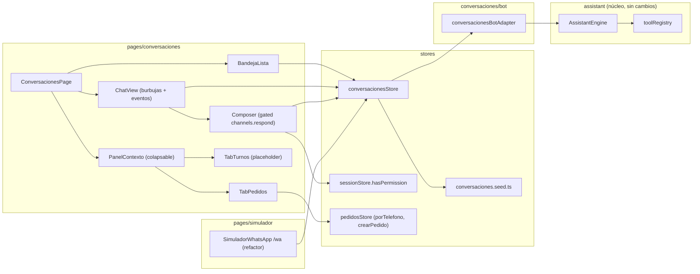
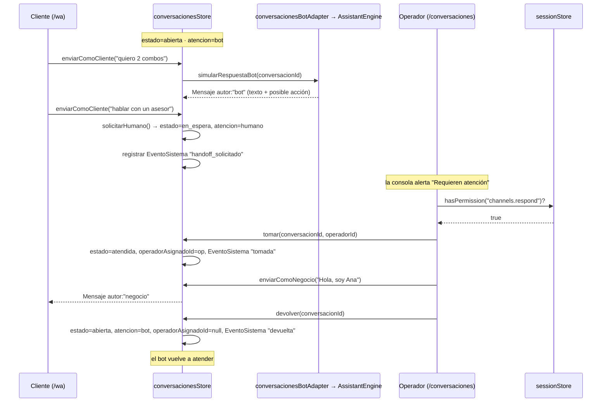
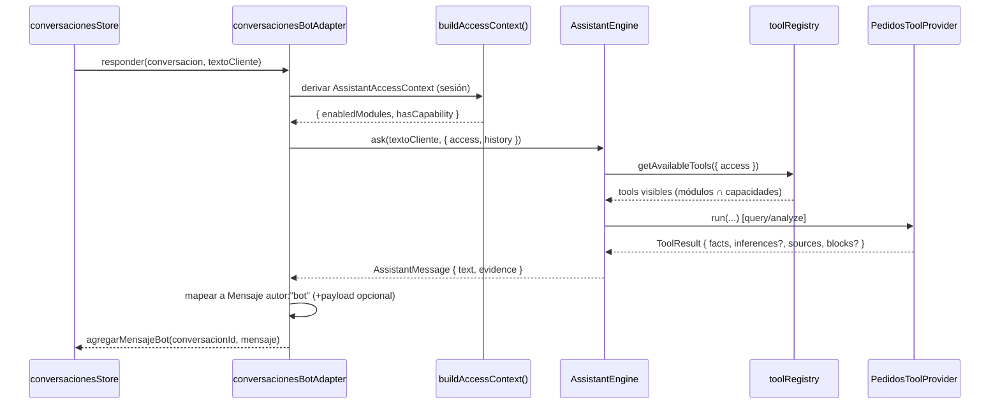
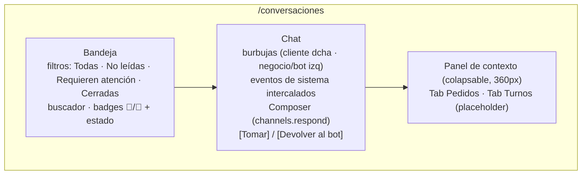

# Documento de Diseño: Conversaciones

## Overview

**Conversaciones** es una **capa transversal de comunicaciones** para la app (React 18 + MobX + react-router v7 + Tailwind 4). Su primer y único canal en este MVP es **WhatsApp**, pero el modelo de dominio se diseña multicanal desde el inicio (`CanalId`). El módulo introduce una **consola del operador** en `/conversaciones` (dentro del `AppShell`) y reconvierte el actual simulador `/wa` en la **vista del cliente** del mismo canal, de modo que ambas superficies consumen el **mismo store** (`conversacionesStore`) y se sincronizan de forma bidireccional en vivo.

La atención de una conversación tiene dos modos: **humana** (un operador toma el chat) y **automática** (el "bot"). Decisión de arquitectura central: **el "bot" no es un segundo motor**. La atención automática es **Necto Intelligence** (el asistente ya existente en `src/assistant`) respondiendo dentro del canal a través del **Tool Registry central**. No se duplica lógica de intención en `conversacionesStore`.

El módulo se integra con el **contrato de acceso** de la app (Sesión → `AccessContext` → Rol → capacidades → `hasPermission(cap)`, formato `<dominio>.<accion>`, *fail-closed*, el admin es un rol normal). Se añade una nueva capacidad **`channels.respond`** para gobernar responder y hacer *handoff*.

### Restricciones de alcance (MVP)

Estas restricciones son parte del diseño y condicionan cada sección posterior:

1. **Frontend-only / mock reactivo.** No hay backend, no hay Meta / WhatsApp Cloud API real, no hay webhooks. Todo el estado vive en MobX y se persiste en `localStorage` (con *fallback* a memoria).
2. **El bot pasa por el `AssistantEngine`/`ToolRegistry` existentes.** La atención automática NO es un motor nuevo; es Necto Intelligence. No se replica detección de intención en el store de conversaciones.
3. **Motor rule-based, solo TEXTO.** El modelo de mensaje queda **preparado** para multimodal (imágenes/audio) y multicanal, pero no se implementa.
4. **Sin concepto de "módulo contratado por tienda"** (no existe entidad Tienda). El filtro de lo que el bot puede hacer = **módulos habilitados en sesión ∩ capacidades**, exactamente lo que el `ToolRegistry` ya calcula.
5. **Encapsulamiento estricto.** `conversacionesStore` **no importa** `pedidosStore`. El acceso a Pedidos es siempre por **métodos públicos** (`pedidosStore.porTelefono(tel)` —nuevo— y `pedidosStore.crearPedido`), nunca leyendo el array de pedidos.

---

## Architecture

### Arquitectura de 3 capas

```mermaid
graph TD
    subgraph C1["CAPA 1 — Canal de entrada (WhatsApp)"]
        WA["Simulador Cliente /wa<br/>(vista del cliente)"]
        CO["Consola Operador /conversaciones<br/>(AppShell, guard channels.read)"]
    end

    subgraph C2["CAPA 2 — Estado común"]
        STORE["conversacionesStore (MobX)<br/>conversaciones · mensajes · eventos<br/>estado del hilo + modo de atención<br/>persistencia localStorage/memoria"]
    end

    subgraph C3["CAPA 3 — Atención"]
        HUM["Atención Humana<br/>(operador toma el chat)"]
        BOT["Atención Automática<br/>Necto Intelligence"]
    end

    subgraph NUCLEO["Núcleo asistente (agnóstico, ya existe)"]
        ADAPT["ConversacionesBotAdapter<br/>(adaptador delgado, en el módulo)"]
        ENGINE["AssistantEngine (ask)"]
        REGISTRY["ToolRegistry (módulos ∩ capacidades)"]
        PTOOLS["PedidosToolProvider"]
        FUT["Turnos / Inventario ToolProviders<br/>(FUTURO — solo interfaces)"]
    end

    WA -->|enviarComoCliente| STORE
    CO -->|enviarComoNegocio / tomar / devolver| STORE
    STORE --> WA
    STORE --> CO

    STORE -->|modo humano| HUM
    STORE -->|modo bot| BOT
    BOT --> ADAPT
    ADAPT --> ENGINE
    ENGINE --> REGISTRY
    REGISTRY --> PTOOLS
    REGISTRY -.futuro.-> FUT
    ADAPT -->|Mensaje autor:"bot"| STORE

    HUM -.crearPedido / porTelefono.-> PEDIDOS["pedidosStore (API pública)"]
    STORE -.NO importa.-x PEDIDOS
```

- **Capa 1 (Canal):** dos superficies React que leen y escriben el mismo store. `/wa` es la vista del cliente (escribe como `cliente`); `/conversaciones` es la consola del operador (escribe como `negocio`, gestiona el *handoff*).
- **Capa 2 (Estado común):** `conversacionesStore` es el **único dueño** de conversaciones, mensajes y eventos de sistema. No conoce Pedidos ni el asistente como dependencias de import de dominio (ver invariantes).
- **Capa 3 (Atención):** humana o automática. La automática **delega** en el núcleo del asistente vía un adaptador delgado que vive en el módulo de conversaciones (no en el núcleo).

### Diagrama de componentes



### Secuencia — Handoff (bot ↔ humano)



### Secuencia — Bot vía AssistantEngine



---

## Data Models

Todos los contratos viven en `stores/conversaciones.store.ts` (o un `conversaciones.types.ts` adyacente). TypeScript, alias `@/`.

```typescript
// ── Identificadores y enumeraciones ──────────────────────────────────────────

/** Estado del hilo de conversación (máquina de estados del handoff). */
export type EstadoConversacion = "abierta" | "en_espera" | "atendida" | "cerrada";

/** Quién atiende ahora mismo la conversación. */
export type ModoAtencion = "bot" | "humano";

/** Autoría de un mensaje. "negocio" = operador humano; "bot" = Necto Intelligence. */
export type AutorMensaje = "cliente" | "negocio" | "bot";

/** Módulo de dominio al que un mensaje/acción hace referencia (para el panel de contexto). */
export type ModuloDestino = "pedidos" | "turnos" | "agendamiento" | "inventario" | "general";

/** Canal de comunicación. Hoy solo WhatsApp; preparado para más. */
export type CanalId = "whatsapp"; // futuro: "instagram" | "webchat" | ...

// ── Contenido del mensaje (preparado para multimodal) ────────────────────────

/**
 * Contenido de un mensaje. En el MVP SOLO texto (`tipo: "texto"`), pero el
 * envoltorio discriminado por `tipo` deja lista la extensión multimodal
 * (imagen/audio) sin romper el modelo ni los consumidores existentes.
 */
export interface MensajeContenido {
  tipo: "texto"; // futuro: "imagen" | "audio" | "documento" | ...
  texto: string;
}

// ── Mensaje ──────────────────────────────────────────────────────────────────

/**
 * Un mensaje dentro de una conversación. `payload` transporta referencias de
 * dominio SIN acoplar el store a Pedidos (solo ids/valores primitivos).
 */
export interface Mensaje {
  id: string;
  conversacionId: string;
  autor: AutorMensaje;
  contenido: MensajeContenido;
  timestamp: string; // ISO 8601
  /** Módulo de dominio con el que se relaciona el mensaje (si aplica). */
  moduloContexto?: ModuloDestino;
  /**
   * Datos de dominio referenciados por el mensaje. Solo primitivos/ids: NO se
   * incrusta la entidad Pedido, para respetar el encapsulamiento (invariante D2).
   */
  payload?: {
    pedidoId?: string;
    turnoNumero?: string;
    items?: Array<{ nombre: string; cantidad: number; precio?: number }>;
  };
}

// ── Evento de sistema ─────────────────────────────────────────────────────────

/** Tipo de evento de sistema (transiciones y anotaciones del hilo). */
export type TipoEventoSistema =
  | "handoff_solicitado"
  | "tomada"
  | "devuelta"
  | "cerrada"
  | "reabierta";

/**
 * Evento de sistema intercalado en la línea de tiempo (no es un mensaje de
 * ninguna de las partes; es una anotación del hilo: "Ana tomó la conversación").
 */
export interface EventoSistema {
  id: string;
  conversacionId: string;
  tipo: TipoEventoSistema;
  texto: string;          // legible: "El cliente pidió hablar con un asesor"
  timestamp: string;      // ISO 8601
  actorId?: string;       // operadorId cuando aplica
}

// ── Contacto y conversación ────────────────────────────────────────────────────

/**
 * Contacto del canal. Es la identidad ligera del cliente en el canal, NO una
 * entidad Cliente del dominio (que no existe). El teléfono es la clave de
 * cruce con Pedidos vía `pedidosStore.porTelefono`.
 */
export interface Contacto {
  telefono: string;
  nombre: string;
  origen: "whatsapp";
}

/**
 * Cabecera de una conversación. Los mensajes y eventos NO viven aquí (ver
 * decisión "Línea de tiempo" abajo): se guardan en índices separados del store,
 * de modo que la cabecera sea barata de observar en la bandeja.
 */
export interface Conversacion {
  id: string;
  canal: CanalId;
  contacto: Contacto;
  estado: EstadoConversacion;
  atencion: ModoAtencion;
  operadorAsignadoId: string | null;
  noLeidos: number;
  ultimaActividad: string; // ISO 8601
  /** Referencias de dominio activas (solo ids; encapsulamiento). */
  pedidoActivoId?: string;
  turnoActivoId?: string;
}

/** Filtros de la bandeja. `requieren_atencion` == estado "en_espera". */
export type FiltroBandeja = "todas" | "no_leidas" | "requieren_atencion" | "cerradas";

/** Item de la línea de tiempo unificada que consume el ChatView. */
export type ItemLineaTiempo =
  | { clase: "mensaje"; data: Mensaje }
  | { clase: "evento"; data: EventoSistema };
```

### Decisión: mensajes/eventos separados, línea de tiempo derivada

`Mensaje` y `EventoSistema` se almacenan en **estructuras separadas** dentro del store (dos `Map`/arrays indexados por `conversacionId`), y la vista consume una **línea de tiempo unificada derivada** (`ItemLineaTiempo[]`) que los intercala por `timestamp` mediante un *getter* MobX.

Justificación:
- Mensajes y eventos tienen **ciclos de vida y semántica distintos** (uno es contenido de una parte, el otro es una anotación del sistema); mezclarlos en un solo array obligaría a *union types* con ramas por todos lados en la escritura.
- La **bandeja** solo necesita la cabecera `Conversacion` (barata de observar); no debe recomputar al llegar cada mensaje de otra conversación.
- La **unificación** es una preocupación de **presentación**, por lo que se resuelve como *getter computado* y no como estado persistido, evitando duplicar la verdad.

---

## Components and Interfaces

### `conversacionesStore` (Capa 2 — dueño del estado)

Singleton MobX (`makeAutoObservable`) al estilo del resto de stores del proyecto. Persistencia en `localStorage` bajo clave propia (p. ej. `necto.conversaciones`), con *fallback* silencioso a memoria si no hay `localStorage` (mismo patrón que `pedidos.store`).

```typescript
export class ConversacionesStore {
  // ── Estado observable ───────────────────────────────────────────────────────
  /** Cabeceras de conversación (fuente de la bandeja). */
  conversaciones: Conversacion[];
  /** Mensajes indexados por conversacionId. */
  private mensajesPorConv: Map<string, Mensaje[]>;
  /** Eventos de sistema indexados por conversacionId. */
  private eventosPorConv: Map<string, EventoSistema[]>;
  /** Conversación seleccionada en la consola (UI). */
  seleccionadaId: string | null;
  /** Filtro activo de la bandeja. */
  filtro: FiltroBandeja;
  /** Texto del buscador de la bandeja. */
  busqueda: string;

  constructor() { /* carga seed + persistencia; makeAutoObservable(this) */ }

  // ── Getters de bandeja / filtros ─────────────────────────────────────────────
  /** Conversaciones tras aplicar filtro + búsqueda, ordenadas por ultimaActividad desc. */
  get bandeja(): Conversacion[];
  /** Conversaciones que requieren atención (estado === "en_espera"). */
  get requierenAtencion(): Conversacion[];
  /** Nº total de no leídos (para badge del sidebar). */
  get totalNoLeidos(): number;
  /** Cabecera por id. */
  getConversacion(id: string): Conversacion | undefined;
  /** Línea de tiempo unificada (mensajes + eventos) ordenada por timestamp. */
  lineaDeTiempo(conversacionId: string): ItemLineaTiempo[];

  // ── Acciones de mensajería ───────────────────────────────────────────────────
  /** El cliente escribe (desde /wa). Si atencion==="bot", dispara simularRespuestaBot. */
  enviarComoCliente(conversacionId: string, texto: string): void;
  /** El operador responde (desde /conversaciones). Autor "negocio". Requiere channels.respond. */
  enviarComoNegocio(conversacionId: string, texto: string): void;

  // ── Handoff (máquina de estados) ─────────────────────────────────────────────
  /** Cliente pide asesor → en_espera + atencion humano + evento handoff_solicitado. */
  solicitarHumano(conversacionId: string): void;
  /** Operador toma → atendida + operadorAsignadoId + evento tomada. Requiere channels.respond. */
  tomar(conversacionId: string, operadorId: string): void;
  /** Operador devuelve → abierta + atencion bot + operadorAsignadoId null + evento devuelta. Requiere channels.respond. */
  devolver(conversacionId: string): void;
  /** Cierra la conversación → cerrada + evento cerrada. */
  cerrar(conversacionId: string): void;

  // ── Lectura / selección ──────────────────────────────────────────────────────
  /** Marca noLeidos = 0. */
  marcarLeido(conversacionId: string): void;
  /** Selecciona (y marca leído) para la consola. */
  seleccionar(conversacionId: string): void;
  setFiltro(f: FiltroBandeja): void;
  setBusqueda(q: string): void;

  // ── Atención automática (delegada en el adaptador → AssistantEngine) ─────────
  /**
   * Pide al bot que responda al último mensaje del cliente. NO contiene lógica
   * de intención: delega en conversacionesBotAdapter.responder(...) y agrega el
   * resultado como Mensaje autor:"bot". No-op si atencion !== "bot".
   */
  simularRespuestaBot(conversacionId: string): Promise<void>;

  /** Uso interno del adaptador: agrega un mensaje del bot ya resuelto. */
  agregarMensajeBot(conversacionId: string, texto: string, payload?: Mensaje["payload"]): void;
}

export const conversacionesStore = new ConversacionesStore();
```

**Notas de diseño del store:**
- Las acciones de *handoff* y `enviarComoNegocio` **no comprueban capacidades dentro del store**: el *gating* vive en la UI (composer/botones) vía `hasPermission("channels.respond")`. El store asume que quien lo llama ya fue autorizado. (Coherente con el patrón del proyecto: `acceso.utils` gobierna la UI, los stores mutan estado.) Se documenta como invariante de la capa de UI, no del store.
- `simularRespuestaBot` es `async` porque `AssistantEngine.ask` devuelve `Promise<AssistantMessage>`.

### Adaptador al AssistantEngine — `conversacionesBotAdapter`

Vive en el **módulo de conversaciones** (p. ej. `pages/conversaciones/bot/conversaciones-bot.adapter.ts` o `stores/conversaciones.bot.ts`), **no** en `src/assistant/**` (el núcleo sigue agnóstico, invariante A1). Traduce entre `Mensaje`/`Conversacion` y el `EngineContext`, y del `AssistantMessage` resultante de vuelta a un `Mensaje` autor `"bot"`.

```typescript
import type { AssistantEngine, AssistantMessage, EngineContext } from "@/assistant";
import { buildAccessContext } from "@/assistant/bootstrap";

export interface ConversacionesBotAdapter {
  /**
   * Resuelve la respuesta automática para el texto del cliente.
   * - Deriva el AssistantAccessContext de la sesión (buildAccessContext()).
   * - Llama engine.ask(texto, { access, history }).
   * - Mapea AssistantMessage → { texto, payload? } para agregarMensajeBot.
   * NO muta dominio salvo mediante la acción existente de Pedidos (crear pedido),
   * que el propio ToolProvider gobierna; en MVP el bot es query/analyze.
   */
  responder(input: {
    textoCliente: string;
    history?: AssistantMessage[];
  }): Promise<{ texto: string; payload?: Mensaje["payload"] }>;
}
```

- El adaptador usa `buildAccessContext()` (ya existe en `assistant/bootstrap.ts`) para el `access`, garantizando el filtro **módulos ∩ capacidades** *fail-closed* sin reimplementarlo.
- El *engine* concreto (`LocalRuleEngine`) se inyecta; el adaptador depende solo de la interfaz `AssistantEngine` (invariante A3 del asistente).
- **Preparado para el futuro:** cuando se sumen `Turnos`/`Inventario` como *providers*, no cambia nada aquí: basta con registrarlos en el `toolRegistry` en el `bootstrap`.

### `pedidosStore.porTelefono(telefono)` — método nuevo a añadir

Para que el panel de contexto consulte pedidos por teléfono **sin** que `conversacionesStore` toque el array de pedidos, se añade un método público a `pedidosStore`:

```typescript
// En stores/pedidos.store.ts (añadir):
/**
 * Pedidos asociados a un teléfono de contacto, ordenados por createdAt desc.
 * Es la puerta pública para que otros módulos (p. ej. Conversaciones) crucen un
 * contacto con sus pedidos SIN leer el array `pedidos` directamente.
 */
porTelefono(telefono: string): Pedido[] {
  return this.pedidos
    .filter((p) => p.telefono === telefono)
    .sort((a, b) => b.createdAt.localeCompare(a.createdAt));
}
```

La creación de pedido desde el chat reutiliza `pedidosStore.crearPedido({ cliente, telefono, modalidad, items, notas?, origen: "whatsapp" })` (firma ya existente, sin cambios).

### UI — Consola `/conversaciones`

Ruta dentro del `AppShell`, protegida con `<CapabilityGuard capacidad="channels.read">`. Layout de **2 columnas + panel de contexto colapsable** (no permanente).



- **Columna izquierda (bandeja):** lista de `conversacionesStore.bandeja`; filtros que llaman `setFiltro`; buscador (`setBusqueda`); *badges* diferenciando **estado del chat** (`abierta`/`en_espera`/`atendida`/`cerrada`) del **responsable** (🤖 `bot` / 👤 `humano`).
- **Columna centro (chat):** `lineaDeTiempo(id)` renderizada como burbujas con autoría clara (cliente a la derecha; `negocio`/`bot` a la izquierda) y eventos de sistema intercalados. El **composer** está habilitado **solo** con `hasPermission("channels.respond")`; deshabilitado muestra el motivo (`motivoSinPermiso`). Botón principal que alterna **[Tomar conversación]** / **[Devolver al bot]** según `estado`/`atencion`.
- **Panel de contexto (colapsable):**
  - **Tab Pedidos:** pedidos activos del contacto vía `pedidosStore.porTelefono(contacto.telefono)`, con estado de preparación y pago; botón **[Crear pedido]** que prellena `cliente`/`telefono`/`origen:"whatsapp"` y llama `crearPedido`. Reutiliza el patrón de bloques/paneles del asistente donde aplique.
  - **Tab Turnos:** *placeholder* "disponible si el módulo está activo" (futuro).

### UI — Simulador `/wa` (refactor, vista del cliente)

`SimuladorWhatsApp.tsx` se refactoriza para:
- Consumir `conversacionesStore` (no `chats.mock.ts`).
- **Quitar el candado de solo lectura**; añadir input libre + comando rápido **"Hablar con un asesor"** (que dispara `solicitarHumano`).
- Escribir con `enviarComoCliente`; lo que se escribe en `/wa` aparece en `/conversaciones` y viceversa (demo en vivo por reactividad MobX/`observer`).
- Mantener el modelo preparado para que el bot responda vía el `AssistantEngine` (a través de `simularRespuestaBot`).

`chats.mock.ts` queda **deprecado**: el *seed* de conversaciones pasa a vivir en un `conversaciones.seed.ts` consumido por el store.

---

## Reglas de acceso

### Nueva capacidad `channels.respond`

Se añade a `roles.store.ts` y se integra en el modelo de canal:

| Capacidad | Qué habilita |
|---|---|
| `channels.read` | Ver la bandeja, consultar historiales, **entrar** a la sección `/conversaciones`. |
| `channels.respond` | **Responder** en el chat, **tomar** la conversación y **devolverla** al bot (*handoff*). |
| `channels.manage` | Editar plantillas, reglas de enrutamiento y configuración del canal. |

Regla del contrato respetada: **entrar a una sección ≠ poder operarla** (invariante C5). `channels.read` abre la puerta; responder exige `channels.respond`.

### Cambios concretos por archivo

`stores/roles.store.ts`:
- Añadir `"channels.respond"` al `type Capacidad` (queda entre `channels.read` y `channels.manage`).
- Añadir `"channels.respond"` a `CAPACIDADES`.
- Añadir `"channels.respond": "Responder en canales"` a `CAPACIDAD_LABEL`.
- Añadir `"channels.respond"` al grupo `"canales"` en `CAPACIDAD_GRUPOS`.
- **Mapeo a roles en `ROLES_SEED`:**
  - `admin_tienda`: incluye todo (`[...CAPACIDADES]`) → obtiene `channels.respond` automáticamente.
  - `supervisor_pedidos`: añadir `"channels.respond"` (ya tiene read + manage) → las 3.
  - `vendedor`: añadir `"channels.respond"` (hoy tiene solo `channels.read`) → read + respond.
  - `preparacion`: sin capacidades de canales → ninguna.

`stores/operadores.store.ts` — nueva sección en `SECCIONES.pedidos`:
```typescript
{ id: "conversaciones", label: "Conversaciones", path: "/conversaciones", capacidad: "channels.read" },
```

`app/App.tsx` — ruta dentro del bloque `AppShell`:
```tsx
<Route path="/conversaciones" element={
  <CapabilityGuard capacidad="channels.read"><ConversacionesPage /></CapabilityGuard>
} />
```
`/wa` permanece **standalone** (fuera del `AppShell`), como hoy.

`app/AppSidebar.tsx` — ítem condicionado por `sessionStore.puedeVerSeccion("pedidos", "conversaciones")` (equivale a `hasPermission("channels.read")`).

`stores/acceso.utils.ts` — helpers de conveniencia nuevos (misma forma que los existentes):
```typescript
/** Responder en el chat y tomar/devolver la conversación (handoff). */
export function puedeResponderConversacion(): boolean { return puede("channels.respond"); }
/** Ver la bandeja / entrar a Conversaciones. */
export function puedeVerConversaciones(): boolean { return puede("channels.read"); }
```

---

## Pseudocódigo

### Handoff (máquina de estados en `conversacionesStore`)

```pascal
PROCEDURE solicitarHumano(convId)
  conv ← getConversacion(convId)
  IF conv = NULL THEN RETURN
  IF conv.estado = "cerrada" THEN RETURN         // no reactivar aquí
  conv.estado ← "en_espera"
  conv.atencion ← "humano"
  conv.ultimaActividad ← now()
  registrarEvento(convId, "handoff_solicitado", "El cliente pidió hablar con un asesor")
END PROCEDURE

PROCEDURE tomar(convId, operadorId)               // UI ya validó channels.respond
  conv ← getConversacion(convId)
  IF conv = NULL THEN RETURN
  IF conv.estado NOT IN {"en_espera", "abierta"} THEN RETURN
  conv.estado ← "atendida"
  conv.atencion ← "humano"
  conv.operadorAsignadoId ← operadorId
  conv.ultimaActividad ← now()
  registrarEvento(convId, "tomada", "Conversación tomada por el operador", operadorId)
END PROCEDURE

PROCEDURE devolver(convId)                         // UI ya validó channels.respond
  conv ← getConversacion(convId)
  IF conv = NULL THEN RETURN
  IF conv.estado ≠ "atendida" THEN RETURN
  conv.estado ← "abierta"
  conv.atencion ← "bot"
  conv.operadorAsignadoId ← NULL
  conv.ultimaActividad ← now()
  registrarEvento(convId, "devuelta", "Conversación devuelta al bot")
END PROCEDURE

PROCEDURE cerrar(convId)
  conv ← getConversacion(convId)
  IF conv = NULL THEN RETURN
  conv.estado ← "cerrada"
  conv.ultimaActividad ← now()
  registrarEvento(convId, "cerrada", "Conversación cerrada")
END PROCEDURE
```

### Envío de mensajes y enrutamiento al bot

```pascal
PROCEDURE enviarComoCliente(convId, texto)
  conv ← getConversacion(convId)
  IF conv = NULL OR trim(texto) = "" THEN RETURN
  agregarMensaje(convId, autor:"cliente", texto)
  conv.noLeidos ← conv.noLeidos + 1
  conv.ultimaActividad ← now()
  IF conv.atencion = "bot" AND conv.estado ≠ "cerrada" THEN
    simularRespuestaBot(convId)                    // async, delega en el adaptador
  END IF
END PROCEDURE

PROCEDURE enviarComoNegocio(convId, texto)         // UI ya validó channels.respond
  conv ← getConversacion(convId)
  IF conv = NULL OR trim(texto) = "" THEN RETURN
  agregarMensaje(convId, autor:"negocio", texto)
  conv.ultimaActividad ← now()
END PROCEDURE

ASYNC PROCEDURE simularRespuestaBot(convId)
  conv ← getConversacion(convId)
  IF conv = NULL OR conv.atencion ≠ "bot" THEN RETURN   // solo el bot responde en modo bot
  textoCliente ← ultimoMensajeCliente(convId).contenido.texto
  // El adaptador deriva el AssistantAccessContext de la sesión y llama al engine.
  // NO hay lógica de intención aquí: todo pasa por el AssistantEngine/ToolRegistry.
  resultado ← await botAdapter.responder({ textoCliente, history: historial(convId) })
  agregarMensajeBot(convId, resultado.texto, resultado.payload)
END PROCEDURE
```

### Adaptador → AssistantEngine

```pascal
ASYNC FUNCTION responder({ textoCliente, history }) RETURNS { texto, payload? }
  access ← buildAccessContext()                    // módulos ∩ capacidades, fail-closed
  ctx ← { access, history }
  msg ← await engine.ask(textoCliente, ctx)         // AssistantMessage
  payload ← extraerPayloadDeEvidencia(msg.evidence) // ej. pedidoId si el ToolResult lo trae
  RETURN { texto: msg.text, payload }
END FUNCTION
```

---

## Correctness Properties

Enunciados verificables (universalmente cuantificados sobre conversaciones/estados válidos):

### Property 1: Transiciones de estado válidas
Para toda conversación `c`, las transiciones permitidas son exactamente:
`abierta → en_espera` (solicitarHumano), `en_espera|abierta → atendida` (tomar), `atendida → abierta` (devolver), `* → cerrada` (cerrar). Cualquier otra transición es un no-op (fail-safe).

**Validates: Requirements 4.1, 4.2, 4.4, 4.5, 4.6, 4.8**

### Property 2: Coherencia estado/atención
`estado = "atendida" ⟹ atencion = "humano" ∧ operadorAsignadoId ≠ null`. `atencion = "bot" ⟹ operadorAsignadoId = null`.

**Validates: Requirements 4.9, 4.10**

### Property 3: Autoría según modo
El bot solo produce mensajes cuando `atencion = "bot"`; un mensaje `autor:"negocio"` solo puede existir tras un `tomar` (estado `atendida`). El cliente puede escribir en cualquier estado no cerrado.

**Validates: Requirements 2.2, 2.3, 3.3, 5.1, 5.3**

### Property 4: Gating por capacidad
Responder (`enviarComoNegocio`), `tomar` y `devolver` se exponen en la UI **si y solo si** `hasPermission("channels.respond")`. Entrar a `/conversaciones` requiere `channels.read`.

**Validates: Requirements 3.1, 3.2, 8.4**

### Property 5: Encapsulamiento (sin import directo de pedidosStore)
`conversaciones.store.ts` no importa `pedidosStore`. Todo cruce con Pedidos ocurre por `pedidosStore.porTelefono` / `pedidosStore.crearPedido` desde la capa de UI/panel. `Mensaje.payload` solo contiene primitivos/ids, nunca la entidad `Pedido`.

**Validates: Requirements 7.3, 10.5, 10.6**

### Property 6: Bot sin lógica de intención propia
La respuesta automática se obtiene exclusivamente vía `AssistantEngine.ask`; `conversaciones.store.ts` no contiene detección de intención ni ramas por palabra clave del cliente.

**Validates: Requirements 5.2**

### Property 7: Filtro fail-closed heredado
El conjunto de acciones que el bot puede ejecutar es un subconjunto de `toolRegistry.getAvailableTools({ access })` con `access = buildAccessContext()`; sin sesión válida el bot no dispone de ninguna tool.

**Validates: Requirements 5.4, 5.5**

### Property 8: Bidireccionalidad
Un mensaje enviado desde `/wa` (`enviarComoCliente`) es observable en `/conversaciones` y viceversa (misma instancia de store; reactividad MobX).

**Validates: Requirements 6.1, 6.2, 6.4**

### Property 9: Sincronía de no leídos
`marcarLeido(c)` ⟹ `c.noLeidos = 0`; `enviarComoCliente` incrementa `noLeidos`; `enviarComoNegocio`/`agregarMensajeBot` no lo incrementan.

**Validates: Requirements 1.10, 1.11, 3.6**

---

## Error Handling

| Escenario | Condición | Respuesta | Recuperación |
|---|---|---|---|
| `localStorage` ausente/corrupto | Entorno sin `localStorage` o JSON inválido al hidratar | *try/catch* silencioso; se cae a `seed`/memoria (patrón de `pedidos.store`) | La app arranca con datos por defecto; se sigue operando en memoria |
| Transición inválida | Se llama `tomar`/`devolver`/`solicitarHumano` en un estado que no lo admite | No-op (no muta, no lanza) | El estado permanece consistente (Property 1) |
| Conversación inexistente | `convId` no existe | Retorno temprano (guard `IF conv = NULL`) | Sin efectos secundarios |
| Texto vacío | `enviarComoCliente`/`enviarComoNegocio` con texto en blanco | Ignorado (no crea mensaje) | — |
| Acción sin permiso | UI intenta responder/handoff sin `channels.respond` | Botón/composer deshabilitado con `motivoSinPermiso("channels.respond")` | El usuario ve el permiso requerido; no se llama al store |
| Fallo del `AssistantEngine` | `engine.ask` rechaza o tarda | El adaptador captura el error y agrega un `Mensaje` bot de *fallback* ("No pude procesar tu mensaje, un asesor te atenderá") y opcionalmente marca `en_espera` | La conversación queda apta para *handoff* humano |
| Sesión no válida durante bot | `buildAccessContext()` devuelve contexto vacío | `getAvailableTools` retorna `[]`; el bot no ejecuta tools (fail-closed) | Respuesta genérica sin acciones de dominio |

---

## Testing Strategy

### Unit testing

- **Store — transiciones:** `solicitarHumano`/`tomar`/`devolver`/`cerrar` producen el `estado`/`atencion`/`operadorAsignadoId` esperados y registran el `EventoSistema` correspondiente; las transiciones inválidas son no-op.
- **Store — mensajería:** `enviarComoCliente` incrementa `noLeidos` y, en modo bot, dispara `simularRespuestaBot`; `enviarComoNegocio` solo agrega mensaje `negocio`; texto vacío se ignora.
- **Store — bandeja/filtros:** `bandeja` aplica filtro + búsqueda y ordena por `ultimaActividad`; `requierenAtencion` == `en_espera`; `marcarLeido` pone `noLeidos` a 0.
- **Línea de tiempo:** `lineaDeTiempo` intercala mensajes y eventos por `timestamp`.
- **Adaptador:** con un `AssistantEngine` *fake*, `responder` deriva `access` de la sesión, llama `ask` y mapea `AssistantMessage → { texto, payload }`; ante rechazo del engine devuelve el *fallback*.
- **Pedidos:** `pedidosStore.porTelefono` filtra y ordena correctamente y no altera el array.
- **Acceso:** `puedeResponderConversacion`/`puedeVerConversaciones` reflejan `hasPermission`; roles seed mapean las capacidades esperadas (admin/supervisor = 3, vendedor = read+respond, preparación = ninguna).

### Property-based testing (fast-check)

Librería: **fast-check** (ecosistema TS/Vitest).

- **Property 1 (transiciones):** para toda secuencia aleatoria de acciones (`solicitarHumano|tomar|devolver|cerrar`) aplicada a una conversación, el `estado` final siempre pertenece a `EstadoConversacion` y nunca se alcanza una combinación prohibida (invariante de coherencia estado/atención, Property 2).
- **Property 3 (autoría):** para toda secuencia de mensajes generada, no existe mensaje `autor:"bot"` mientras `atencion = "humano"`, ni `autor:"negocio"` sin un `tomar` previo.
- **Property 4/7 (gating):** para todo conjunto aleatorio de capacidades de sesión, la disponibilidad de responder/handoff en la UI ⟺ `channels.respond ∈ capacidades`, y el conjunto de tools del bot ⊆ `getAvailableTools` (fail-closed cuando el conjunto está vacío).
- **Property 5 (encapsulamiento):** test estático/estructural que verifica que `conversaciones.store.ts` no contiene un import de `pedidos.store` (grep/AST en test) y que `Mensaje.payload` solo admite primitivos.
- **Property 9 (no leídos):** para toda secuencia de envíos y `marcarLeido`, `noLeidos ≥ 0` y `marcarLeido` lo lleva a 0.

### Integration testing

- **Bidireccionalidad `/wa` ↔ `/conversaciones`:** render de ambas vistas sobre la misma instancia de store; un `enviarComoCliente` en `/wa` aparece en la consola y un `enviarComoNegocio` aparece en `/wa` (React Testing Library + `observer`).
- **Flujo de handoff extremo a extremo:** cliente pide asesor → aparece en "Requieren atención" → operador con `channels.respond` toma → responde como negocio → devuelve al bot.

---

## Fuera de alcance (Out of Scope)

Explícitamente **NO** se implementa en este MVP (el modelo queda preparado, sin código):

- **Multimodal** (imágenes, audio, documentos). `MensajeContenido` está discriminado por `tipo` pero solo `"texto"` está soportado.
- **Multicanal real** (Instagram, webchat, etc.). `CanalId` está listo, pero solo `"whatsapp"`.
- **Integración con Meta / WhatsApp Cloud API**, webhooks, envío/recepción real de mensajes. Todo es mock reactivo.
- **Backend / persistencia remota.** Solo `localStorage`/memoria.
- **Mutaciones del bot más allá de crear pedido.** El bot en MVP es `query`/`analyze` y, como mucho, propone/crea pedido mediante la acción **ya existente** de Pedidos. No hay `recommend`/`execute` que muten otros dominios.
- **Providers de Turnos/Inventario funcionales.** Quedan como **interfaces/placeholder** (tab Turnos, registro futuro en `toolRegistry`); no se implementan.
- **Reglas de enrutamiento y edición de plantillas** más allá del *gating* por `channels.manage` (la UI de configuración del canal es trabajo posterior).

---

## Invariantes de dependencia entre capas

Reglas duras de arquitectura que el código debe respetar (verificables en revisión y en tests estructurales):

- **D1 — Dueño único del estado.** `conversacionesStore` es el único propietario de conversaciones, mensajes y eventos. Ninguna otra capa muta ese estado directamente.
- **D2 — Conversaciones no conoce Pedidos.** `conversaciones.store.ts` **no importa** `pedidos.store`. El cruce con Pedidos ocurre solo por métodos públicos (`porTelefono`, `crearPedido`) desde la UI/panel de contexto. `Mensaje.payload` transporta solo ids/primitivos.
- **D3 — Un solo motor.** La atención automática pasa siempre por el `AssistantEngine`/`toolRegistry`. No hay lógica de intención en `conversacionesStore`.
- **D4 — Núcleo del asistente agnóstico.** El adaptador (`conversacionesBotAdapter`) vive en el módulo de conversaciones y usa `buildAccessContext()`; el núcleo `src/assistant/**` no importa `conversacionesStore` ni ningún store de dominio como valor (invariante A1 del asistente).
- **D5 — Autorización centralizada.** Toda decisión de "¿puede responder/tomar/devolver?" pasa por `sessionStore.hasPermission("channels.respond")` (vía `acceso.utils`); "¿puede entrar?" por `channels.read`. Fail-closed; el admin es un rol normal.
- **D6 — Canal 1 lee de Capa 2.** Tanto `/wa` como `/conversaciones` consumen la **misma** instancia `conversacionesStore`. `chats.mock.ts` queda deprecado; el *seed* vive en el store.
```