# Implementation Plan: Conversaciones

## Overview

Este plan convierte el diseño de **Conversaciones** en una serie de pasos de codificación incrementales para un agente de código, siguiendo un enfoque test-driven. Se implementa en **TypeScript** sobre la app existente (React 18 + MobX `makeAutoObservable` + react-router v7 + Tailwind 4), en `packages/apps/web/modules/app/src`. Los tests corren con **vitest** (`cd packages/apps/web/modules/app && npx vitest run <path>`) y las propiedades con **fast-check**.

El orden es: (1) acceso y roles, (2) tipos/contratos del dominio, (3) `conversacionesStore` con persistencia y seed, (4) puerta pública en `pedidosStore`, (5) adaptador al `AssistantEngine`, (6) consola `/conversaciones`, (7) ruta + sidebar, (8) refactor del simulador `/wa`, (9) property-based tests, (10) verificación final. Cada tarea construye sobre las anteriores y termina cableada con la app; no hay código huérfano.

Alcance frontend-only: sin backend, sin Meta / WhatsApp Cloud API, sin webhooks, solo texto y solo canal `whatsapp` (multimodal y multicanal quedan preparados en el modelo, sin implementar).

## Tasks

- [ ] 1. Añadir la capacidad `channels.respond` al modelo de acceso
  - [x] 1.1 Extender `roles.store.ts` con `channels.respond`
    - En `stores/roles.store.ts`, añadir `"channels.respond"` al `type Capacidad` en el orden jerárquico exacto: entre `"channels.read"` y `"channels.manage"`.
    - Añadir `"channels.respond"` al array `CAPACIDADES` (en la misma posición del grupo de canales).
    - Añadir `"channels.respond": "Responder en canales"` a `CAPACIDAD_LABEL`.
    - Añadir `"channels.respond"` al grupo `"canales"` de `CAPACIDAD_GRUPOS` (entre `channels.read` y `channels.manage`).
    - _Requirements: 8.1_

  - [x] 1.2 Mapear `channels.respond` a los roles en `ROLES_SEED`
    - En `stores/roles.store.ts`: `admin_tienda` ya usa `[...CAPACIDADES]` (obtiene `channels.respond` automáticamente); verificarlo.
    - `supervisor_pedidos`: añadir `"channels.respond"` (queda con `channels.read` + `channels.respond` + `channels.manage`).
    - `vendedor`: añadir `"channels.respond"` (queda con `channels.read` + `channels.respond`, sin `channels.manage`).
    - `preparacion`: no añadir ninguna capacidad de canales (las tres ausentes).
    - _Requirements: 8.5, 8.6, 8.7_

  - [ ]* 1.3 Escribir/actualizar unit tests del mapeo de roles y catálogo
    - Verificar que `admin_tienda` y `supervisor_pedidos` conceden exactamente `channels.read`, `channels.respond`, `channels.manage`; `vendedor` solo `channels.read` + `channels.respond`; `preparacion` ninguna.
    - Verificar el orden jerárquico `read → respond → manage` en `CAPACIDADES`/`CAPACIDAD_GRUPOS`.
    - _Requirements: 8.1, 8.5, 8.6, 8.7_

  - [x] 1.4 Añadir helpers de acceso en `acceso.utils.ts`
    - En `stores/acceso.utils.ts` añadir `puedeResponderConversacion()` → `puede("channels.respond")` y `puedeVerConversaciones()` → `puede("channels.read")`, con la misma forma que los helpers existentes.
    - _Requirements: 8.1, 8.4_

  - [ ]* 1.5 Escribir unit tests de los helpers de acceso
    - Verificar que `puedeResponderConversacion` y `puedeVerConversaciones` reflejan `sessionStore.hasPermission` (incluye caso fail-closed sin sesión válida).
    - _Requirements: 8.4_

  - [x] 1.6 Registrar la sección "Conversaciones" en `operadores.store.ts`
    - En `SECCIONES.pedidos` añadir una única entrada `{ id: "conversaciones", label: "Conversaciones", path: "/conversaciones", capacidad: "channels.read" }`, sin duplicados.
    - _Requirements: 8.2_

- [x] 2. Definir los tipos y contratos del dominio de Conversaciones
  - [x] 2.1 Crear `conversaciones.types.ts` con las enumeraciones e interfaces
    - Crear `stores/conversaciones.types.ts` (alias `@/`) con: `EstadoConversacion`, `ModoAtencion`, `AutorMensaje`, `ModuloDestino`, `CanalId` (`"whatsapp"`), `MensajeContenido` (discriminado por `tipo: "texto"`), `Mensaje` (con `payload` solo de primitivos/ids), `TipoEventoSistema`, `EventoSistema`, `Contacto`, `Conversacion`, `FiltroBandeja` e `ItemLineaTiempo`.
    - Documentar en comentarios la preparación multimodal (`tipo`) y el encapsulamiento de `payload` (sin entidad `Pedido`).
    - _Requirements: 10.3, 10.6_

- [x] 3. Implementar `conversacionesStore` (dueño único del estado)
  - [x] 3.1 Crear el seed inicial `conversaciones.seed.ts`
    - Crear `stores/conversaciones.seed.ts` exportando conversaciones + mensajes + eventos de demo (canal `whatsapp`, contactos con `telefono`/`nombre`/`origen`), coherentes con los invariantes estado/atención.
    - _Requirements: 9.4_

  - [x] 3.2 Crear el esqueleto del store con estado observable y persistencia
    - Crear `stores/conversaciones.store.ts` con la clase `ConversacionesStore` (`makeAutoObservable`) y el singleton `conversacionesStore`; estado observable: `conversaciones`, `mensajesPorConv`, `eventosPorConv`, `seleccionadaId`, `filtro`, `busqueda`.
    - Persistir en `localStorage` bajo clave propia (p. ej. `necto.conversaciones`) con `try/catch` silencioso y fallback a memoria; hidratar en el constructor: si hay estado válido restaurarlo, si no cargar el seed.
    - No importar `pedidos.store` (invariante D2).
    - _Requirements: 9.1, 9.2, 9.3, 9.4, 10.5_

  - [ ]* 3.3 Escribir unit tests de persistencia y arranque
    - Verificar hidratación desde estado válido (sin cargar seed), carga de seed cuando no hay estado válido, y operación en memoria sin errores cuando `localStorage` es inaccesible o el contenido es inválido.
    - _Requirements: 9.1, 9.2, 9.3, 9.4_

  - [x] 3.4 Implementar acciones de mensajería del cliente y del negocio
    - `enviarComoCliente(convId, texto)`: rechazar texto vacío/solo espacios y texto que excede el límite del cliente; agregar `Mensaje` autor `"cliente"`, incrementar `noLeidos`, actualizar `ultimaActividad`; si `atencion === "bot"` y estado ≠ `"cerrada"`, disparar `simularRespuestaBot`.
    - `enviarComoNegocio(convId, texto)`: rechazar vacío/solo espacios y texto > 4096; agregar `Mensaje` autor `"negocio"` como más reciente, actualizar `ultimaActividad`, sin incrementar `noLeidos`.
    - Rechazar contenido cuyo `tipo` no sea `"texto"` y cuyo canal no sea `"whatsapp"` sin mutar estado.
    - _Requirements: 3.3, 3.4, 3.5, 3.6, 6.2, 10.2, 10.4_

  - [ ]* 3.5 Escribir unit tests de mensajería
    - Verificar incremento de `noLeidos` en `enviarComoCliente`, no incremento en `enviarComoNegocio`, ignorar texto vacío, rechazo por exceso de longitud y rechazo de tipo/canal no soportados.
    - _Requirements: 3.3, 3.4, 3.5, 3.6, 6.2, 10.2, 10.4_

  - [x] 3.6 Implementar la máquina de estados de handoff
    - `solicitarHumano`: `abierta → en_espera` + `atencion "humano"` (no-op si `cerrada`); `tomar(convId, operadorId)`: `en_espera|abierta → atendida` + `atencion "humano"` + `operadorAsignadoId`; `devolver`: `atendida → abierta` + `atencion "bot"` + `operadorAsignadoId = null`; `cerrar`: `* → cerrada` (no-op y sin evento si ya `cerrada`).
    - Cada transición válida registra el `EventoSistema` correspondiente y actualiza `ultimaActividad`; transiciones inválidas son no-op sin evento. El store no comprueba capacidades (el gating vive en la UI).
    - _Requirements: 4.1, 4.2, 4.4, 4.5, 4.6, 4.7, 4.8, 4.9, 4.10_

  - [ ]* 3.7 Escribir unit tests de las transiciones de handoff
    - Verificar cada transición válida (estado/atención/operador/evento), los no-ops (transición inválida, conversación inexistente, `cerrar` sobre `cerrada`) y la coherencia estado/atención.
    - _Requirements: 4.1, 4.2, 4.4, 4.5, 4.6, 4.8, 4.9, 4.10_

  - [x] 3.8 Implementar getters de bandeja, no leídos y selección
    - `bandeja`: aplica `filtro` (`todas`/`no_leidas`/`requieren_atencion`==`en_espera`/`cerradas`) + `busqueda` (nombre o teléfono, case-insensitive) y ordena por `ultimaActividad` desc con desempate estable por `id` asc; `requierenAtencion` (`en_espera`); `totalNoLeidos`; `getConversacion(id)`.
    - `marcarLeido(convId)` → `noLeidos = 0`; `seleccionar(convId)` (fija selección y marca leído); `setFiltro`; `setBusqueda`.
    - _Requirements: 1.1, 1.3, 1.4, 1.5, 1.6, 1.7, 1.10, 1.11_

  - [ ]* 3.9 Escribir unit tests de bandeja, filtros y no leídos
    - Verificar cada filtro combinado con búsqueda, el orden (desc + desempate por id), `marcarLeido`/`seleccionar` dejando `noLeidos` en 0 y `totalNoLeidos`.
    - _Requirements: 1.1, 1.3, 1.4, 1.5, 1.6, 1.7, 1.10, 1.11_

  - [x] 3.10 Implementar la línea de tiempo unificada derivada
    - `lineaDeTiempo(convId)`: getter/método que intercala mensajes y eventos como `ItemLineaTiempo[]` ordenados por `timestamp` asc, preservando el orden de inserción ante timestamps idénticos.
    - _Requirements: 2.1_

  - [ ]* 3.11 Escribir unit tests de la línea de tiempo
    - Verificar intercalado por timestamp, estabilidad ante timestamps idénticos y caso vacío.
    - _Requirements: 2.1_

  - [x] 3.12 Implementar el enganche de atención automática (delegación al adaptador)
    - `simularRespuestaBot(convId)` (async): no-op si `atencion !== "bot"`; toma el último texto del cliente, delega en `conversacionesBotAdapter.responder(...)` y agrega el resultado vía `agregarMensajeBot`. Sin lógica de intención en el store (invariante D3).
    - `agregarMensajeBot(convId, texto, payload?)`: agrega un único `Mensaje` autor `"bot"` si el texto tiene contenido; no incrementa `noLeidos`.
    - _Requirements: 5.1, 5.2, 5.3, 5.7, 10.7_

- [x] 4. Añadir la puerta pública `pedidosStore.porTelefono`
  - [x] 4.1 Implementar `porTelefono(telefono)` en `pedidos.store.ts`
    - Añadir método público que filtra por `telefono` y ordena por `createdAt` desc, sin mutar el array `pedidos`.
    - _Requirements: 7.3_

  - [ ]* 4.2 Escribir unit tests de `porTelefono`
    - Verificar filtrado, orden desc y que no altera el array original; caso sin coincidencias devuelve lista vacía.
    - _Requirements: 7.3, 7.4_

- [x] 5. Implementar el adaptador `conversacionesBotAdapter` al AssistantEngine
  - [x] 5.1 Crear el adaptador delgado en el módulo de conversaciones
    - Crear el adaptador (p. ej. `pages/conversaciones/bot/conversaciones-bot.adapter.ts`) que deriva el `AssistantAccessContext` con `buildAccessContext()`, llama `engine.ask(textoCliente, { access, history })` (engine inyectado, dependiendo solo de la interfaz `AssistantEngine`) y mapea `AssistantMessage → { texto, payload? }`.
    - Ante rechazo/error o timeout de 30 s, devolver un mensaje de fallback indicando que un asesor atenderá al cliente. No vive en `src/assistant/**` (invariante D4).
    - _Requirements: 5.1, 5.2, 5.4, 5.5, 5.6, 5.7, 10.7_

  - [ ]* 5.2 Escribir unit tests del adaptador con un engine fake
    - Verificar derivación de `access`, llamada a `ask`, mapeo a `{ texto, payload }`, fallback ante rechazo/timeout y conjunto vacío de tools con sesión no válida (fail-closed).
    - _Requirements: 5.4, 5.5, 5.6_

- [x] 6. Construir la consola del operador `/conversaciones`
  - [x] 6.1 Crear `ConversacionesPage` con layout de 2 columnas + panel colapsable
    - Crear `pages/conversaciones/ConversacionesPage.tsx` (`observer`) con la estructura: bandeja (izq), chat (centro) y `PanelContexto` colapsable (der, inicialmente colapsado). Cablear con `conversacionesStore`.
    - _Requirements: 7.1, 7.2_

  - [x] 6.2 Implementar `BandejaLista` (filtros, buscador, badges, no leídos)
    - Crear el componente que renderiza `conversacionesStore.bandeja`; filtros (`Todas`/`No leídas`/`Requieren atención`/`Cerradas`) vía `setFiltro`; buscador vía `setBusqueda`; badge de estado distinto del badge de responsable (🤖/👤); contador de no leídos; indicador de bandeja vacía; al seleccionar llama `seleccionar` (marca leído).
    - _Requirements: 1.1, 1.3, 1.4, 1.5, 1.6, 1.7, 1.8, 1.9, 1.10, 1.11_

  - [x] 6.3 Implementar `ChatView` (línea de tiempo unificada + eventos)
    - Crear el componente que consume `lineaDeTiempo(seleccionadaId)`: burbujas de `cliente` a la derecha con etiqueta de autoría, `negocio`/`bot` a la izquierda con etiqueta que distingue negocio de bot, eventos de sistema como anotación diferenciada; indicador de conversación vacía.
    - _Requirements: 2.1, 2.2, 2.3, 2.4, 2.5_

  - [x] 6.4 Implementar `Composer` con gating `channels.respond`
    - Crear el composer que envía como negocio vía `enviarComoNegocio` con límite de 4096 caracteres; habilitado solo si `puedeResponderConversacion()`, deshabilitado muestra `motivoSinPermiso("channels.respond")`; mostrar aviso cuando se supera el límite.
    - _Requirements: 3.1, 3.2, 3.5_

  - [x] 6.5 Implementar el botón Tomar / Devolver
    - Botón principal que alterna [Tomar conversación] / [Devolver al bot] según `estado`/`atencion`, llamando `tomar`/`devolver`; visible/habilitado solo con `puedeResponderConversacion()`.
    - _Requirements: 4.2, 4.3, 4.4_

  - [x] 6.6 Implementar `PanelContexto` con `TabPedidos` y `TabTurnos`
    - `PanelContexto` colapsable con control de expandir/colapsar. `TabPedidos`: lista pedidos del contacto vía `pedidosStore.porTelefono(contacto.telefono)` (más reciente primero) mostrando estado de preparación y de pago; mensaje de ausencia si no hay pedidos; botón [Crear pedido] que prellena `cliente`/`telefono`/`origen: "whatsapp"` e invoca `pedidosStore.crearPedido`, mostrando error y conservando datos si falla.
    - `TabTurnos`: placeholder reservado para uso futuro.
    - _Requirements: 7.1, 7.2, 7.3, 7.4, 7.5, 7.6, 7.7, 7.8_

  - [ ]* 6.7 Escribir tests de componente de la consola
    - Verificar gating del composer/botones por `channels.respond`, indicadores vacíos, badges de estado vs responsable y el prellenado + manejo de error de "Crear pedido".
    - _Requirements: 1.8, 2.5, 3.2, 7.4, 7.7_

- [x] 7. Cablear la ruta y la navegación
  - [x] 7.1 Registrar la ruta `/conversaciones` con `CapabilityGuard`
    - En `app/App.tsx`, dentro del bloque `AppShell`, añadir `<Route path="/conversaciones" element={<CapabilityGuard capacidad="channels.read"><ConversacionesPage /></CapabilityGuard>} />`. `/wa` permanece standalone.
    - _Requirements: 8.2, 8.4_

  - [x] 7.2 Añadir el ítem "Conversaciones" en `AppSidebar`
    - En `app/AppSidebar.tsx` añadir el ítem enlazado a `/conversaciones`, condicionado por `sessionStore.puedeVerSeccion("pedidos", "conversaciones")` (equivale a `channels.read`).
    - _Requirements: 8.3_

  - [ ]* 7.3 Escribir test de acceso a la ruta
    - Verificar que sin `channels.read` el guard impide el render y muestra acceso denegado, y que el ítem del sidebar solo aparece con `channels.read`.
    - _Requirements: 8.3, 8.4, 1.2_

- [x] 8. Refactorizar el simulador `/wa` como vista del cliente
  - [x] 8.1 Conectar `SimuladorWhatsApp` al `conversacionesStore` bidireccional
    - En `pages/simulador/SimuladorWhatsApp.tsx` (`observer`): consumir `conversacionesStore` en vez de `chats.mock.ts`; input libre editable siempre (sin candado); enviar con `enviarComoCliente` (límite 1–2000, conservar texto y avisar si inválido); mostrar mensajes de negocio y de bot; permanecer standalone fuera del `AppShell`.
    - _Requirements: 6.1, 6.2, 6.3, 6.4, 6.5, 6.8, 9.5_

  - [x] 8.2 Añadir el comando rápido "Hablar con un asesor"
    - Comando que ejecuta `solicitarHumano` sobre la conversación activa; si no hay conversación activa, presentar la indicación correspondiente.
    - _Requirements: 6.6, 6.7_

  - [x] 8.3 Deprecar `chats.mock.ts`
    - Retirar el consumo de `chats.mock.ts` en el simulador; el seed vive en `conversaciones.seed.ts`. Eliminar/marcar como deprecado el mock sin dejar imports colgantes.
    - _Requirements: 9.5_

  - [ ]* 8.4 Escribir test de integración de bidireccionalidad y handoff
    - Render de `/wa` y `/conversaciones` sobre la misma instancia de store: `enviarComoCliente` en `/wa` aparece en la consola y `enviarComoNegocio` aparece en `/wa`; flujo cliente pide asesor → aparece en "Requieren atención" → operador toma → responde → devuelve.
    - _Requirements: 6.1, 6.2, 6.4_

- [ ] 9. Property-based tests con fast-check (Correctness Properties del diseño)
  - [ ]* 9.1 Property 1 — Transiciones de estado válidas
    - Para toda secuencia aleatoria de `solicitarHumano|tomar|devolver|cerrar`, el estado final ∈ `EstadoConversacion` y nunca se alcanza una transición prohibida (los no permitidos son no-op).
    - **Property 1**
    - _Requirements: 4.1, 4.2, 4.4, 4.5, 4.6, 4.8_

  - [ ]* 9.2 Property 2 — Coherencia estado/atención
    - `estado = "atendida" ⟹ atencion = "humano" ∧ operadorAsignadoId ≠ null`; `atencion = "bot" ⟹ operadorAsignadoId = null`, sobre secuencias aleatorias.
    - **Property 2**
    - _Requirements: 4.9, 4.10_

  - [ ]* 9.3 Property 3 — Autoría según modo
    - Para toda secuencia de mensajes: no existe `autor:"bot"` mientras `atencion = "humano"` ni `autor:"negocio"` sin un `tomar` previo; el cliente puede escribir en cualquier estado no cerrado.
    - **Property 3**
    - _Requirements: 2.2, 2.3, 3.3, 5.1, 5.3_

  - [ ]* 9.4 Property 4 — Gating por capacidad
    - Para todo conjunto aleatorio de capacidades, la disponibilidad de responder/`tomar`/`devolver` en la UI ⟺ `channels.respond ∈ capacidades`; entrar a `/conversaciones` requiere `channels.read`.
    - **Property 4**
    - _Requirements: 3.1, 3.2, 8.4_

  - [ ]* 9.5 Property 5 — Encapsulamiento (test estructural)
    - Test estático/estructural que verifica que `conversaciones.store.ts` no importa `pedidos.store` y que `Mensaje.payload` solo admite primitivos/ids (no la entidad `Pedido`).
    - **Property 5**
    - _Requirements: 7.3, 10.5, 10.6_

  - [ ]* 9.6 Property 6 — Bot sin lógica de intención propia (opcional)
    - Verificar (estructural o por doble de engine) que la respuesta automática se obtiene solo vía `AssistantEngine.ask` y que `conversaciones.store.ts` no contiene detección de intención ni ramas por palabra clave.
    - **Property 6**
    - _Requirements: 5.2_

  - [ ]* 9.7 Property 7 — Filtro fail-closed heredado (opcional)
    - Verificar que el conjunto de tools del bot ⊆ `toolRegistry.getAvailableTools({ access })` y que sin sesión válida el conjunto es vacío.
    - **Property 7**
    - _Requirements: 5.4, 5.5_

  - [ ]* 9.8 Property 8 — Bidireccionalidad (opcional)
    - Verificar que todo mensaje enviado desde `/wa` es observable en `/conversaciones` y viceversa (misma instancia de store).
    - **Property 8**
    - _Requirements: 6.1, 6.2, 6.4_

  - [ ]* 9.9 Property 9 — Sincronía de no leídos
    - Para toda secuencia de envíos y `marcarLeido`: `noLeidos ≥ 0`, `enviarComoCliente` incrementa, `enviarComoNegocio`/`agregarMensajeBot` no, y `marcarLeido` lo lleva a 0.
    - **Property 9**
    - _Requirements: 1.10, 1.11, 3.6_

- [x] 10. Verificación final y ajuste de conteo de capacidades
  - [x] 10.1 Actualizar el test de conteo de capacidades afectado
    - En `stores/roles.store.test.ts`, actualizar la aserción `expect(CAPACIDADES).toHaveLength(17)` al nuevo total (18) tras añadir `channels.respond`, y revisar el texto del caso "las 16 capacidades".
    - Actualizar las referencias cosméticas de conteo "de 16 capacidades" / "/16" en `pages/pedidos/equipo/RolesTab.tsx` (y el umbral `>= 16` en `EquipoTabla.tsx` y el comentario en `equipo.constants.ts`) para que reflejen el nuevo total.
    - _Requirements: 8.1_

  - [x] 10.2 Ejecutar la suite de los archivos nuevos y afectados
    - Ejecutar con `cd packages/apps/web/modules/app && npx vitest run <paths>` los tests de `roles.store`, `acceso.utils`, `conversaciones.store`, adaptador, `pedidos.store` y componentes/integración creados; corregir fallos hasta que pasen.
    - Ensure all tests pass, ask the user if questions arise.
    - _Requirements: 8.1, 8.5, 8.6, 8.7_

## Notes

- Las tareas marcadas con `*` son opcionales y pueden omitirse para un MVP más rápido; incluyen los tests unitarios, de componente e integración y las propiedades no críticas (9.6, 9.7, 9.8). Se mantienen como **requeridas** el store (tarea 3), el acceso (tarea 1), la consola (tarea 6), la ruta/sidebar (tarea 7), el simulador (tarea 8) y las propiedades críticas de transiciones (9.1), gating (9.4), encapsulamiento (9.5) y no leídos (9.9), además de la verificación final (tarea 10).
- El `TabTurnos` (dentro de 6.6) es un placeholder reservado; no requiere lógica funcional.
- Cada tarea referencia criterios de aceptación concretos para trazabilidad; las propiedades citan su número del diseño.
- El agente NO debe implementar las subtareas con `*`; SÍ debe implementar las que no lo llevan.
- Fuera de alcance (no crear tareas): despliegue, backend, multimodal, multicanal real y Meta / WhatsApp Cloud API.

## Task Dependency Graph

```mermaid
graph TD
    T1_1["1.1 channels.respond en roles.store"] --> T1_2["1.2 mapeo a roles"]
    T1_1 --> T1_4["1.4 helpers acceso.utils"]
    T1_1 --> T10_1["10.1 fix conteo capacidades"]
    T1_2 --> T1_3["1.3* tests roles"]
    T1_4 --> T1_5["1.5* tests helpers"]
    T1_1 --> T1_6["1.6 seccion Conversaciones"]

    T2_1["2.1 tipos del dominio"] --> T3_1["3.1 seed"]
    T2_1 --> T3_2["3.2 store esqueleto + persistencia"]
    T3_1 --> T3_2
    T3_2 --> T3_3["3.3* tests persistencia"]
    T3_2 --> T3_4["3.4 mensajeria"]
    T3_4 --> T3_5["3.5* tests mensajeria"]
    T3_2 --> T3_6["3.6 handoff"]
    T3_6 --> T3_7["3.7* tests handoff"]
    T3_2 --> T3_8["3.8 bandeja/no leidos"]
    T3_8 --> T3_9["3.9* tests bandeja"]
    T3_2 --> T3_10["3.10 linea de tiempo"]
    T3_10 --> T3_11["3.11* tests linea"]
    T3_4 --> T3_12["3.12 simularRespuestaBot + agregarMensajeBot"]
    T5_1 --> T3_12

    T4_1["4.1 pedidosStore.porTelefono"] --> T4_2["4.2* tests porTelefono"]

    T2_1 --> T5_1["5.1 conversacionesBotAdapter"]
    T5_1 --> T5_2["5.2* tests adaptador"]

    T3_8 --> T6_1["6.1 ConversacionesPage layout"]
    T1_4 --> T6_1
    T6_1 --> T6_2["6.2 BandejaLista"]
    T6_1 --> T6_3["6.3 ChatView"]
    T3_10 --> T6_3
    T6_3 --> T6_4["6.4 Composer gated"]
    T3_4 --> T6_4
    T6_1 --> T6_5["6.5 boton Tomar/Devolver"]
    T3_6 --> T6_5
    T6_1 --> T6_6["6.6 PanelContexto (TabPedidos/Turnos)"]
    T4_1 --> T6_6
    T6_2 --> T6_7["6.7* tests consola"]
    T6_4 --> T6_7
    T6_6 --> T6_7

    T6_1 --> T7_1["7.1 ruta + CapabilityGuard"]
    T1_6 --> T7_2["7.2 item AppSidebar"]
    T7_1 --> T7_3["7.3* test acceso ruta"]
    T7_2 --> T7_3

    T3_12 --> T8_1["8.1 refactor /wa bidireccional"]
    T8_1 --> T8_2["8.2 comando 'Hablar con un asesor'"]
    T3_6 --> T8_2
    T8_1 --> T8_3["8.3 deprecar chats.mock.ts"]
    T8_2 --> T8_4["8.4* test integracion bidireccional"]
    T7_1 --> T8_4

    T3_6 --> T9_1["9.1* prop transiciones"]
    T3_6 --> T9_2["9.2* prop coherencia"]
    T3_12 --> T9_3["9.3* prop autoria"]
    T6_4 --> T9_4["9.4* prop gating"]
    T3_2 --> T9_5["9.5* prop encapsulamiento"]
    T5_1 --> T9_6["9.6* prop bot sin intencion"]
    T5_1 --> T9_7["9.7* prop fail-closed"]
    T8_1 --> T9_8["9.8* prop bidireccionalidad"]
    T3_8 --> T9_9["9.9* prop no leidos"]

    T1_2 --> T10_1
    T6_7 --> T10_2["10.2 verificacion final vitest"]
    T7_3 --> T10_2
    T8_4 --> T10_2
    T10_1 --> T10_2
```



```json
{
  "waves": [
    { "wave": 1, "tasks": ["1.1", "2.1", "4.1"] },
    { "wave": 2, "tasks": ["1.2", "1.4", "1.6", "3.1", "4.2", "5.1"] },
    { "wave": 3, "tasks": ["1.3", "1.5", "3.2", "5.2", "7.2", "9.6", "9.7", "10.1"] },
    { "wave": 4, "tasks": ["3.3", "3.4", "3.6", "3.8", "3.10", "9.5"] },
    { "wave": 5, "tasks": ["3.5", "3.7", "3.9", "3.11", "3.12", "6.1", "9.1", "9.2", "9.9"] },
    { "wave": 6, "tasks": ["6.2", "6.3", "6.5", "6.6", "7.1", "8.1", "9.3"] },
    { "wave": 7, "tasks": ["6.4", "7.3", "8.2", "8.3", "9.8"] },
    { "wave": 8, "tasks": ["6.7", "8.4", "9.4"] },
    { "wave": 9, "tasks": ["10.2"] }
  ]
}
```
