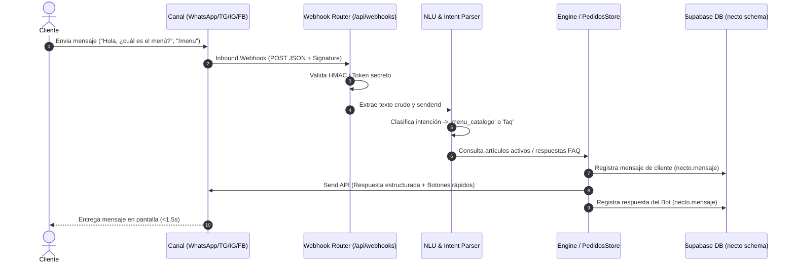

# Flujo 01: Catálogo y Consultas Frecuentes (FAQ)

## 1. Propósito del Flujo
Atender de forma automática y en tiempo real (< 1 segundo) las solicitudes de información general, ubicación, horarios de atención, métodos de pago y la consulta del menú/catálogo de productos por parte de clientes en cualquier canal integrado (WhatsApp, Telegram, Instagram, Facebook).

---

## 2. Diagrama de Secuencia



---

## 3. Especificación Detallada de ENTRADAS (Qué Entra)

### 3.1 Evento de Webhook Entrante (Inbound Event)
- **Canal de Ingreso:** `whatsapp`, `telegram`, `instagram`, `facebook`.
- **Firma / Seguridad:** `X-Hub-Signature-256` (Meta) o `X-Telegram-Bot-Api-Secret-Token` (Telegram).
- **Ejemplo Payload Entrante (WhatsApp / Meta Cloud API):**

```json
{
  "object": "whatsapp_business_account",
  "entry": [
    {
      "id": "100200300400500",
      "changes": [
        {
          "value": {
            "messaging_product": "whatsapp",
            "metadata": {
              "display_phone_number": "573145376069",
              "phone_number_id": "987654321"
            },
            "contacts": [
              {
                "profile": { "name": "Mariana Reyes" },
                "wa_id": "573001234567"
              }
            ],
            "messages": [
              {
                "from": "573001234567",
                "id": "wamid.HBgMNTczMDAxMjM0NTY3FQIAERgSQjE2RDM5QjY0RjI3RTk4NkEwAA==",
                "timestamp": "1758810000",
                "type": "text",
                "text": { "body": "Hola, ¿qué productos tienen disponibles hoy?" }
              }
            ]
          },
          "field": "messages"
        }
      ]
    }
  ]
}
```

### 3.2 Campos Extraídos y Normalizados
| Campo Extrayente | Tipo | Valor de Ejemplo | Descripción / Regla |
|---|---|---|---|
| `canal` | enum | `'whatsapp'` | Canal por el que ingresa el paquete. |
| `senderId` | string | `'573001234567'` | Número E.164 canónico. |
| `senderName` | string | `'Mariana Reyes'` | Nombre público de la cuenta. |
| `messageId` | string | `'wamid.HBgM...'` | ID único para deduplicación idempotente (7 días). |
| `cuerpoTexto` | string | `'Hola, ¿qué productos tienen...'` | Texto procesable por el motor NLU. |

---

## 4. Procesamiento Interno y Reglas de Negocio

1. **Verificación de Idempotencia:** Se comprueba si `messageId` ya existe en `necto.mensaje`. Si existe, se descarta con HTTP 200 sin reprocesar.
2. **Normalización de Contacto:** Se busca en `necto.contacto` por `telefono_norm`. Si no existe, se inserta la entidad cliente.
3. **Máquina de Estados de Hilo:** Se verifica si el hilo existe en `necto.conversacion`.
   - Si no existe, se crea con `estado: 'abierta'` y `modo_atencion: 'bot'`.
   - Si existe y `modo_atencion: 'humano'`, **el bot no responde automáticamente** (Silenciamiento por Handoff).
4. **Clasificación NLU:**
   - Detecta frases clave: *"menú"*, *"carta"*, *"precios"*, *"qué venden"*, *"categorías"*.
   - Asigna intención: `menu_catalogo`.
5. **Consulta de Catálogo:** Se obtienen los ítems activos desde el almacenamiento de productos disponibles (`PedidosStore` / catálogo maestro).

---

## 5. Especificación Detallada de SALIDAS (Qué Sale)

### 5.1 Mensaje Saliente al Cliente (Outbound API)
- **Formato:** Texto estructurado con viñetas, precios formateados en $COP y lista interactiva o botones rápidos.
- **Ejemplo Payload Saliente hacia API de Canal:**

```json
{
  "messaging_product": "whatsapp",
  "recipient_type": "individual",
  "to": "573001234567",
  "type": "interactive",
  "interactive": {
    "type": "button",
    "header": { "type": "text", "text": "🍔 Menú Necto" },
    "body": {
      "text": "¡Hola Mariana! 👋 Contamos con las siguientes opciones listas para preparar:\n\n1. Combo Hamburguesa Doble - $28.000\n2. Combo Clásico Pollo - $24.000\n3. Bebida Natural 500ml - $6.000\n\n¿Deseas armar tu pedido ahora?"
    },
    "footer": { "text": "ST&T Comercio Inteligente" },
    "action": {
      "buttons": [
        {
          "type": "reply",
          "reply": { "id": "BTN_CREAR_PEDIDO", "title": "🛒 Realizar Pedido" }
        },
        {
          "type": "reply",
          "reply": { "id": "BTN_HABLAR_ASESOR", "title": "👤 Asesor Humano" }
        }
      ]
    }
  }
}
```

### 5.2 Mutaciones en Base de Datos (Supabase Schema `necto`)
- **`necto.mensaje` (Mensaje de Cliente):**
  - `conversacion_id`: UUID del hilo.
  - `autor_tipo`: `'cliente'`.
  - `contenido`: `{ "texto": "Hola, ¿qué productos tienen disponibles hoy?" }`.
- **`necto.mensaje` (Mensaje de Bot):**
  - `conversacion_id`: UUID del hilo.
  - `autor_tipo`: `'bot'`.
  - `contenido`: `{ "texto": "¡Hola Mariana! Contamos con...", "payload": { "intent": "menu_catalogo" } }`.
- **`necto.conversacion`:**
  - `ultima_actividad`: Timestamp ISO 8601 actual.

### 5.3 Eventos en Tiempo Real (Supabase Realtime Channels)
- Publica en canal `necto:mensaje` el nuevo mensaje entrante y la respuesta del bot para actualizar la consola web de Necto en tiempo real sin recargar página.

---

## 6. Casos de Borde y Manejo de Errores

| Escenario de Error | Causa Raíz | Acción y Respuesta del Sistema |
|---|---|---|
| **Mensaje de audio enviado por cliente** | El usuario envió nota de voz preguntando por el menú. | El servicio extrae el audio, invoca transcripción automática (Whisper/Node), convierte a texto y lo procesa por el flujo regular NLU. |
| **Error en la API del Proveedor** | Timeout o fallo 50x en Meta Cloud API. | Reintento automático con backoff exponencial (máx 3 intentos). Si persiste, se registra alerta en `necto.evento_sistema`. |
| **Cliente en atención por Asesor Humano** | `modo_atencion == 'humano'`. | No se emite respuesta automática. El mensaje del cliente se entrega en directo a la bandeja del operador. |
