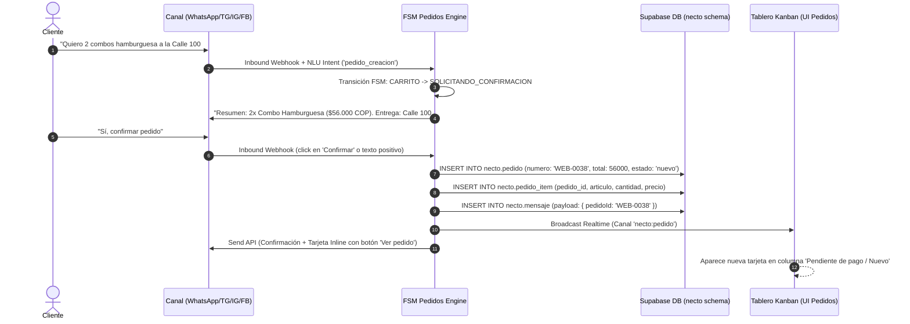
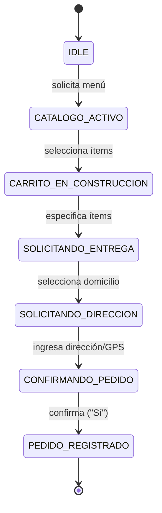

# Flujo 02: Creación Conversacional y Confirmación de Pedidos

## 1. Propósito del Flujo
Guiar al cliente paso a paso desde la selección de artículos hasta la confirmación de la orden en el chat, registrando una orden transaccional completa en la base de datos (`necto.pedido`), generando una tarjeta de pedido inline dentro de la conversación y sincronizando de inmediato el tablero Kanban de atención/despacho.

---

## 2. Diagrama de Secuencia



---

## 3. Especificación Detallada de ENTRADAS (Qué Entra)

### 3.1 Mensajes de Selección de Productos y Confirmación
- **Entrada 1 (Selección / Armado):** Texto con productos, cantidades o click en botones interactivos.
- **Entrada 2 (Datos de Entrega):** Texto con dirección física (`"Calle 100 # 15-20, Apto 402"`) o envío de pin de localización geográfica (GPS `latitude`, `longitude`).
- **Entrada 3 (Confirmación):** Respuesta afirmativa (`"Sí"`, `"Confirmar"`, `"Acepto"`) o respuesta a botón interactivo con payload `CONFIRMAR_ORDEN`.

### 3.2 Ejemplo Payload Entrante (Pin de Ubicación GPS en WhatsApp):

```json
{
  "from": "573145376069",
  "id": "wamid.HBgMNTczMTQ1Mzc2MDY5...",
  "timestamp": "1758810500",
  "type": "location",
  "location": {
    "latitude": 4.68352,
    "longitude": -74.04321,
    "name": "Calle 100 # 15-20",
    "address": "Bogotá, Cundinamarca, Colombia"
  }
}
```

---

## 4. Procesamiento Interno y FSM de Pedidos



### Reglas de Validación Transaccional:
1. **Congelamiento de Precios:** Los precios de los artículos se capturan desde la lista oficial al momento de la confirmación y se persisten en `necto.pedido_item` sin alterarse por cambios futuros del catálogo.
2. **Generación de Consecutivo:** El backend invoca la función secuencial `nextval('necto.pedido_seq')` para emitir el identificador único con prefijo `WEB-XXXX` (ej. `WEB-0038`).
3. **Estado Inicial Mandatorio:** Todo pedido iniciado por chat ingresa con `estado: 'nuevo'`, `modalidad: 'domicilio'` (o `'retiro'`) y `pagado: false`.

---

## 5. Especificación Detallada de SALIDAS (Qué Sale)

### 5.1 Mensaje Saliente con Tarjeta de Pedido Inline (Outbound API)
- **Cuerpo del Mensaje enviado al cliente:**

```json
{
  "messaging_product": "whatsapp",
  "to": "573145376069",
  "type": "interactive",
  "interactive": {
    "type": "button",
    "header": { "type": "text", "text": "✅ ¡Pedido Confirmado!" },
    "body": {
      "text": "Tu pedido *WEB-0038* ha sido registrado exitosamente.\n\n📋 *Resumen de la Orden:*\n• 2x Combo Hamburguesa Doble ($56.000)\n\n📍 *Entrega:* Calle 100 # 15-20\n💰 *Total:* $56.000 COP\n💳 *Estado:* Pendiente de pago\n\nNuestro equipo iniciará la preparación de inmediato."
    },
    "action": {
      "buttons": [
        {
          "type": "reply",
          "reply": { "id": "BTN_ESTADO_WEB-0038", "title": "🔍 Estado del pedido" }
        }
      ]
    }
  }
}
```

### 5.2 Estructura del Objeto Persistido en `necto.pedido`

```json
{
  "id": "e4a1b2c3-9876-4321-8888-123456789abc",
  "organizacion_id": "00000000-0000-0000-0000-000000000001",
  "numero": "WEB-0038",
  "cliente_nombre": "Jessy Quinto",
  "cliente_telefono": "+573145376069",
  "modalidad": "domicilio",
  "direccion": "Calle 100 # 15-20",
  "total": 56000,
  "estado": "nuevo",
  "pagado": false,
  "origen_canal": "whatsapp",
  "creado_en": "2026-09-25T09:45:00-05:00"
}
```

### 5.3 Renderizado en la Consola Web (ChatView Adaptativo)
En la consola de Necto, el mensaje del bot adjunta la clave `payload: { pedidoId: 'WEB-0038' }`. El componente `ChatView.tsx` detecta esta clave y dibuja de forma automática la **Tarjeta Interactiva Inline**:
- Encabezado con badge distintivo `WEB-0038`.
- Indicador de estado `nuevo` (color lavanda/índigo).
- Total formateado en `$56.000 COP`.
- Badge de pago `Pendiente`.
- Botón directo `"Ver pedido"` que abre el modal de detalle transaccional.

---

## 6. Invariantes de Consistencia del Flujo

| ID | Regla / Invariante | Cumplimiento |
|---|---|---|
| **C7** | Desacoplamiento de Pago | El estado de pago se gestiona exclusivamente en la entidad `necto.pedido.pagado`. La conversación nunca se marca como "pagada". |
| **C10** | Trazabilidad Inmutable | La asociación `payload.pedidoId` dentro del mensaje del bot es de solo lectura una vez emitida; garantiza audibilidad histórica. |
