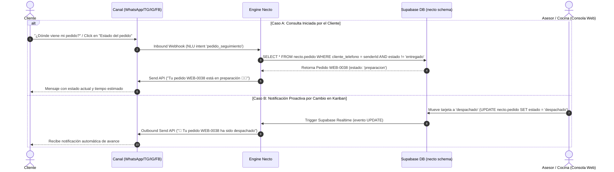

# Flujo 03: Seguimiento y Consulta de Estado de Pedidos

## 1. Propósito del Flujo
Permitir a los clientes consultar en cualquier momento el estado en tiempo real de su orden activa (*nuevo*, *preparacion*, *listo*, *despachado*, *entregado*), así como notificar proactivamente al cliente en su chat cuando el equipo de operaciones actualiza el estado de la orden desde el Tablero Kanban.

---

## 2. Diagrama de Secuencia



---

## 3. Especificación Detallada de ENTRADAS (Qué Entra)

### 3.1 Petición de Consulta por el Cliente
- **Texto libre:** `"¿Cómo va mi orden?"`, `"¿Dónde está el repartidor?"`, `"¿Ya enviaron mi comida?"`.
- **Botón Interactivo:** Pulsar el botón `"🔍 Estado del pedido"` o `"BTN_ESTADO_WEB-0038"`.
- **Identificador de búsqueda:** Se utiliza el `senderId` (teléfono E.164, `chat_id`, `IGSID` o `PSID`) o el número explicito `WEB-XXXX` si el usuario lo menciona en el texto.

### 3.2 Evento Realtime de Cambio de Estado en Consola (Operaciones)
- **Evento PostgreSQL Trigger:** `UPDATE ON necto.pedido`.
- **Payload interno capturado por el gateway:**

```json
{
  "event": "UPDATE",
  "table": "pedido",
  "schema": "necto",
  "record": {
    "numero": "WEB-0038",
    "cliente_telefono": "+573145376069",
    "estado": "despachado",
    "origen_canal": "whatsapp"
  },
  "old_record": {
    "estado": "listo"
  }
}
```

---

## 4. Procesamiento Interno y Mapeo de Estados

| Estado en DB (`necto.pedido.estado`) | Nombre Visible en Chat | Mensaje Explicativo Enviado al Cliente |
|---|---|---|
| `nuevo` | 🟡 Recibido | *"Tu pedido ha sido recibido y está pendiente de confirmación."* |
| `preparacion` | 👨‍🍳 En Preparación | *"Tu pedido está en cocina siendo preparado con los ingredientes más frescos."* |
| `listo` | ✅ Listo para Despacho | *"Tu pedido está listo y empaquetado aguardando asignación de repartidor."* |
| `despachado` | 🚀 En Camino | *"¡Tu pedido va en camino a tu dirección! El repartidor se encuentra en ruta."* |
| `entregado` | 🎉 Entregado | *"Tu pedido ha sido entregado con éxito. ¡Gracias por elegirnos!"* |
| `cancelado` | ❌ Cancelado | *"Tu pedido ha sido cancelado. Si tienes dudas, contáctanos."* |

---

## 5. Especificación Detallada de SALIDAS (Qué Sale)

### 5.1 Mensaje Notificación de Cambio de Estado (Outbound API)

```json
{
  "messaging_product": "whatsapp",
  "to": "573145376069",
  "type": "text",
  "text": {
    "body": "🚀 *Actualización de tu Pedido WEB-0038*\n\n¡Buenas noticias! Tu pedido ha sido *Despachado* y va en camino a *Calle 100 # 15-20*.\n\nTiempo estimado de entrega: 15-25 minutos. 🛵"
  }
}
```

### 5.2 Actualización Visual en Panel de Contexto (Consola Necto)
- En el panel lateral derecho del operador (`ContextPanel.tsx`), la pestaña **Pedidos** refresca en tiempo real el ícono y color del estado del pedido activo correspondiente a la conversación abierta.

---

## 6. Casos de Borde y Errores Comunes

1. **Cliente sin pedidos activos:** Si el cliente consulta por su orden pero no registra ninguna en estado pendiente, el bot responde: *"No encontramos ningún pedido activo asociado a tu número. ¿Deseas ver el catálogo para realizar una orden?"*.
2. **Múltiples pedidos activos:** Si el cliente posee más de un pedido en proceso, el bot lista las órdenes activas: *"Tienes 2 pedidos en curso: WEB-0038 (En camino) y WEB-0041 (Recibido). ¿De cuál deseas información?"*.
