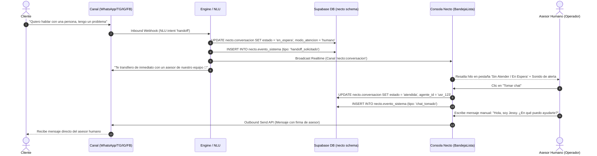
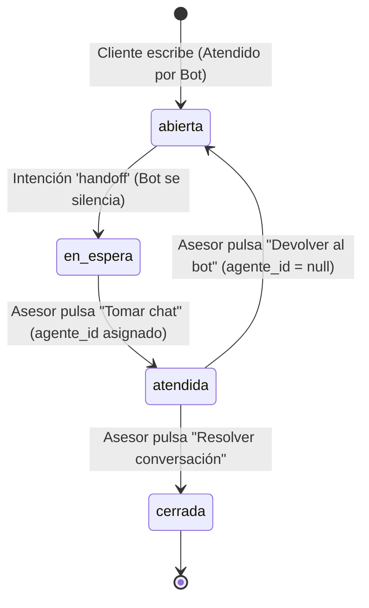

# Flujo 04: Escalado a Asesor Humano (Handoff) y Toma de Control

## 1. Propósito del Flujo
Garantizar una transición atómica, transparente y sin pérdida de contexto desde la atención automatizada por Inteligencia Artificial (Chatbot Necto) hacia un Asesor Humano de la mesa de ayuda, cuando el cliente lo solicita o cuando el bot detecta baja confianza en la respuesta.

---

## 2. Diagrama de Secuencia



---

## 3. Especificación Detallada de ENTRADAS (Qué Entra)

### 3.1 Disparadores del Handoff (Entradas)
- **Solicitud Directa del Cliente (Palabras Clave NLU):** `"hablar con un asesor"`, `"persona"`, `"humano"`, `"agente"`, `"soporte"`, `"queja"`, `"reclamo"`.
- **Botón Interactivo:** Pulsar el botón `"👤 Asesor Humano"` o `"BTN_HABLAR_ASESOR"`.
- **Incapacidad del Bot (Fall-back Threshold):** Cuando la IA califica su nivel de confianza por debajo de `0.6` tras 2 intentos consecutivos de consulta no resuelta.
- **Acción Manual del Asesor:** El operador fuerza la toma de un hilo desde la consola antes de que el cliente lo pida.

---

## 4. Procesamiento Interno y Máquina de Estados de Handoff

### Transiciones de Estado del Hilo (`necto.conversacion`):



### Reglas de Negocio Estrictas (Invariantes C3 y C4):
1. **Invariante C3 (Atención de Handoff):** Si `estado == 'atendida'`, la propiedad `modo_atencion` DEBE ser `'humano'` y `agente_id != null`. Si `modo_atencion == 'bot'`, `agente_id` DEBE ser `null`.
2. **Invariante C4 (Silenciamiento Estricto del Bot):** En cuanto la conversación entra en `en_espera` o `atendida`, **el bot queda deshabilitado para responder automáticamente** a cualquier mensaje de ese cliente hasta que el asesor devuelva el chat al bot o cierre el ticket.

---

## 5. Especificación Detallada de SALIDAS (Qué Sale)

### 5.1 Mensaje Saliente de Confirmación de Transferencia (al Cliente)

```json
{
  "messaging_product": "whatsapp",
  "to": "573001234567",
  "type": "text",
  "text": {
    "body": "🤝 Entendido. He transferido tu conversación a nuestro equipo de soporte.\n\nUn asesor se conectará contigo en un momento. Conservaremos el historial de tu consulta para no hacerte repetir información."
  }
}
```

### 5.2 Salida a la Consola Web del Operador
- **BandejaLista:** El hilo de conversación se mueve a la vista **"En espera"** con un distintivo visual rojo/naranja de urgencia y tiempo transcurrido.
- **Notificación Sonora:** Emisión de una alerta de audio discreta en la aplicación web del operador.
- **Burbuja de Asesor (ChatView):** Los mensajes que el operador redacte desde el compositor web se dibujan con fondo índigo de marca (`secondary-600`), alineados a la derecha y marcados como `"Asesor Humano"`.

### 5.3 Audit Log en `necto.evento_sistema`

```json
{
  "id": "f8921a44-1234-4321-9999-000000000000",
  "conversacion_id": "c1112223-3333-4444-5555-666677778888",
  "tipo_evento": "handoff_solicitado",
  "payload": {
    "motivo": "solicitud_cliente_texto",
    "texto_disparador": "Necesito hablar con una persona",
    "agente_anterior_id": null
  },
  "creado_en": "2026-09-25T09:46:00-05:00"
}
```

---

## 6. Casos de Borde

1. **Mensaje fuera del horario laboral:** Si el handoff se dispara fuera de la jornada de atención del comercio, el bot notifica: *"Actualmente nuestro equipo de asesores se encuentra fuera de horario laboral (Lunes a Sábado 8:00 AM - 6:00 PM). Hemos dejado tu caso registrado y te responderemos a primera hora."*
2. **Devolución al Bot:** Si el asesor resuelve el inconveniente puntual y pulsa **"Devolver al bot"**, la conversación regresa a `estado: 'abierta'`, `modo_atencion: 'bot'` y `agente_id: null`, reactivando las respuestas automáticas del bot.
