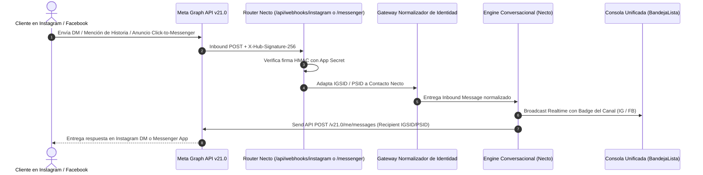

# Flujo 05: Ingesta y Atención Omnicanal (Instagram Direct & Facebook Messenger)

## 1. Propósito del Flujo
Especifíca la arquitectura de ingesta, normalización de identidades, renderizado en consola y envío de respuestas salientes para las interacciones provenientes de **Instagram Direct Messages** (DMs, Menciones de Historia) y **Facebook Messenger** (Anuncios Click-to-Messenger, carruseles de catálogo), utilizando Meta Graph API v21.0 y la infraestructura unificada de webhooks de Necto.

---

## 2. Arquitectura de Ingesta Unificada Meta



---

## 3. Especificación Detallada de ENTRADAS (Qué Entra)

### 3.1 Webhooks Entrantes de Meta Graph API v21.0

#### A. Inbound Webhook Instagram Direct (Story Mention / Respuesta a Historia):

```json
{
  "object": "instagram",
  "entry": [
    {
      "id": "17841400000000000",
      "time": 1758811000,
      "messaging": [
        {
          "sender": { "id": "9876543210123" },
          "recipient": { "id": "17841400000000000" },
          "timestamp": 1758811000,
          "message": {
            "mid": "m_1234567890",
            "text": "¡Hola! Vi esta hamburguesa en su historia, ¿tienen domicilio a la 100?",
            "reply_to": {
              "story": {
                "url": "https://instagram.cc/story_cdn_image.jpg",
                "id": "1800000000000"
              }
            }
          }
        }
      ]
    }
  ]
}
```

#### B. Inbound Webhook Facebook Messenger (Anuncio Click-to-Messenger Ads):

```json
{
  "object": "page",
  "entry": [
    {
      "id": "10987654321",
      "time": 1758811200,
      "messaging": [
        {
          "sender": { "id": "45678901234" },
          "recipient": { "id": "10987654321" },
          "timestamp": 1758811200,
          "message": {
            "mid": "m_fb_9988776655",
            "text": "Quiero aprovechar la promoción del anuncio",
            "referral": {
              "ref": "PROMO_COMBO_DOBLE",
              "source": "ADS",
              "type": "OPEN_THREAD",
              "ad_id": "6001122334455"
            }
          }
        }
      ]
    }
  ]
}
```

---

## 4. Normalización de Identidades (Invariante C8)

Para consolidar las conversaciones en una sola bandeja sin romper la integridad del sistema:

| Canal | Tipo de ID de Meta | Identificador Interno | Resolución de Perfil Público |
|---|---|---|---|
| **Instagram Direct** | `IGSID` (Instagram Scoped ID) | `ig:<igsid>` (ej. `ig:9876543210123`) | Llamada a `/v21.0/{IGSID}?fields=username,name,profile_pic` para obtener el `@handle`. |
| **Facebook Messenger** | `PSID` (Page Scoped ID) | `fb:<psid>` (ej. `fb:45678901234`) | Llamada a `/v21.0/{PSID}?fields=first_name,last_name,profile_pic`. |

---

## 5. Especificación Detallada de SALIDAS (Qué Sale)

### 5.1 Respuesta Saliente a Instagram Direct (Send API)

```json
{
  "recipient": { "id": "9876543210123" },
  "message": {
    "text": "¡Hola @mariana_reyes! 👋 Sí, tenemos domicilio en la Calle 100.\n\n¿Te gustaría revisar el menú o realizar tu pedido de una vez?",
    "quick_replies": [
      {
        "content_type": "text",
        "title": "📋 Ver Menú",
        "payload": "VER_MENU_IG"
      },
      {
        "content_type": "text",
        "title": "🛒 Hacer Pedido",
        "payload": "CREAR_PEDIDO_IG"
      }
    ]
  }
}
```

### 5.2 Respuesta Saliente a Facebook Messenger con Carrusel de Productos (Generic Template)

```json
{
  "recipient": { "id": "45678901234" },
  "message": {
    "attachment": {
      "type": "template",
      "payload": {
        "template_type": "generic",
        "elements": [
          {
            "title": "Combo Hamburguesa Doble",
            "image_url": "https://necto.app/images/combo-doble.jpg",
            "subtitle": "2 carnes 150g + Papas + Bebida por $28.000 COP",
            "buttons": [
              {
                "type": "postback",
                "title": "🛒 Pedir Combo",
                "payload": "ADD_COMBO_DOBLE"
              }
            ]
          },
          {
            "title": "Combo Clásico Pollo",
            "image_url": "https://necto.app/images/combo-pollo.jpg",
            "subtitle": "Pechuga crujiente + Papas + Bebida por $24.000 COP",
            "buttons": [
              {
                "type": "postback",
                "title": "🛒 Pedir Combo",
                "payload": "ADD_COMBO_POLLO"
              }
            ]
          }
        ]
      }
    }
  }
}
```

---

## 6. Distintivos Visuales en Consola Necto (UI & UX)

En la pantalla de la consola unificada (`BandejaLista.tsx`):
- **Conversación de Instagram:** Muestra el avatar del cliente, el handle `@usuario`, la insignia de canal con **gradiente morado-fucsia-naranja** oficial y previsualización del DM.
- **Conversación de Facebook Messenger:** Muestra el nombre del cliente, la insignia de canal en **azul Messenger corporativo** y la etiqueta del anuncio de origen si ingresó vía Facebook Ad.
