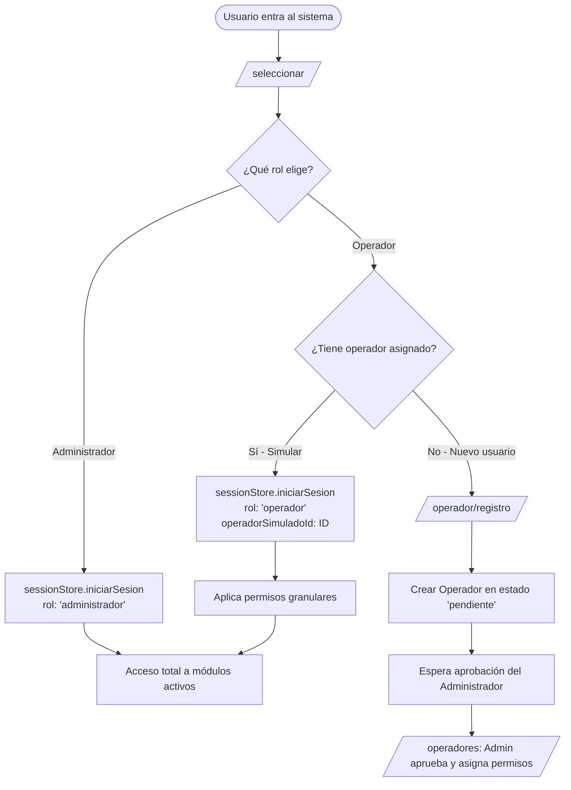

# Flujo de Inicio y Ciclo de Vida del Perfil

Este documento describe el punto de partida de la aplicación, el mecanismo de selección de sesión y el proceso de alta de operadores.

---

## 1. Punto de Entrada: `/seleccionar`

*Ubicación:* `packages/apps/web/modules/app/src/pages/seleccionar/SeleccionarPage.tsx`

Toda sesión de usuario comienza en la ruta `/seleccionar`. Esta pantalla actúa como despachador inicial antes de acceder a la aplicación principal (`/app` o las rutas de módulos).

### Pasos del flujo:
1. **Selección de Módulos**:
   El usuario escoge con cuáles módulos trabajará en la sesión:
   - `turnos` (Gestión de Colas y Turnos)
   - `agendamiento` (Citas y Profesionales)
2. **Selección de Rol**:
   - **Administrador**: Otorga permisos totales e inmediatos.
   - **Operador**: Abre dos alternativas:
     - **Simular un operador existente**: El usuario elige un operador del catálogo activo para ingresar con su contexto y restricciones.
     - **Solicitar acceso**: Enlace hacia el formulario de auto-registro (`/operador/registro`).

Al confirmar, se invoca `sessionStore.iniciarSesion(...)` y se redirige al primer módulo disponible.

---

## 2. Solicitud y Auto-registro: `/operador/registro`

*Ubicación:* `packages/apps/web/modules/app/src/pages/operador/OperadorRegistroPage.tsx`

Cuando un operador nuevo necesita acceso:

1. Ingresa a `/operador/registro`.
2. Completa los datos requeridos:
   - Nombre completo
   - Correo electrónico
   - Teléfono
   - Módulo objetivo (`turnos` o `agendamiento`)
3. Al enviar el formulario, el store `operadores.store.ts` crea una entidad con estado inicial **`"pendiente"`**:
   - Permisos iniciales vacíos: `permisos: []`
   - Sin colas asignadas: `colaIds: []`
4. El sistema muestra una confirmación notificando que la cuenta debe ser aprobada y configurada por un Administrador antes de poder operar.

---

## 3. Diagrama del Ciclo de Vida

