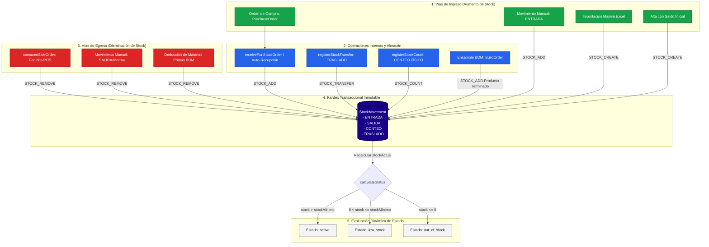

# 04. Flujo Completo de Inventario y Ciclo de Vida

Este documento describe con exactitud el ciclo de vida de los productos, materias primas, órdenes de compra y movimientos de stock en **StockFlow (Módulo Inventario)**.

---

## 4.1 Diagrama Global del Flujo de Inventario (Mermaid)



---

## 4.2 Flujos Operativos Paso a Paso

### Flujo 1: Aprovisionamiento de Proveedores (Compras)
```text
[Proveedor Cotizado]
       │
       ▼
[Crear PurchaseOrder (status: 'pending')]
       │
       ▼ (Llegada física del camión / pedido a bodega)
[receivePurchaseOrder(poId)]
       ├──► 1. Suma cantidad a 'stockActual' de cada producto
       ├──► 2. Actualiza 'costPrice' si el precio varió
       ├──► 3. Genera movimiento Kardex 'ENTRADA' (STOCK_ADD)
       └──► 4. Transiciona orden a 'received' con fecha y hora
```

---

### Flujo 2: Manufactura y Ensamble por Receta (BOM)
```text
[Definición de BuildOrder con lista de materiales BOM]
       │
       ▼
[Validación de Insumos: ¿stockActual >= required * quantity?]
       ├── NO ──► Lanza Error y cancela la orden sin alterar stock
       │
       └── SÍ
           ├──► 1. Deduce cada materia prima del catálogo
           ├──► 2. Genera movimientos Kardex 'SALIDA' (Consumo Ensamble)
           ├──► 3. Incrementa el producto terminado en 'stockActual'
           ├──► 4. Genera movimiento Kardex 'ENTRADA' (Producción Terminada)
           └──► 5. Marca la orden como 'completed'
```

---

### Flujo 3: Consumo de Existencias por Venta Omnicanal
```text
[Comanda de Pedidos pasa a EN_PREPARACION en Cocina/KDS]
       │
       ▼
[consumeSaleOrder({ orderId, items, channel })]
       ├──► 1. Busca coincidencias por ID, SKU o Nombre
       ├──► 2. Descuenta 'item.quantity' de 'stockActual'
       ├──► 3. Genera registro formal en Kardex 'SALIDA' (STOCK_REMOVE)
       │       con concept: "Venta Automática Pedido #{id}"
       └──► 4. Recalcula estado (active / low_stock / out_of_stock)
```

---

### Flujo 4: Auditoría y Ajuste por Conteo Físico
```text
[Auditor cuenta existencias físicas en bodega: countedStock]
       │
       ▼
[registerStockCount({ productId, countedStock, notes })]
       ├──► 1. Calcula diferencia: diff = countedStock - previousStock
       ├──► 2. Asigna stockActual = countedStock
       └──► 3. Genera registro 'CONTEO' (STOCK_COUNT) en Kardex
               especificando la diferencia neta y justificación
```

---

## 4.3 Algoritmo de Cálculo de Estado del Producto

La función pura `calculateStatus(stockActual: number, stockMinimo: number): ProductStatus` en `inventoryService.ts` rige el semáforo del inventario:

```typescript
if (stockActual <= 0) {
  return "out_of_stock"; // Agotado: Requiere compra urgente o pausa de venta
}
if (stockActual <= stockMinimo) {
  return "low_stock";    // Stock Bajo: Punto de reorden alcanzado
}
return "active";         // Activo / Óptimo: Existencias suficientes
```
