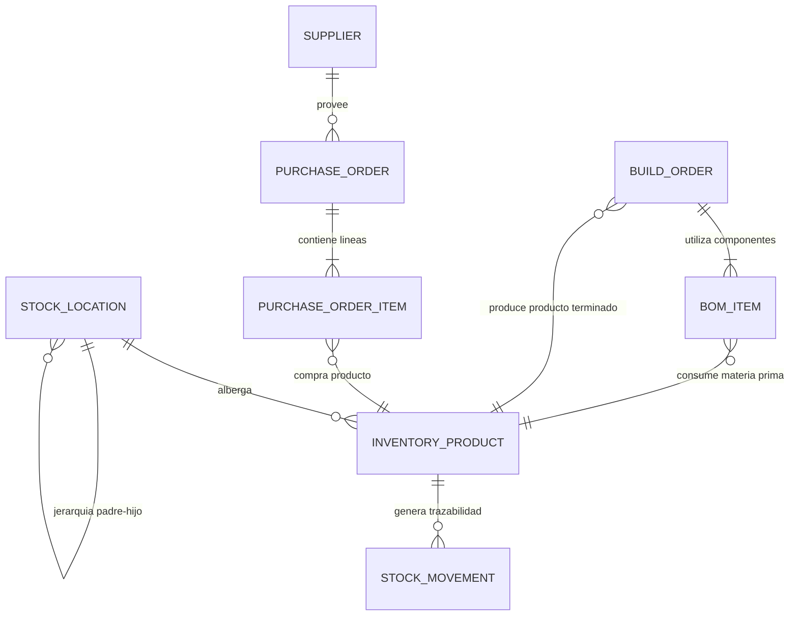

# 06. Modelo de Datos del Módulo Inventario

Este documento especifica en detalle todas las entidades, interfaces TypeScript, esquemas de metadatos dinámicos y estructuras de persistencia del módulo **Inventario** de **StockFlow**.

---

## 6.1 Diagrama Entidad-Relación (Mermaid)



---

## 6.2 Entidades e Interfaces TypeScript

Ubicación del código fuente: `packages/apps/web/modules/app/src/ModuloInventario/types/inventory.types.ts`.

### 1. Entidad `InventoryProduct` (Producto Maestro)

| Campo | Tipo | Obligatorio | Descripción |
|---|---|---|---|
| `id` | `string` | Sí | Identificador alfanumérico único (ej. `"prod-001"`). |
| `sku` | `string` | Sí | Código de referencia de almacén (Stock Keeping Unit). |
| `ipn` | `string` | No | Internal Part Number (código de parte de ingeniería). |
| `name` | `string` | Sí | Nombre descriptivo del producto o material. |
| `category` | `string` | Sí | Clasificación taxonómica (ej. `"Carnes"`, `"Bebidas"`). |
| `productType` | `ProductType` | Sí | Tipo de producto para metadatos dinámicos. |
| `costPrice` | `number` | Sí | Precio de costo unitario de adquisición o producción. |
| `salePrice` | `number` | Sí | Precio de venta unitario al público. |
| `unit` | `UnitOfMeasure` | Sí | Unidad de medida (`UND`, `KG`, `LT`, etc.). |
| `stockActual` | `number` | Sí | Saldo físico de existencias disponibles. |
| `stockMinimo` | `number` | Sí | Umbral crítico de punto de reorden. |
| `locationId` | `string` | Sí | ID de la bodega física asignada. |
| `locationName` | `string` | Sí | Nombre legible de la bodega asignada. |
| `barcode` | `string` | No | Código de barras estándar (EAN-13 / UPC). |
| `supplier` | `string` | No | Nombre del proveedor habitual. |
| `imageUrl` | `string` | No | Fotografía del producto. |
| `metadata` | `Record<string, any>`| Sí | Atributos dinámicos JSONB según el `productType`. |
| `status` | `ProductStatus` | Sí | `"active"`, `"inactive"`, `"low_stock"`, `"out_of_stock"`. |
| `createdAt` | `string` | Sí | Fecha ISO de creación. |
| `updatedAt` | `string` | Sí | Fecha ISO de última modificación. |

---

### 2. Entidad `StockMovement` (Asiento de Kardex)

```typescript
export interface StockMovement {
  id: string;               // Identificador único del movimiento
  productId: string;        // ID del producto afectado
  productSku: string;       // SKU en el momento del movimiento
  productName: string;      // Nombre histórico del producto
  type: MovementType;       // "ENTRADA" | "SALIDA" | "CONTEO" | "TRASLADO"
  action: StockTrackingAction; // "STOCK_ADD" | "STOCK_REMOVE" | "STOCK_COUNT" | "STOCK_TRANSFER" | "STOCK_CREATE"
  quantity: number;         // Cantidad neta operada
  previousStock: number;    // Balance anterior
  newStock: number;         // Balance resultante
  fromLocation?: string;    // Bodega origen (en salidas o traslados)
  toLocation?: string;      // Bodega destino (en entradas o traslados)
  concept: string;          // Motivo descriptivo del movimiento
  referenceDoc?: string;    // Factura, OC o ID de Comanda de Venta
  timestamp: string;        // Fecha y hora ISO exacta
  author: string;           // Usuario responsable del movimiento
  notes?: string;           // Observaciones adicionales
  batchCode?: string;       // Código de lote
}
```

---

### 3. Entidad `StockLocation` (Bodegas y Sedes)

```typescript
export interface StockLocation {
  id: string;               // Identificador único (ej. "loc-001")
  name: string;             // Nombre (ej. "Almacén Central")
  code: string;             // Código corto (ej. "BOD-101")
  description?: string;     // Descripción de uso
  parentLocationId?: string | null; // Ubicación padre para jerarquías
  itemsCount?: number;      // Total de SKUs alojados en la bodega
}
```

---

### 4. Entidades de Compras (`Supplier`, `PurchaseOrder`)

```typescript
export interface Supplier {
  id: string;
  name: string;
  taxId: string;            // NIT o RUT fiscal
  contactPerson: string;
  email: string;
  phone: string;
  leadTimeDays: number;     // Días promedio de entrega
  rating?: number;          // Puntuación del proveedor (1-5)
}

export interface PurchaseOrderItem {
  productId: string;
  productSku: string;
  productName: string;
  quantity: number;
  unitPrice: number;
  unit: UnitOfMeasure;
}

export interface PurchaseOrder {
  id: string;
  orderNumber: string;      // Ej. "OC-2026-451"
  supplierId: string;
  supplierName: string;
  targetLocationId: string;
  targetLocationName: string;
  status: "draft" | "pending" | "received" | "cancelled";
  items: PurchaseOrderItem[];
  totalAmount: number;
  issueDate: string;
  expectedDate?: string;
  receivedDate?: string;
  notes?: string;
}
```

---

### 5. Entidades de Manufactura (`BuildOrder`, `BomItem`)

```typescript
export interface BomItem {
  id: string;
  componentProductId: string; // ID de la materia prima
  componentSku: string;
  componentName: string;
  quantityRequired: number;   // Cantidad consumida por unidad fabricada
  unit: UnitOfMeasure;
}

export interface BuildOrder {
  id: string;
  buildNumber: string;        // Ej. "BOM-ENS-821"
  outputProductId: string;    // ID del producto final que se creará
  outputProductSku: string;
  outputProductName: string;
  quantityToBuild: number;    // Unidades totales a fabricar
  status: "pending" | "in_progress" | "completed" | "cancelled";
  bom: BomItem[];             // Lista de materiales componentes
  locationId: string;
  locationName: string;
  createdAt: string;
  completedAt?: string;
  notes?: string;
}
```

---

## 6.3 Tipos Enumerados del Dominio

* **`ProductType`**: `"standard"` | `"perishable"` | `"apparel"` | `"electronics"` | `"pharma"` | `"raw_material"`
* **`UnitOfMeasure`**: `"UND"` | `"KG"` | `"GR"` | `"LT"` | `"ML"` | `"METRO"` | `"CAJA"` | `"PAR"` | `"PAQUETE"` | `"ROLLO"`
* **`ProductStatus`**: `"active"` | `"inactive"` | `"low_stock"` | `"out_of_stock"`
* **`MovementType`**: `"ENTRADA"` | `"SALIDA"` | `"CONTEO"` | `"TRASLADO"`
* **`StockTrackingAction`**: `"STOCK_ADD"` | `"STOCK_REMOVE"` | `"STOCK_COUNT"` | `"STOCK_TRANSFER"` | `"STOCK_CREATE"`

---

## 6.4 Esquema DynamoDB Cloud (`Inventarios@Table`)

* **`pk`**: `OWNER#{ownerId}`
* **`sk`**: `ITEM#{itemId}` o `TEMPLATE#{templateId}`
* **Estructura del Ítem Cloud**:
  * `id`, `code`, `name`, `category`, `clientName`, `status`, `condition`, `location`, `evidenceCount`, `evidenceType`, `notes`, `lastUpdated`, `createdAt`.
