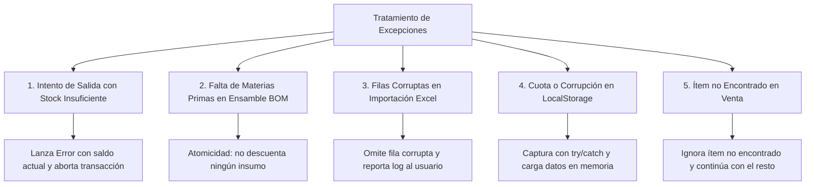

# 10. Manejo de Errores y Excepciones del Módulo Inventario

Este documento describe cómo **StockFlow (Módulo Inventario)** previene, captura y recupera fallos de validación, errores de concurrencia y anomalías operativas.

---

## 10.1 Casos de Error y Estrategias de Mitigación



---

## 10.2 Detalle de Excepciones Implementadas

### 1. Salidas Manuales Mayores a las Existencias
* **Escenario**: Un bodeguero intenta dar salida a 20 unidades cuando el sistema registra 15.
* **Comportamiento**:
  * `inventoryService.registerMovement` detecta `previousStock < quantity`.
  * Arroja un error:
    ```text
    "Stock insuficiente. Stock actual: 15 UND, intentando retirar: 20 UND"
    ```
  * El hook `useInventory` captura el error, fija `setError(message)` y lo despliega en un banner de alerta rojo en la interfaz. El estado físico permanece intacto.

---

### 2. Rotura de Stock durante la Fabricación (BOM)
* **Escenario**: Se intenta fabricar 10 combos, pero solo hay insumos suficientes para 8.
* **Comportamiento**:
  * `executeBuildOrder` ejecuta un bucle preliminar de inspección antes de modificar cualquier registro.
  * Si algún insumo no alcanza el total requerido (`quantityRequired * quantityToBuild`), lanza inmediatamente:
    ```text
    "Stock insuficiente para el insumo [Nombre]. Requiere: 10 KG, disponible: 8 KG"
    ```
  * Ninguna materia prima es descontada y el producto terminado no se incrementa, evitando inventarios a medio fabricar.

---

### 3. Recuperación ante Fallas de Almacenamiento Local (LocalStorage)
* **Escenario**: La cuota del navegador se agota (5MB excedidos) o el JSON guardado en el navegador se corrompe.
* **Comportamiento**:
  * El constructor `init()` de `inventoryService` encapsula todas las lecturas de `localStorage` en bloques `try/catch`.
  * Si `JSON.parse` falla o el almacenamiento está bloqueado por políticas del navegador, emite un `console.warn` y carga automáticamente los datos semilla en memoria (`INITIAL_PRODUCTS_MOCK`, `STOCK_LOCATIONS_MOCK`).
  * La aplicación sigue funcionando con normalidad en memoria sin interrumpir la operación del negocio.

---

### 4. Tolerancia en Consumo de Ventas (`consumeSaleOrder`)
* **Escenario**: Llega una comanda de venta con un producto que fue borrado del inventario.
* **Comportamiento**:
  * `consumeSaleOrder` busca el producto en un ciclo seguro: si `pIndex === -1`, simplemente omite dicho ítem y continúa procesando el resto de los platos de la comanda.
  * No lanza una excepción fatal que bloquee la comanda de venta en cocina.
