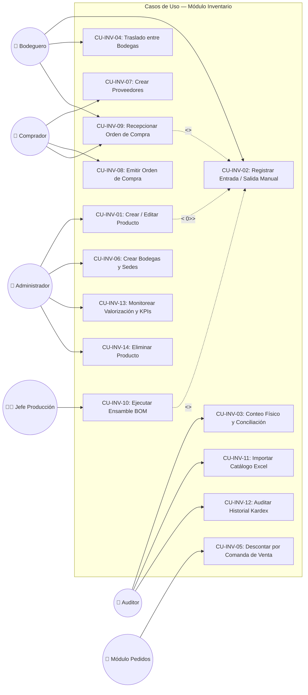

# Diagrama UML de Casos de Uso del Módulo Inventario

Este documento presenta el diagrama UML de casos de uso de **StockFlow (Módulo Inventario)**, modelando las interacciones entre los actores y las funcionalidades operativas del ERP.

---

## Diagrama UML de Casos de Uso (Mermaid)

---

## Matriz de Cobertura: Actores vs. Casos de Uso

| Caso de Uso | Bodeguero | Auditor | Comprador | Jefe Prod | Admin | Módulo Pedidos |
|---|:---:|:---:|:---:|:---:|:---:|:---:|
| **CU-01: Crear/Editar Producto** | | | | | **X** | |
| **CU-02: Entrada/Salida Manual** | **X** | | | | **X** | |
| **CU-03: Conteo Físico** | | **X** | | | | |
| **CU-04: Traslado entre Bodegas** | **X** | | | | **X** | |
| **CU-05: Descuento por Ventas** | | | | | | **X** |
| **CU-06: Crear Bodegas** | | | | | **X** | |
| **CU-07: Crear Proveedores** | | | **X** | | **X** | |
| **CU-08: Orden de Compra (PO)** | | | **X** | | **X** | |
| **CU-09: Recepcionar Compra** | **X** | | **X** | | | |
| **CU-10: Ejecutar Ensamble BOM**| | | | **X** | | |
| **CU-11: Importar Excel** | | **X** | | | **X** | |
| **CU-12: Auditar Kardex** | | **X** | | | **X** | |
| **CU-13: Valorización y KPIs** | | **X** | | | **X** | |
| **CU-14: Eliminar Producto** | | | | | **X** | |
