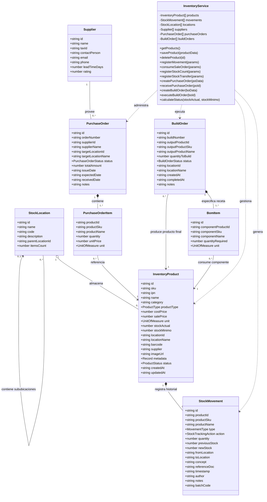

# Diagrama UML de Clases del Módulo Inventario

Este documento presenta el diagrama UML de clases y entidades de **StockFlow (Módulo Inventario)**, modelando los atributos, métodos, relaciones y cardinalidades que existen en `packages/apps/web/modules/app/src/ModuloInventario/types/inventory.types.ts`.

---

## Diagrama UML de Clases (Mermaid)

---

## Enumeraciones y Tipos Literales

* **`ProductType`**: `"standard"` | `"perishable"` | `"apparel"` | `"electronics"` | `"pharma"` | `"raw_material"`
* **`UnitOfMeasure`**: `"UND"` | `"KG"` | `"GR"` | `"LT"` | `"ML"` | `"METRO"` | `"CAJA"` | `"PAR"` | `"PAQUETE"` | `"ROLLO"`
* **`ProductStatus`**: `"active"` | `"inactive"` | `"low_stock"` | `"out_of_stock"`
* **`MovementType`**: `"ENTRADA"` | `"SALIDA"` | `"CONTEO"` | `"TRASLADO"`
* **`StockTrackingAction`**: `"STOCK_ADD"` | `"STOCK_REMOVE"` | `"STOCK_COUNT"` | `"STOCK_TRANSFER"` | `"STOCK_CREATE"`
* **`PurchaseOrderStatus`**: `"draft"` | `"pending"` | `"received"` | `"cancelled"`
* **`BuildOrderStatus`**: `"pending"` | `"in_progress"` | `"completed"` | `"cancelled"`
