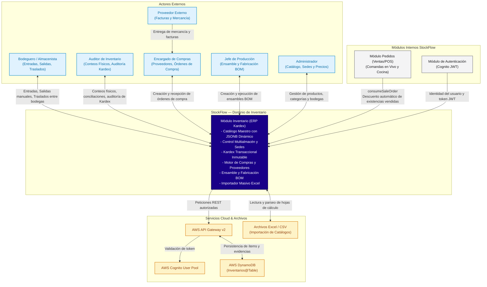

# Diagrama de Contexto del Módulo Inventario

Este documento presenta el diagrama de contexto del módulo **Inventario** dentro de **StockFlow**, delimitando sus límites con los actores humanos, módulos hermanos del sistema y servicios cloud.

---

## Diagrama de Contexto (Mermaid)

---

## Flujo de Información de Contexto

1. **Venta Directa**: El módulo `Pedidos` consume automáticamente el inventario mediante el método `consumeSaleOrder`, garantizando que las ventas por WhatsApp o mostrador se descuenten inmediatamente del Kardex.
2. **Cadena de Suministro**: El **Encargado de Compras** genera órdenes para los **Proveedores**, y el **Bodeguero** da ingreso a la mercancía al momento de su recepción física.
3. **Producción**: El **Jefe de Producción** transforma materias primas en productos finales a través de listas de materiales (BOM).
4. **Gobernanza y Persistencia**: El **Auditor** y el **Administrador** concilian saldos físicos contra saldos contables, con soporte de almacenamiento local y replicación hacia **AWS DynamoDB**.
