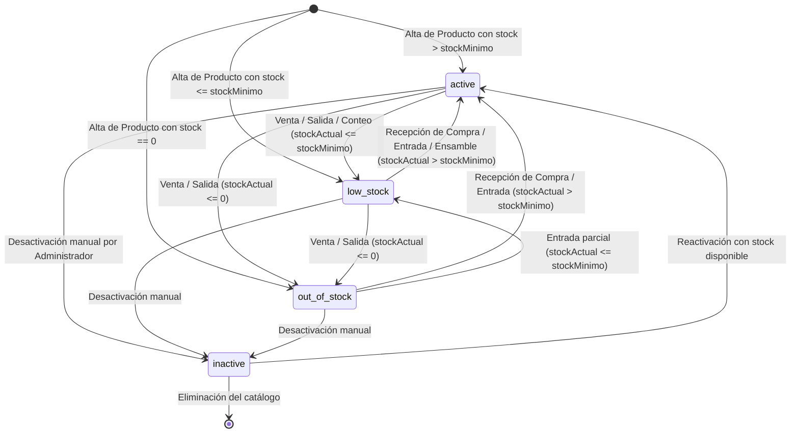
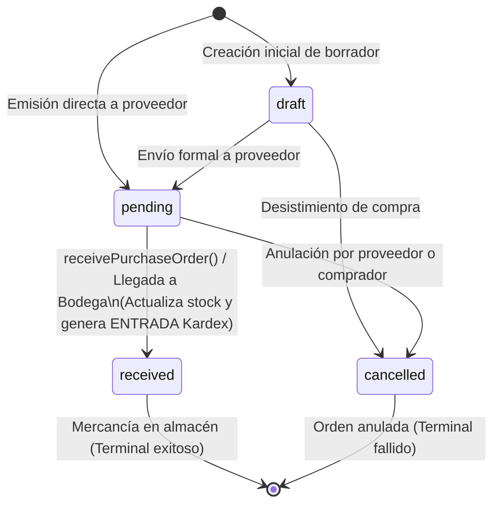
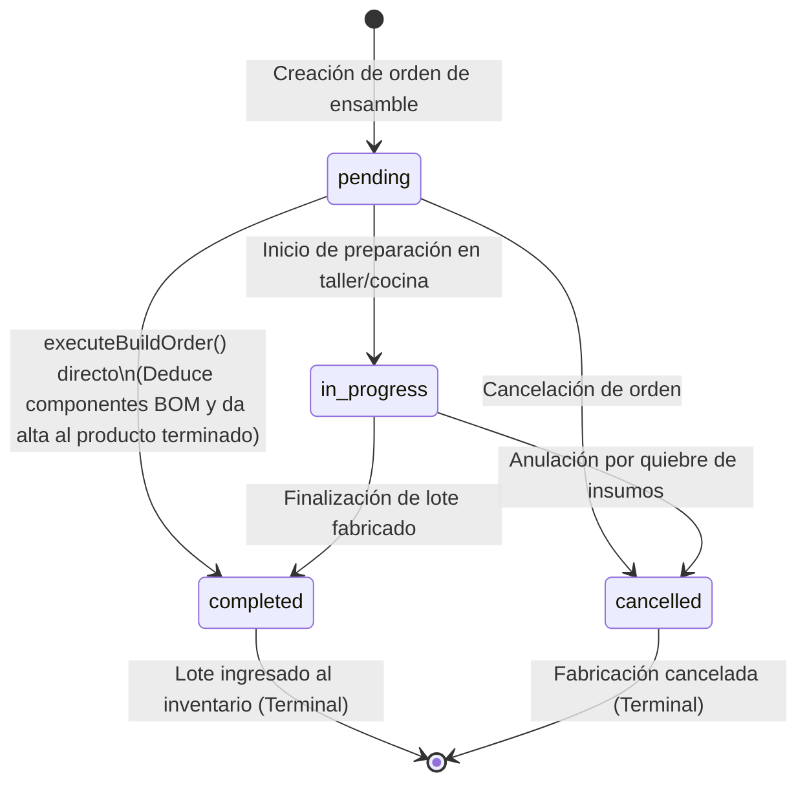

# Diagramas UML de Máquinas de Estados del Módulo Inventario

Este documento presenta los diagramas de estados UML para las entidades con ciclo de vida dinámico en **StockFlow (Módulo Inventario)**:
1. Máquina de Estados del **Producto en Inventario** (`ProductStatus`).
2. Máquina de Estados de la **Orden de Compra a Proveedor** (`PurchaseOrderStatus`).
3. Máquina de Estados de la **Orden de Fabricación / Ensamble** (`BuildOrderStatus`).

---

## 1. Máquina de Estados del Producto (`ProductStatus`)

Rige la disponibilidad y semáforo operativo de cada SKU en el catálogo.

### Tabla de Transiciones del Producto:

| Estado Actual | Evento / Condición | Estado Resultante | Efecto en StockFlow |
|---|---|---|---|
| `active` | `stockActual <= stockMinimo` | `low_stock` | Insignia amarilla de alerta en catálogo y sugerencia de compra. |
| `active` o `low_stock` | `stockActual <= 0` | `out_of_stock` | Insignia roja de agotado; activa `autoPauseOnStockOut` en Pedidos. |
| Cualquiera | Desactivación por Administrador | `inactive` | Oculto de la venta al público y canales externos. |
| `out_of_stock` | Recepción de mercancía (`STOCK_ADD`) | `active` / `low_stock` | Desbloqueo automático para venta en WhatsApp y mostrador. |

---

## 2. Máquina de Estados de la Orden de Compra (`PurchaseOrderStatus`)

Gobierna el aprovisionamiento de insumos desde proveedores externos.

---

## 3. Máquina de Estados de la Orden de Fabricación (`BuildOrderStatus`)

Gobierna la transformación de materias primas a producto terminado (BOM).

