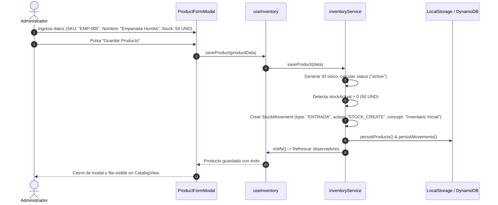
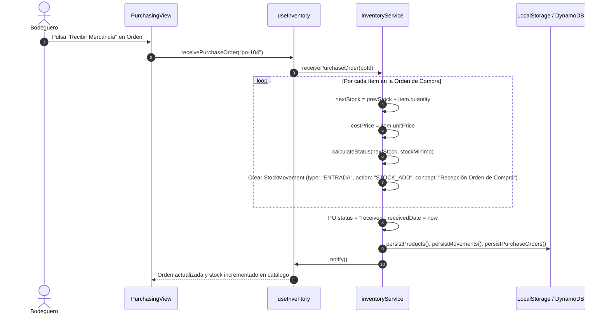
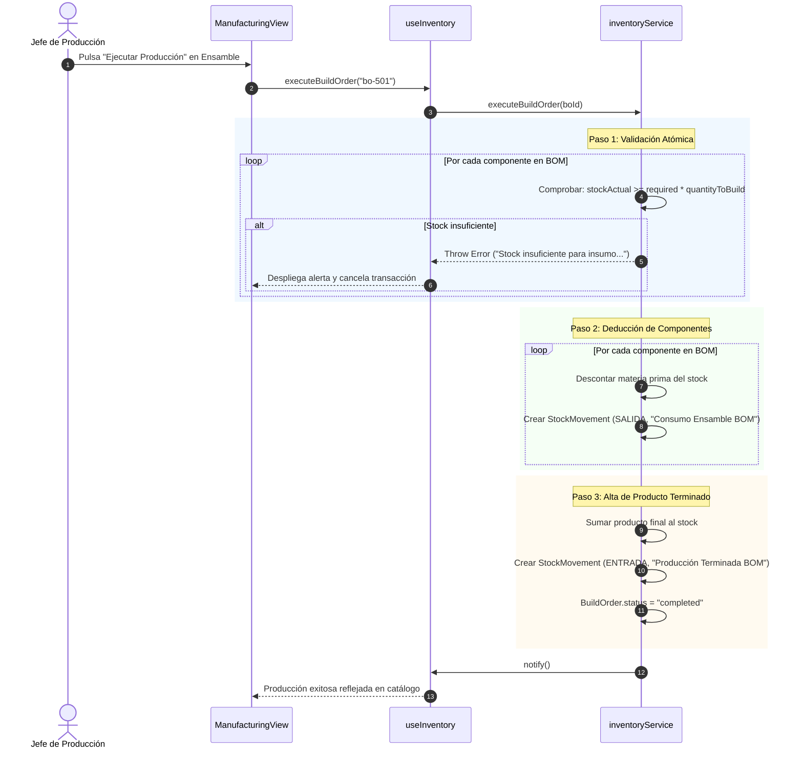
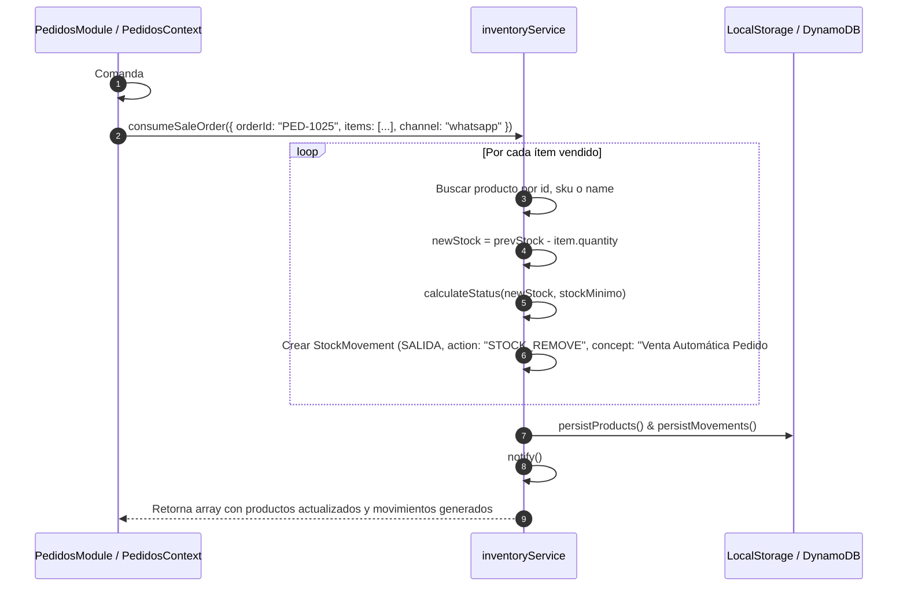
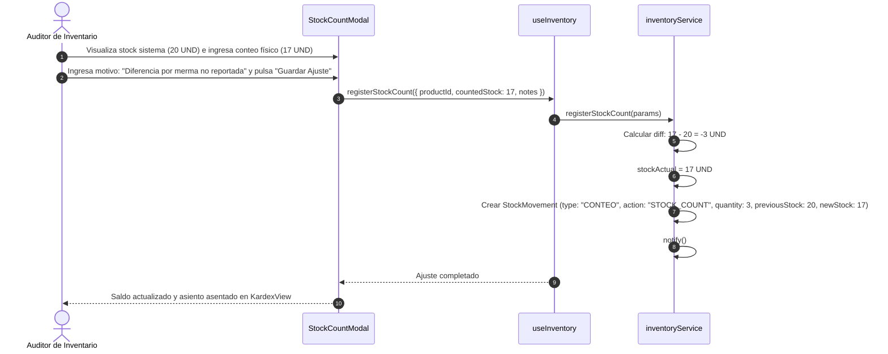

# Diagramas UML de Secuencia del Módulo Inventario

Este documento presenta los diagramas de secuencia UML para los flujos operativos más críticos de **StockFlow (Módulo Inventario)**.

---

## Flujo 1: Creación de Producto con Balance Inicial

Muestra la creación de un nuevo SKU y el asiento automático de apertura en el Kardex.

---

## Flujo 2: Recepción de Orden de Compra a Proveedor

Muestra la llegada física de mercancía y el ingreso automático al stock y Kardex.

---

## Flujo 3: Fabricación y Ensamble por Receta (BOM)

Muestra la validación atómica y transformación de materias primas a producto terminado.

---

## Flujo 4: Descuento Automático por Venta Omnicanal (`Pedidos`)

Muestra el enlace transaccional donde una comanda de WhatsApp o mostrador descuenta inventario.

---

## Flujo 5: Conteo Físico y Conciliación de Auditoría

Muestra la reconciliación entre el stock contado en bodega y el saldo contable del sistema.

