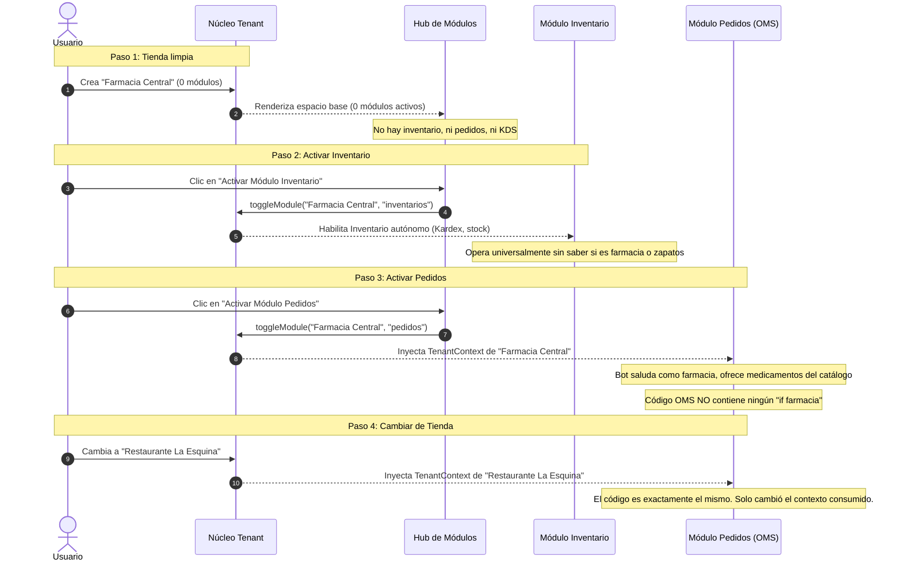

# 01 — Modelo Conceptual: Tenant + Módulos Plug & Play

Este documento describe la relación estructural entre el **Tenant (Tienda)** y los **Módulos de Negocio** en Necto.

---

## 1. La Tienda como Contenedor Neutral (Tenant)

En Necto, una **Tienda** no es un software de restaurante ni un software de ferretería. Una tienda es un **límite de aislamiento multi-inquilino (Tenant Boundary)** que define:
- Un identificador único (`tenantId` o `businessId`).
- Un nombre comercial (`storeName`).
- Una ubicación y moneda contable (`currency`, `city`, `country`).
- Unos canales de comunicación habilitados (`whatsapp`, `web`, `pos`).
- Una lista de módulos activos (`activeModules: []`).

La tienda **no tiene preconcebido ningún flujo operativo** hasta que se le acoplan módulos.

---

## 2. El Espacio Base: 0 Módulos Instalados

Cuando un usuario completa el proceso de creación de tienda (Onboarding) y decide **no seleccionar ningún módulo**:

```
Tienda: "Farmacia Central"
Módulos Instalados: 0 de 6

[ Catálogo de Módulos Plug & Play ]
┌───────────────────────────────┐  ┌───────────────────────────────┐
│ Sistema de Pedidos Omnicanal  │  │ Control de Stock & Inventario │
│ [ Activar Módulo ]            │  │ [ Activar Módulo ]            │
└───────────────────────────────┘  └───────────────────────────────┘
┌───────────────────────────────┐  ┌───────────────────────────────┐
│ Control de Turnos & Caja      │  │ Reservas & Gestión de Salón   │
│ [ Activar Módulo ]            │  │ [ Activar Módulo ]            │
└───────────────────────────────┘  └───────────────────────────────┘
```

### Reglas del Espacio Base:
1. **No se fuerza ninguna pantalla de Inventario:** No aparece tabla de Kardex, ni almacenes, ni compras a proveedores.
2. **No se fuerza ninguna pantalla de Pedidos:** No aparece tablero Kanban, ni órdenes en vivo, ni chats.
3. **No se fuerza ninguna pantalla de Cocina/KDS:** No hay hornos, ni tiempos de cocción, ni comandas.
4. **La barra lateral (Sidebar) es limpia:** Solo muestra la identidad del espacio y el acceso al **"Catálogo de Módulos"**.

---

## 3. Activación Modular e Independencia Operativa

Los módulos son **micro-aplicaciones desacopladas** que se acoplan y desacoplan en tiempo de ejecución.

### Escenario A: Solo Inventario Activo
```
Farmacia Central
└── Inventario ✓
```
- **Inventario opera al 100% de forma autónoma:** Administra productos, stock disponible, bodegas, movimientos de entrada/salida (Kardex), compras a laboratorios/proveedores y valoración contable.
- **Inventario no necesita saber qué tipo de tienda es:** Maneja SKUs, unidades de medida y costos tanto si son medicamentos como si son tornillos o telas.
- **La barra lateral solo muestra la sección de Inventario:** No existen pedidos ni WhatsApp.

### Escenario B: Solo Pedidos Activo
```
Ferretería El Albañil
└── Pedidos (OMS) ✓
```
- **Pedidos opera al 100% como gestor de ventas:**
  - El bot de WhatsApp atiende clientes.
  - El Kanban muestra pedidos: *Nuevo → Confirmado → En Alistamiento → Listo → Entregado*.
  - Registra pagos y totales.
- Si no hay módulo de Inventario instalado, Pedidos simplemente consulta el catálogo configurado en el Tenant sin ejecutar transacciones de Kardex complejas.

### Escenario C: Pedidos + Inventario Activos
```
Zapatería Elegance
├── Pedidos (OMS) ✓
└── Inventario ✓
```
- Ambos módulos coexisten de forma desacoplada y se comunican mediante **contratos y eventos de dominio**:
  - Al confirmarse un pedido en el OMS (`order.confirmed`), Inventario reserva o descuenta el par de zapatos del Kardex.
  - Al agotarse una talla en Inventario (`stock.depleted`), el catálogo del Tenant se actualiza y el Bot de Pedidos informa que la talla no está disponible.

---

## 4. El Escenario Canónico de Prueba (Benchmark de la Arquitectura)

Para certificar que la arquitectura respeta este principio, cualquier desarrollador o auditor puede ejecutar la siguiente secuencia:



---

## 5. Resumen de Diseño

- **La tienda existe primero:** Es el contenedor de identidad y configuración.
- **Los módulos se acoplan después:** Son capacidades universales que se activan según las necesidades de la empresa.
- **Cero acoplamiento de industria en el código:** Nunca se escribe código condicionado a un arquetipo dentro de un módulo. El módulo siempre consume la identidad del Tenant.
