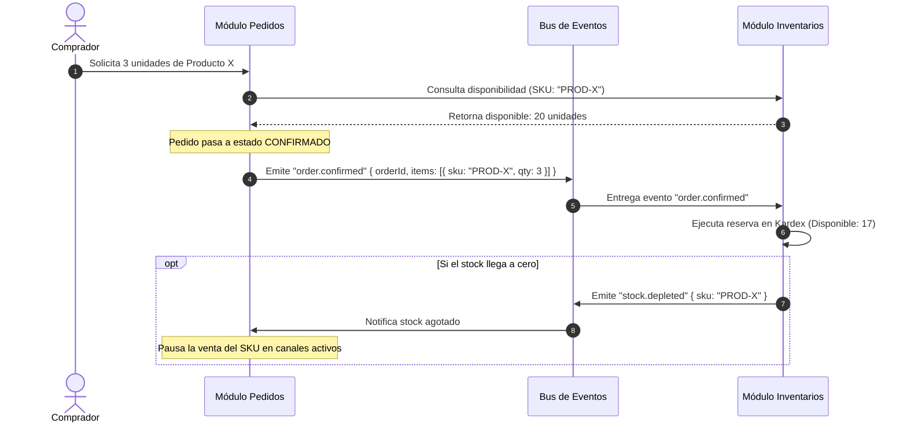

# 03 — Ownership de Dominios & Comunicación Inter-Módulos

Este documento define las fronteras de responsabilidad entre módulos independientes y el protocolo de consumo de capacidades sin duplicación.

---

## 1. El Principio de Ownership: Consumir sin Duplicar

> **Regla de Arquitectura:**  
> *"Un módulo es dueño de una capacidad. Otro módulo puede consumir esa capacidad, pero jamás replicarla o administrarla como propia."*

### Ejemplo del Error de Duplicación vs. La Solución Limpia:

- **Error de Duplicación (Anti-Patrón):**  
  El módulo de Pedidos crea su propio campo `cantidadDisponible: 15` y su propia pantalla de *"Configurar existencias del producto"*. Cuando Inventario también tiene *"Gestionar stock"*, los datos se desincronizan y el usuario no sabe dónde modificar la realidad física de su negocio.

- **Diseño Correcto (Consumo de Capacidad):**  
  **Inventarios** es el único dueño de las existencias. **Pedidos** necesita saber si puede vender el producto, por lo que consulta a Inventarios:  
  *"¿Stock disponible de Coca-Cola?"* -> *"20 unidades"*.  
  Al confirmar la orden, Pedidos emite: *"Reservar 3 unidades"*.  
  Inventarios descuenta las 3 unidades. Pedidos no administra stock; **consume** la capacidad provista por Inventarios.

---

## 2. Matriz Estricta de Responsabilidades

| Dominio Funcional | Módulo Propietario | Comportamiento en Otros Módulos |
| :--- | :--- | :--- |
| **Creación de pedidos y órdenes** | **Pedidos** | Exclusivo de Pedidos. |
| **Estados del ciclo de vida** | **Pedidos** | Informa a otros módulos vía eventos (`order.confirmed`). |
| **Canales de venta (WhatsApp, Web, POS)** | **Pedidos** | Configura qué fuentes inyectan órdenes al Kanban. |
| **Precios aplicados a la venta** | **Pedidos** | Calcula descuentos, recargos y subtotales de la orden. |
| **Catálogo de productos maestros** | **Catálogo** | Proveedor de datos para Pedidos e Inventarios. |
| **Existencias físicas & Movimientos** | **Inventarios** | Exclusivo de Inventarios. Pedidos solo consulta disponibilidad. |
| **Reserva y deducción de stock** | **Inventarios** | Se ejecuta en respuesta al evento `order.confirmed`. |
| **Bodegas y pasillos de picking** | **Inventarios** | Pedidos visualiza la bodega sugerida para empaque. |
| **Ficha y saldo de Clientes** | **Clientes** | Pedidos vincula la orden al ID del cliente. |
| **Conexión telefónica de WhatsApp** | **Integraciones (Tienda)** | Servicio habilitador compartido para toda la tienda. |

---

## 3. Protocolo de Integración entre Pedidos e Inventarios



---

## 4. Contratos de Datos de Integración

### Solicitud de Disponibilidad en Línea:

```typescript
export interface StockAvailabilityQuery {
  tenantId: string;
  skus: string[];
}

export interface StockAvailabilityResponse {
  tenantId: string;
  results: Array<{
    sku: string;
    isAvailable: boolean;
    availableQuantity: number;
    allowBackorders: boolean;
    warehouseId?: string;
    pickingLocation?: string;
  }>;
}
```

### Evento de Confirmación y Reserva:

```typescript
export interface OrderConfirmedReservationPayload {
  tenantId: string;
  orderId: string;
  orderNumber: string;
  reservedItems: Array<{
    sku: string;
    quantity: number;
    unitPrice: number;
  }>;
  timestamp: string;
}
```

---

## 5. Resiliencia y Desacoplamiento

1. **Operación sin Inventarios:** Si una tienda tiene instalado Pedidos pero **no** tiene instalado Inventarios, Pedidos no falla: asume disponibilidad abierta para todos los productos de su catálogo de venta.
2. **Operación sin Pedidos:** Si una tienda tiene instalado Inventarios pero **no** tiene instalado Pedidos, Inventarios opera al 100% recibiendo compras de proveedores, ajustes manuales y traslados de bodega.
