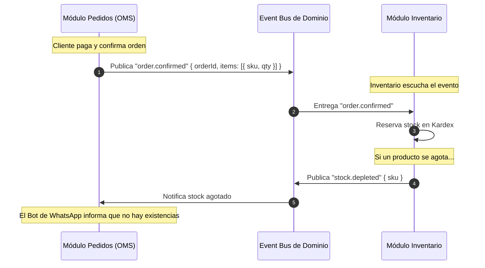

# 03 — Comunicación Inter-Módulos: Eventos & Catálogo

Este documento define cómo interactúan los módulos independientes (**Pedidos**, **Inventario**, etc.) sin acoplar sus bases de código, utilizando el patrón de **Event-Driven Architecture (EDA)** y **Contratos de Dominio (DDD)**.

---

## 1. El Catálogo no le pertenece a Pedidos ni a Inventario

Un error frecuente de diseño es meter el catálogo dentro de Pedidos (llamándolo "Menú" o "Lista de Venta") o dentro de Inventario (llamándolo "Artículos de Kardex").

En una arquitectura limpia:
- **El Catálogo es un recurso del Tenant:** La tienda es dueña de su oferta comercial (qué vende, a qué precio y con qué fotos/descripciones).
- **Inventario nutre al Catálogo:** Informa existencias físicas, costos y bodegas.
- **Pedidos consume el Catálogo:** Lee los productos disponibles y sus precios para armar cotizaciones y ventas.

```
                  ┌──────────────────────────────┐
                  │        TIENDA / TENANT       │
                  └──────────────┬───────────────┘
                                 │
                 ┌───────────────┼───────────────┐
                 │               │               │
        ┌────────▼────────┐ ┌────▼────┐ ┌────────▼────────┐
        │    CATÁLOGO     │ │ PEDIDOS │ │   INVENTARIO    │
        │     MAESTRO     │ │  (OMS)  │ │    (KARDEX)     │
        └────────┬────────┘ └────┬────┘ └────────┬────────┘
                 │               │               │
                 └───────────────┴───────────────┘
                     Eventos de Dominio / API
```

---

## 2. Comunicación Desacoplada mediante Eventos

En lugar de que el código de Pedidos llame directamente a una función de Inventario (`inventoryService.deductStock(...)`), los módulos se comunican a través de **Eventos de Dominio**:



---

## 3. Contratos de Eventos de Dominio

### Eventos Publicados por Pedidos (OMS)

```typescript
export interface OrderConfirmedEvent {
  type: "order.confirmed";
  tenantId: string;
  orderId: string;
  channel: "whatsapp" | "web" | "pos";
  items: Array<{
    productId: string;
    sku?: string;
    quantity: number;
    unitPrice: number;
  }>;
  total: number;
  timestamp: string;
}

export interface OrderCancelledEvent {
  type: "order.cancelled";
  tenantId: string;
  orderId: string;
  reason: string;
  items: Array<{
    productId: string;
    quantity: number;
  }>;
  timestamp: string;
}

export interface OrderCompletedEvent {
  type: "order.completed";
  tenantId: string;
  orderId: string;
  timestamp: string;
}
```

### Eventos Publicados por Inventario

```typescript
export interface StockUpdatedEvent {
  type: "stock.updated";
  tenantId: string;
  productId: string;
  sku: string;
  newAvailableQuantity: number;
  timestamp: string;
}

export interface StockDepletedEvent {
  type: "stock.depleted";
  tenantId: string;
  productId: string;
  sku: string;
  timestamp: string;
}
```

---

## 4. Beneficios del Desacoplamiento por Eventos

1. **Tolerancia a la Ausencia de Módulos:**
   - Si una tienda **solo tiene Pedidos activo**, el evento `order.confirmed` se emite, pero ningún suscriptor de Inventario lo escucha. El pedido se crea y se entrega sin errores ni bloqueos.
   - Si una tienda **solo tiene Inventario activo**, las compras y traslados de almacén se ejecutan sin importar que no haya ningún módulo de pedidos escuchando.
2. **Extensibilidad sin Modificar el Core:**
   - Si mañana se crea un módulo específico para **Restaurantes / KDS de Cocina**, este módulo se suscribe al evento `order.confirmed` y proyecta la orden en una pantalla de cocineros, **sin tocar una sola línea del núcleo del OMS**.
   - Si se crea un módulo de **Facturación Electrónica**, se suscribe a `order.completed` y emite la factura legal ante la DIAN / SAT automáticamente.
