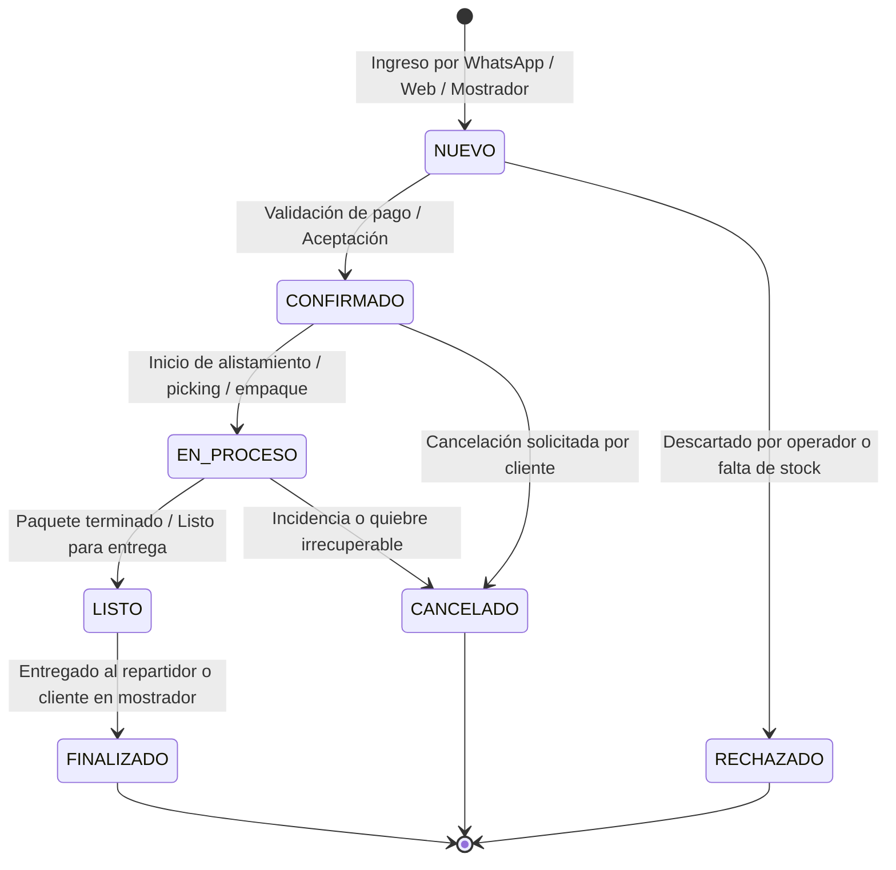

# 04 — Contratos de Datos, Tipos y Ciclo de Vida OMS

Este documento formaliza las interfaces en TypeScript y la máquina de estados finitos que gobierna el núcleo del **Order Management System (OMS)** universal.

---

## 1. Contrato del Tenant Context

El contexto que la tienda provee a todos sus módulos acoplados:

```typescript
export interface TenantContext {
  /** Identificador único del espacio/tienda */
  tenantId: string;
  /** Nombre comercial oficial */
  storeName: string;
  /** Moneda operativa (COP, USD, MXN, ARS) */
  currency: string;
  /** Ubicación o ciudad principal */
  city?: string;
  /** Canales de venta activos */
  channels: {
    whatsapp: boolean;
    web: boolean;
    pos: boolean;
  };
  /** Identidad y personalización de la atención al cliente */
  customerExperience: {
    botName?: string;
    greetingTemplate: string;
    tone?: "profesional" | "cálido" | "técnico" | "desenfadado";
    language?: string;
  };
  /** Catálogo de productos que comercializa el Tenant */
  catalog: CatalogProduct[];
}

export interface CatalogProduct {
  id: string;
  sku?: string;
  name: string;
  description?: string;
  price: number;
  category?: string;
  imageUrl?: string;
  isAvailable: boolean;
  variants?: Array<{
    id: string;
    name: string; // Ej: "Talla 42", "Color Negro", "1/2 Pulgada"
    priceDelta?: number;
  }>;
}
```

---

## 2. Contrato de la Entidad Orden (Universal OMS)

```typescript
export type OrderStatus =
  | "NUEVO"           // Recibido por canal, pendiente de verificación
  | "CONFIRMADO"      // Pago validado y aceptado por el comercio
  | "EN_PROCESO"      // En alistamiento, picking, empaque o preparación
  | "LISTO"           // Empacado y listo para despacho o retiro
  | "FINALIZADO"      // Entregado exitosamente al cliente
  | "CANCELADO"       // Cancelado con motivo registrado
  | "RECHAZADO";      // Descartado antes de ser confirmado

export type OrderChannel = "whatsapp" | "web" | "pos" | "telefono";

export interface OrderItem {
  productId: string;
  name: string;
  quantity: number;
  unitPrice: number;
  variantSelected?: string;
  notes?: string;
}

export interface Customer {
  id?: string;
  name: string;
  phone: string;
  email?: string;
  address?: string;
  city?: string;
}

export interface OrderPayment {
  status: "PENDIENTE" | "PAGADO" | "CONTRA_ENTREGA" | "REEMBOLSADO";
  method: "transferencia" | "efectivo" | "pos" | "mercadopago" | "otro";
  amount: number;
  receiptUrl?: string;
  transactionRef?: string;
}

export interface OrderFulfillment {
  type: "domicilio" | "retiro_en_tienda";
  deliveryAddress?: string;
  deliveryFee: number;
  carrier?: string;
  trackingNumber?: string;
}

export interface Order {
  id: string;
  tenantId: string;
  orderNumber: string; // Ej: "PED-1025"
  customer: Customer;
  channel: OrderChannel;
  status: OrderStatus;
  items: OrderItem[];
  subtotal: number;
  discount: number;
  deliveryFee: number;
  total: number;
  payment: OrderPayment;
  fulfillment: OrderFulfillment;
  notes?: string;
  createdAt: string;
  updatedAt: string;
  history: Array<{
    timestamp: string;
    fromStatus?: OrderStatus;
    toStatus: OrderStatus;
    userOrActor: string; // Ej: "WhatsApp Bot", "Asesor Carlos", "Cliente"
    note?: string;
  }>;
}
```

---

## 3. Máquina de Estados del Pedido

El ciclo de vida del pedido es estrictamente determinista y universal para cualquier tipo de producto o servicio:



### Transiciones y Reglas de Negocio
1. **`NUEVO → CONFIRMADO`:**  
   - Requiere validación de pago (comprobante verificado o selección de pago contra entrega).
   - Emite el evento `order.confirmed` para que Inventario reserve stock.
2. **`CONFIRMADO → EN_PROCESO`:**  
   - La bodega, farmacia, cocina o taller inicia el empaque físico o preparación de los artículos.
   - Si la tienda tiene operarios de despacho, se les asigna la tarea.
3. **`EN_PROCESO → LISTO`:**  
   - El pedido está embalado en su caja o paquete, con factura o remisión adjunta.
   - Se notifica automáticamente al cliente por WhatsApp: *"Tu pedido ya está empacado y listo para salir"*.
4. **`LISTO → FINALIZADO`:**  
   - El pedido se entrega al cliente o a la transportadora. Se cierra la transacción comercial.
   - Emite el evento `order.completed`.
