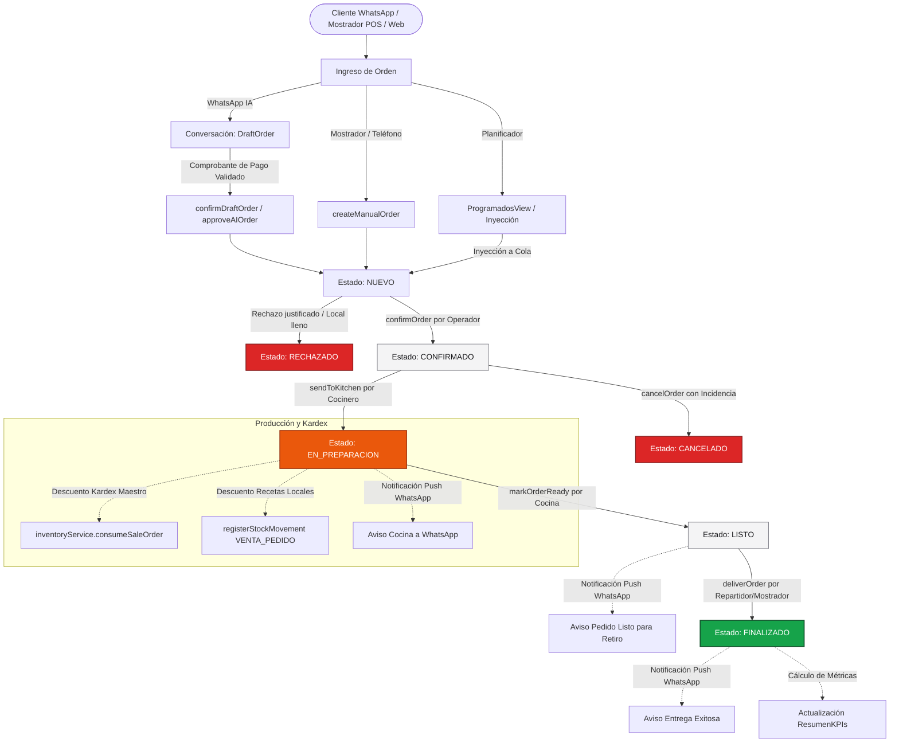

# 04. Flujo Completo del Pedido y Ciclo de Vida

Este documento describe con exactitud el ciclo de vida de un pedido dentro de **StockFlow**, detallando los estados formales implementados, los eventos que provocan cada transición y los efectos colaterales (alertas, deducción de stock y notificaciones a WhatsApp).

---

## 4.1 Diagrama de Flujo del Ciclo de Vida (Mermaid)

---

## 4.2 Estados Reales del Pedido (`OrderStatus`)

En el código fuente (`packages/apps/web/modules/app/src/compositions/pedidos/types.ts`), el tipo `OrderStatus` define 7 estados estrictos:

| Estado | Significado Operativo | Responsable de la Transición | Siguiente Estado Válido |
|---|---|---|---|
| `NUEVO` | Comanda recién ingresada; pendiente de confirmación por el operador o cola de revisión de IA. | Asistente IA o Cajero | `CONFIRMADO`, `RECHAZADO` |
| `CONFIRMADO` | Aceptado por el negocio; asignado número de turno (`turnNumber`) y en espera de entrar a cocina. | Operador de Caja / Asistente IA | `EN_PREPARACION`, `CANCELADO` |
| `EN_PREPARACION` | Comanda ingresada activamente a cocina u horno (KDS). Se ejecuta el descuento del Kardex. | Cocinero Jefe (`PreparacionTiemposView`) | `LISTO`, `CANCELADO` |
| `LISTO` | Cocción finalizada, pedido empacado y verificado en mostrador de despacho. | Personal de Cocina | `FINALIZADO` |
| `FINALIZADO` | Entregado físicamente al cliente o al repartidor. Estado terminal exitoso. | Repartidor / Cajero | Ninguno (Archivado en Historial) |
| `RECHAZADO` | Pedido no aceptado antes de su preparación (ej. fuera de cobertura, local cerrado). | Operador / Administrador | Ninguno (Terminal fallido) |
| `CANCELADO` | Pedido anulado tras haber sido confirmado. Genera `Incidencia` obligatoria. | Supervisor de Turno | Ninguno (Terminal fallido) |

> **Nota de Compatibilidad**: En los documentos de diseño preliminar (`openspec`) se referenciaban nomenclaturas en inglés (`RECEIVED`, `PREPARING`, `READY`, `DELIVERED`, `CANCELLED`). En la implementación TypeScript final del código de producción se normalizó a los estados en español anteriores.

---

## 4.3 Flujos de Entrada según el Canal de Origen

### Camino A: Pedido por WhatsApp e IA (Asistido por Necto Bot)
1. **Detección de Intención**: El cliente escribe a WhatsApp. La IA analiza el texto, extrae ítems del catálogo y consulta si desea adicionales o confirma dirección.
2. **Generación de Borrador (`DraftOrder`)**: La conversación aloja un subtotal dinámico.
3. **Comprobante y Pago**: El cliente envía la captura de transferencia. La IA etiqueta la conversación como `REQUIERE_INTERVENCION` con `VERIFICAR_PAGO_TRANSFERENCIA`.
4. **Liberación a Cocina**: El cajero verifica el extracto en su banco y pulsa *"Confirmar Pedido al Kanban"*. Se invoca `confirmDraftOrder(convId)`, creando el pedido en `CONFIRMADO` con `isAIOrigin: true` y `aiConfidence: "Alta"`.

### Camino B: Pedido Presencial / Mostrador (POS)
1. El cajero ingresa a `PedidosEnVivoView` y abre el formulario de pedido manual.
2. Elige productos, opciones y método de pago (efectivo, datáfono).
3. Se invoca `createManualOrder(data)`, entrando inmediatamente a la columna `NUEVO` y reproduciendo alerta sonora.

### Camino C: Pedido Programado o Recurrente
1. Registrado con anticipación en `ProgramadosView` para una fecha y franja horaria futura.
2. Al llegar la hora (o por activación manual del operador), se ejecuta `injectScheduledOrderToLive(orderId, directToKitchen)`.
3. El pedido se inyecta directamente en `EN_PREPARACION` (si va directo a cocina) o `CONFIRMADO`.

---

## 4.4 Gestión de Tiempos y Niveles de Urgencia

El sistema implementa un monitor de tiempo activo por comanda:
* `createdAt`: Hora de creación del pedido.
* `estimatedMinutes`: Minutos estimados de preparación y despacho (base de 15-30 min + buffer de carga del local).
* `elapsedMinutes`: Minutos reales transcurridos desde la creación.

### Semáforo de Urgencia (`UrgencyLevel`):
El estado de urgencia se evalúa de manera continua y gobierna la interfaz visual del Kanban y de la pantalla KDS:

1. **`A_TIEMPO` (Verde / Neutro)**:
   * Condición: `elapsedMinutes < (estimatedMinutes - 5)`
   * Significado: El pedido se elabora dentro del margen programado.
2. **`PROXIMO` (Amarillo / Alerta)**:
   * Condición: `elapsedMinutes >= (estimatedMinutes - 5)` y `elapsedMinutes <= estimatedMinutes`
   * Significado: La comanda está próxima a vencer su tiempo prometido; el personal debe priorizar su empaque.
3. **`RETRASADO` (Rojo / Crítico con animación)**:
   * Condición: `elapsedMinutes > estimatedMinutes`
   * Significado: Tiempo límite superado. Se resalta visualmente en rojo pulsante en el KDS y dispara alerta auditiva recurrente para la cocina.

---

## 4.5 Efectos Secundarios Automáticos por Transición

| Transición | Acciones Automáticas Ejecutadas por el Sistema |
|---|---|
| **A `CONFIRMADO`** | Asignación de número de turno (`turnNumber = Math.floor(Math.random() * 30) + 1`). Enlace bidireccional con el chat de WhatsApp si proviene de un borrador. Mensaje automático al chat: *"¡Tu pedido #{id} fue confirmado! En breve entra a preparación en cocina."* |
| **A `EN_PREPARACION`** | Disparo de `consumeStockForOrder(order)`: llamada a `inventoryService.consumeSaleOrder` (Kardex maestro) y descuento en recetas de insumos (`StockMovement`). Notificación a WhatsApp: *"Tu comanda #{id} ya ingresó al horno de cocina y se está preparando."* |
| **A `LISTO`** | Notificación sonora de éxito (`playSuccessSound()`) en caja y despacho. Notificación a WhatsApp: *"¡Tu pedido #{id} está listo y empacado para retiro / entrega!"* |
| **A `FINALIZADO`** | Sonido de éxito. Notificación final a WhatsApp agradeciendo la compra. Archivo del pedido en el historial y actualización de KPIs contables del día. |
| **A `CANCELADO`** | Registro automático de una `Incidencia` de severidad alta con el motivo ingresado. Alerta a WhatsApp informando la anulación de la comanda. |
