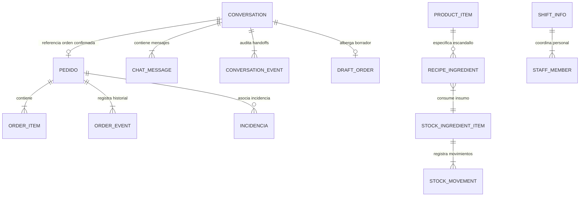

# 06. Modelo de Datos del Módulo Pedidos

Este documento especifica en detalle todas las entidades, interfaces TypeScript, esquemas de persistencia y relaciones que componen el modelo de datos real de **StockFlow (Pedidos)**.

---

## 6.1 Entidades Principales del Dominio



---

## 6.2 Definición de Tipos y Modelos TypeScript

Ubicación del código fuente: `packages/apps/web/modules/app/src/compositions/pedidos/types.ts`.

### 1. Entidad `Pedido`
Representa una orden de venta formal procesada por el sistema.

| Campo | Tipo | Obligatorio | Propósito / Descripción |
|---|---|---|---|
| `id` | `string` | Sí | Identificador alfanumérico único (ej. `"PED-1025"`). |
| `customerName` | `string` | Sí | Nombre del cliente que realiza la compra. |
| `customerPhone` | `string` | No | Número telefónico / WhatsApp en formato E.164. |
| `customerAddress` | `string` | No | Dirección informada por el cliente. |
| `deliveryAddress` | `string` | No | Dirección formal normalizada para el repartidor. |
| `paymentMethod` | `string` | No | Método de pago (`"nequi"`, `"bancolombia"`, `"efectivo"`, `"pos"`). |
| `channel` | `OrderChannel` | Sí | Canal de origen: `"whatsapp"`, `"web"`, `"presencial"`, `"telefono"`. |
| `type` | `OrderType` | Sí | Tipo de pedido: `"inmediato"`, `"programado"`, `"recurrente"`. |
| `status` | `OrderStatus` | Sí | Estado del ciclo de vida (`"NUEVO"`, `"CONFIRMADO"`, etc.). |
| `items` | `OrderItem[]` | Sí | Colección de platos y productos solicitados. |
| `total` | `number` | Sí | Importe monetario total del pedido. |
| `createdAt` | `string` | Sí | Hora o fecha ISO de creación. |
| `estimatedMinutes` | `number` | Sí | Minutos estimados de preparación y entrega. |
| `elapsedMinutes` | `number` | Sí | Minutos reales transcurridos desde la creación. |
| `urgency` | `UrgencyLevel` | Sí | Semáforo: `"A_TIEMPO"`, `"PROXIMO"`, `"RETRASADO"`. |
| `turnNumber` | `number` | No | Número secuencial de turno asignado para cocina (1-30). |
| `isAIOrigin` | `boolean` | No | `true` si el pedido fue generado por el asistente IA en WhatsApp. |
| `aiRawMessage` | `string` | No | Mensaje de texto sin procesar emitido por el cliente. |
| `aiConfidence` | `AIConfidence` | No | Confianza del parsing del modelo: `"Alta"`, `"Media"`, `"Baja"`. |
| `rejectionReason` | `string` | No | Justificación documentada si el pedido fue rechazado. |
| `cancellationReason` | `string` | No | Justificación documentada si el pedido fue cancelado. |
| `isStockConsumed` | `boolean` | No | Bandera de idempotencia para asegurar un solo descuento de stock. |
| `isInLiveQueue` | `boolean` | No | Bandera que indica si un pedido programado ya fue activado en vivo. |
| `notes` | `string` | No | Observaciones culinarias o indicaciones de entrega. |
| `history` | `OrderEvent[]` | Sí | Bitácora inmutable de eventos de transición de estado. |

---

### 2. Sub-entidades de `Pedido`

#### `OrderItem` (Línea de Comanda)
```typescript
export interface OrderItem {
  productId: string;        // ID de referencia al catálogo
  name: string;             // Nombre del plato
  quantity: number;         // Cantidad solicitada
  unitPrice: number;        // Precio unitario
  notes?: string;           // Observaciones culinarias (ej. "sin picante")
  option?: string;          // Variante seleccionada (ej. "Horneada", "Frita")
  category?: string;        // Categoría del producto
}
```

#### `OrderEvent` (Evento de Auditoría)
```typescript
export interface OrderEvent {
  timestamp: string;        // Hora en que ocurrió el evento (ej. "14:32")
  fromStatus?: OrderStatus; // Estado anterior
  toStatus: OrderStatus;    // Nuevo estado aplicado
  user: string;             // Usuario o rol que ejecutó la acción
  ruleName?: string;        // Nombre de la regla si fue por automatización
  note?: string;            // Comentario o justificación operativa
}
```

---

### 3. Modelo Human-in-the-Loop (`Conversation`)

Modela el hilo de WhatsApp desacoplado del pedido, permitiendo la alternancia entre IA y humanos.

| Campo | Tipo | Obligatorio | Propósito |
|---|---|---|---|
| `id` | `string` | Sí | Identificador de la conversación (ej. `"conv-01"`). |
| `customerName` | `string` | Sí | Nombre o alias del cliente en WhatsApp. |
| `customerPhone` | `string` | Sí | Número de teléfono de contacto. |
| `status` | `ConversationStatus` | Sí | `"IA_ATENDIENDO"`, `"REQUIERE_INTERVENCION"`, `"HUMANO_ATENDIENDO"`, `"RESUELTO"`. |
| `controlledBy` | `string \| null` | No | Nombre del operador humano con control exclusivo; `null` si atiende la IA. |
| `requiresHandoffReason` | `HandoffReason` | No | Causa de escalado (`"AMBIGUO"`, `"VERIFICAR_PAGO_TRANSFERENCIA"`, etc.). |
| `orderId` | `string` | No | ID del pedido confirmado al Kanban asociado a este chat. |
| `draftOrder` | `DraftOrder` | No | Comanda en borrador construida dinámicamente en el chat. |
| `messages` | `ChatMessage[]` | Sí | Historial de mensajes emitidos en el chat. |
| `handoffHistory` | `ConversationEvent[]`| Sí | Bitácora de transiciones de control de atención. |
| `unreadForOperator` | `boolean` | Sí | Indicador visual de badge no leído para el operador. |

#### `ChatMessage`
```typescript
export interface ChatMessage {
  id: string;
  sender: "cliente" | "ia" | "humano";
  authorName?: string;
  text: string;
  timestamp: string;
  attachmentUrl?: string;
  attachmentType?: "image" | "comprobante" | "audio";
  attachmentMeta?: {
    bank?: "Nequi" | "Bancolombia" | "Daviplata" | "QR Interbancario" | "Transferencia";
    amount?: number;
    reference?: string;
    status?: "PENDIENTE_VERIFICACION" | "VERIFICADO_OK" | "RECHAZADO";
  };
}
```

---

### 4. Entidades de Insumos y Escandallo

#### `StockIngredientItem` (Materia Prima de Cocina)
```typescript
export interface StockIngredientItem {
  id: string;
  code: string;
  name: string;
  category: "Carnes" | "Harinas y Masas" | "Lácteos" | "Verduras" | "Bebidas" | "Packaging" | "Condimentos" | "General";
  unit: "kg" | "gr" | "lt" | "ml" | "unid" | "paquete";
  currentStock: number;
  minThreshold: number;     // Punto de reorden crítico
  costPerUnit: number;
  expiryDate?: string;
  lotNumber?: string;
  lastRestockedAt?: string;
  imageUrl?: string;
  status: "OPTIMO" | "BAJO" | "CRITICO" | "AGOTADO";
}
```

#### `StockMovement` (Kardex Local)
```typescript
export interface StockMovement {
  id: string;
  ingredientId: string;
  ingredientName: string;
  type: "INGRESO_PROVEEDOR" | "VENTA_PEDIDO" | "MERMA_COCINA" | "AJUSTE_AUDITORIA";
  quantity: number;         // Negativo en venta o merma, positivo en compras
  unit: string;
  orderId?: string;
  reason?: string;
  evidenceUrl?: string;
  evidenceType?: "foto" | "audio" | "texto";
  registeredBy: string;
  timestamp: string;
}
```

---

## 6.3 Esquema de Persistencia Cloud (DynamoDB Single-Table)

En AWS DynamoDB (`Pedidos@Table`), se utiliza un diseño de tabla única indexada por inquilino y tipo de registro:

```text
+-----------------------+-----------------------+------------------------------------------------+
| Partition Key (pk)    | Sort Key (sk)         | Atributos del Ítem                             |
+-----------------------+-----------------------+------------------------------------------------+
| OWNER#usr_tenant123   | ORDER#PED-1025        | { id, customerName, items: [...], total, ... } |
| OWNER#usr_tenant123   | ORDER#PED-1026        | { id, customerName, items: [...], total, ... } |
| OWNER#usr_tenant123   | INGREDIENT#ing-01     | { name: "Harina 000", currentStock: 45.5, ... }|
+-----------------------+-----------------------+------------------------------------------------+
```

* **Patrón de Acceso**:
  * Consultar todas las órdenes activas del inquilino: `QueryCommand` con `pk = OWNER#<id>` y `begins_with(sk, 'ORDER#')`.
  * Actualización atómica de estado: `UpdateCommand` con clave `{ pk, sk }`, modificando la propiedad `#status` y añadiendo el evento a `#history` mediante `list_append`.
