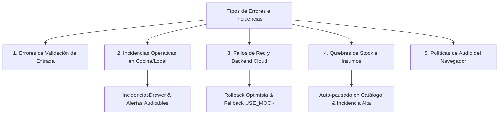

# 10. Manejo de Errores y Excepciones del Módulo Pedidos

Este documento describe las políticas, mecanismos de recuperación y tratamientos de contingencia implementados en **StockFlow (Pedidos)** frente a errores de validación, fallos de conectividad, caídas de base de datos e incidencias operativas.

---

## 10.1 Taxonomía de Errores e Incidencias



---

## 10.2 Errores de Validación y Restricciones de Interfaz

1. **Creación de Pedido Manual sin Ítems**:
   * *Mecanismo*: El botón de confirmación en la UI permanece deshabilitado hasta que al menos un producto con cantidad mayor a 0 sea agregado al carrito.
2. **Rechazo o Cancelación sin Justificación**:
   * *Mecanismo*: Los formularios de `RejectCancelModal` no permiten el envío si el campo de motivo (`reason`) está vacío o contiene únicamente espacios en blanco.
3. **Monto o Descuentos Inválidos**:
   * *Mecanismo*: El cálculo del total utiliza funciones agregadoras basadas en `unitPrice * quantity`, forzando números enteros y previniendo valores negativos.

---

## 10.3 Sistema Formal de Incidencias Operativas (`Incidencia`)

Cuando ocurre una anomalía en el flujo físico o conversacional, el sistema no interrumpe la aplicación con errores fatales, sino que registra una entidad `Incidencia` accesible en `IncidenciasDrawer`:

```typescript
export interface Incidencia {
  id: string;
  title: string;
  severity: "Alta" | "Media" | "Baja";
  type: "pedido_retrasado" | "capacidad_insuficiente" | "error_interpretacion" | "producto_desactivado" | "cancelacion";
  orderId?: string;
  timestamp: string;
  description: string;
  isResolved: boolean;
}
```

### Tipos de Incidencia y Tratamiento:

| Tipo | Causa Desencadenante | Severidad | Acción de Mitigación / Flujo |
|---|---|---|---|
| `cancelacion` | Cancelación de un pedido confirmado (`cancelOrder`). | **Alta** | Se registra el motivo, se notifica a cocina para detener elaboración y se envía push a WhatsApp. |
| `producto_desactivado` | Quiebre de insumo crítico (`currentStock <= 0`) o desactivación manual. | **Media / Alta** | Pausado automático de productos del menú vinculados al ingrediente. |
| `pedido_retrasado` | Cronómetro `elapsedMinutes > estimatedMinutes`. | **Alta** | Animación roja pulsante en KDS y alerta sonora en panel de despacho. |
| `capacidad_insuficiente` | Dotación de cocineros reducida con más de 8 pedidos activos. | **Media** | El sistema eleva el buffer sugerido de preparación para estirar los tiempos prometidos a clientes nuevos. |
| `error_interpretacion` | Cliente envía mensaje ambiguo o expresa reclamo en chat. | **Media** | Transición de conversación a `REQUIERE_INTERVENCION` silenciando a la IA. |

---

## 10.4 Fallos de API y Resiliencia en Persistencia

### 1. Inserción Optimista y Rollback en Catálogo
Al agregar un plato en `CatalogoInteligenteView`, el contexto realiza una inserción optimista en el estado de React con un ID temporal (`tmp-{Date.now()}`):
```typescript
const tempId = `tmp-${Date.now()}`;
const optimistic = { ...newProduct, id: tempId };
setProducts(prev => [optimistic, ...prev]);

try {
  const created = await apiCreateProduct(...);
  // Reconciliación con el ID real de la base de datos
  setProducts(prev => prev.map(p => p.id === tempId ? toProductItem(created) : p));
} catch (err) {
  console.error("[PedidosContext] failed to create product", err);
  if (!PRODUCTS_USE_MOCK) {
    // Rollback: se elimina el producto temporal de la vista
    setProducts(prev => prev.filter(p => p.id !== tempId));
  }
}
```

### 2. Caída o Inaccesibilidad de AWS (Fallback Local)
Si las credenciales de AWS no están configuradas o la red está fuera de línea:
* El cliente detecta la ausencia de `VITE_API_URL` o la activación de `VITE_USE_MOCK=true`.
* Conmuta sin error hacia los generadores mock locales (`mockProducts.ts` y `mockData.ts`), permitiendo que la caja y cocina continúen operando localmente.

### 3. Expiración de Token Cognito
* El cliente de API en `apiFetch` captura errores `401 Unauthorized`.
* Si el token JWT expira, `useAuth()` refresca automáticamente la sesión mediante el SDK de Cognito o redirige de forma controlada al login sin perder el estado del carrito en memoria.

---

## 10.5 Manejo de la Política de Audio del Navegador (Autoplay)

Los navegadores modernos (Chrome, Safari, Edge) bloquean la reproducción de audio mediante `AudioContext` hasta que el usuario haya interactuado físicamente con la página (clic o toque):
* En `soundEffects.ts`, las funciones capturan cualquier excepción con `try/catch` y reanudan el contexto si se encuentra suspendido:
  ```typescript
  if (audioCtx.state === "suspended") {
    audioCtx.resume();
  }
  ```
* Si el usuario silencia voluntariamente las alertas (`isSoundEnabled = false`), las funciones de sonido retornan inmediatamente sin intentar reproducir tonos ni saturar la consola con advertencias.
