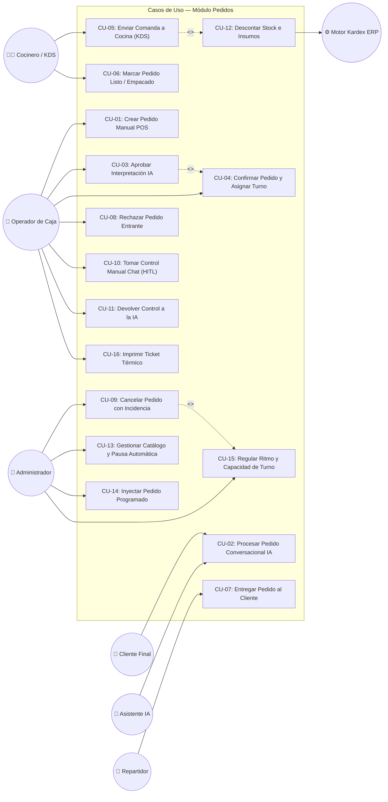

# Diagrama UML de Casos de Uso del Módulo Pedidos

Este documento presenta el diagrama UML de casos de uso de **StockFlow (Módulo Pedidos)**, modelando las interacciones entre los actores y las funcionalidades del sistema.

---

## Diagrama UML de Casos de Uso (Mermaid)

---

## Matriz de Trazabilidad: Actores vs. Casos de Uso

| Caso de Uso | Cliente | Asistente IA | Operador Caja | Cocinero KDS | Repartidor | Administrador | Kardex ERP |
|---|:---:|:---:|:---:|:---:|:---:|:---:|:---:|
| **CU-01: Crear Pedido Manual** | | | **X** | | | | |
| **CU-02: Pedido Conversacional** | **X** | **X** | | | | | |
| **CU-03: Aprobar Interpretación** | | | **X** | | | **X** | |
| **CU-04: Confirmar y Turno** | | **X** | **X** | | | **X** | |
| **CU-05: Enviar a Cocina** | | | | **X** | | **X** | |
| **CU-06: Marcar Listo** | | | | **X** | | | |
| **CU-07: Entregar Pedido** | | | **X** | | **X** | | |
| **CU-08: Rechazar Pedido** | | | **X** | | | **X** | |
| **CU-09: Cancelar con Incidencia** | | | | | | **X** | |
| **CU-10: Tomar Control HITL** | | | **X** | | | **X** | |
| **CU-11: Devolver a IA** | | | **X** | | | **X** | |
| **CU-12: Descontar Stock** | | | | | | | **X** |
| **CU-13: Gestionar Catálogo** | | | | | | **X** | |
| **CU-14: Inyectar Programado** | | | **X** | | | **X** | |
| **CU-15: Ritmo y Capacidad** | | | | | | **X** | |
| **CU-16: Imprimir Ticket** | | | **X** | **X** | | | |
