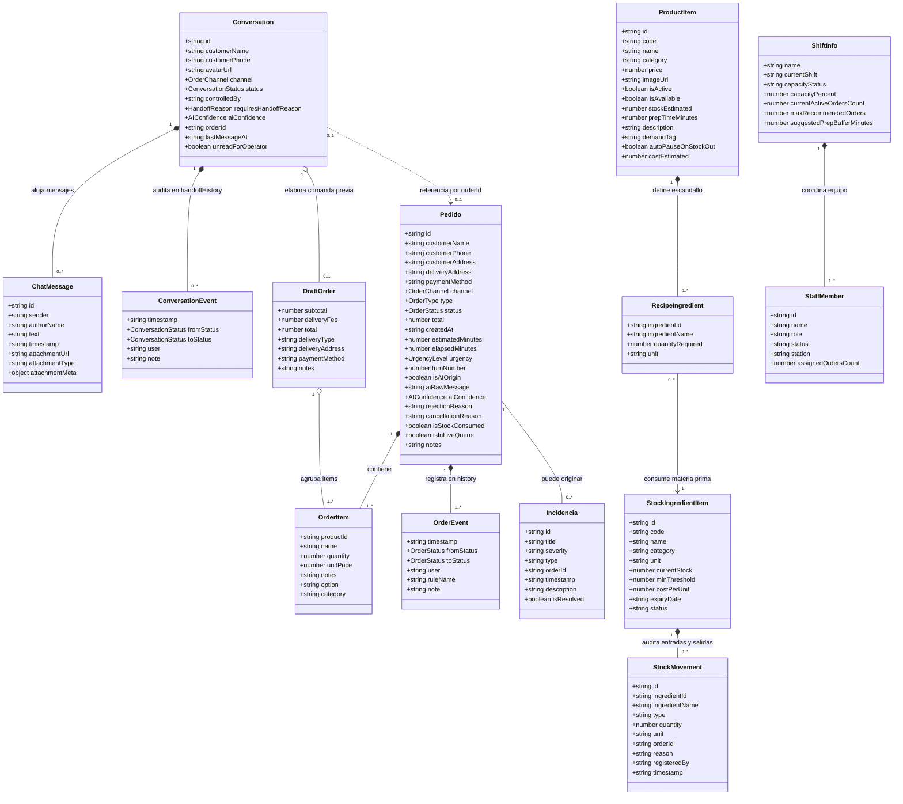

# Diagrama UML de Clases del Módulo Pedidos

Este documento presenta el diagrama UML de clases y entidades del módulo **Pedidos**, reflejando con exactitud los atributos, tipos de datos, cardinalidades y relaciones definidas en el código fuente (`packages/apps/web/modules/app/src/compositions/pedidos/types.ts`).

---

## Diagrama UML de Clases (Mermaid)

---

## Enumeraciones y Tipos Literales del Dominio

* **`OrderStatus`**: `"NUEVO"` | `"CONFIRMADO"` | `"EN_PREPARACION"` | `"LISTO"` | `"FINALIZADO"` | `"RECHAZADO"` | `"CANCELADO"`
* **`UrgencyLevel`**: `"A_TIEMPO"` | `"PROXIMO"` | `"RETRASADO"`
* **`OrderChannel`**: `"whatsapp"` | `"web"` | `"presencial"` | `"telefono"`
* **`OrderType`**: `"inmediato"` | `"programado"` | `"recurrente"`
* **`ConversationStatus`**: `"IA_ATENDIENDO"` | `"REQUIERE_INTERVENCION"` | `"HUMANO_ATENDIENDO"` | `"RESUELTO"`
* **`HandoffReason`**: `"AMBIGUO"` | `"FUERA_DE_ALCANCE"` | `"MODIFICACION_ESPECIAL"` | `"CONFIRMAR_DATO"` | `"CLIENTE_PIDE_HUMANO"` | `"BAJA_CONFIANZA"` | `"VERIFICAR_PAGO_TRANSFERENCIA"` | `"RECLAMO_INCIDENCIA"`
* **`StockMovementType`**: `"INGRESO_PROVEEDOR"` | `"VENTA_PEDIDO"` | `"MERMA_COCINA"` | `"AJUSTE_AUDITORIA"`
* **`IngredientStatus`**: `"OPTIMO"` | `"BAJO"` | `"CRITICO"` | `"AGOTADO"`
