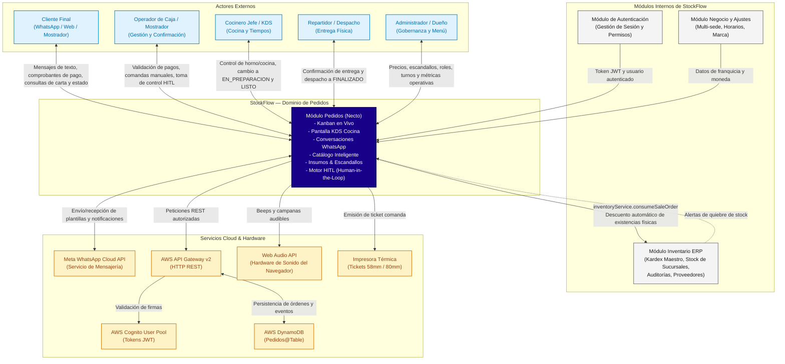

# Diagrama de Contexto del Módulo Pedidos

Este documento presenta el diagrama de contexto del módulo **Pedidos** dentro de **StockFlow**, delimitando sus fronteras con los actores externos, módulos hermanos del sistema y servicios de infraestructura cloud.

---

## Diagrama de Contexto del Sistema (Mermaid)

---

## Descripción del Flujo de Información de Contexto

1. **Entrada de Demanda**:
   * El **Cliente** solicita productos mediante WhatsApp o directamente ante el **Cajero** en el mostrador físico.
   * La información de pedidos no estructurada es parseada por la IA y presentada en el tablero del módulo.
2. **Sincronización con el Núcleo ERP**:
   * Cuando una orden pasa a fase de cocina, el módulo Pedidos invoca a `ModInventario` (`inventoryService.consumeSaleOrder`), garantizando que la contabilidad del Kardex coincida al gramo con las ventas.
3. **Control Operativo**:
   * El **Cocinero** visualiza las comandas ordenadas por número de turno y cronómetro de urgencia.
   * El **Repartidor** toma el paquete listo y cierra el ciclo reportando la entrega.
4. **Persistencia e Infraestructura**:
   * El módulo se comunica con **AWS DynamoDB** para almacenar el estado del pedido y su auditoría inmutable, protegido por **AWS Cognito**.
   * La interfaz interactúa con el hardware del navegador (Web Audio API para alertas sonoras y motor de impresión para comandas físicas).
