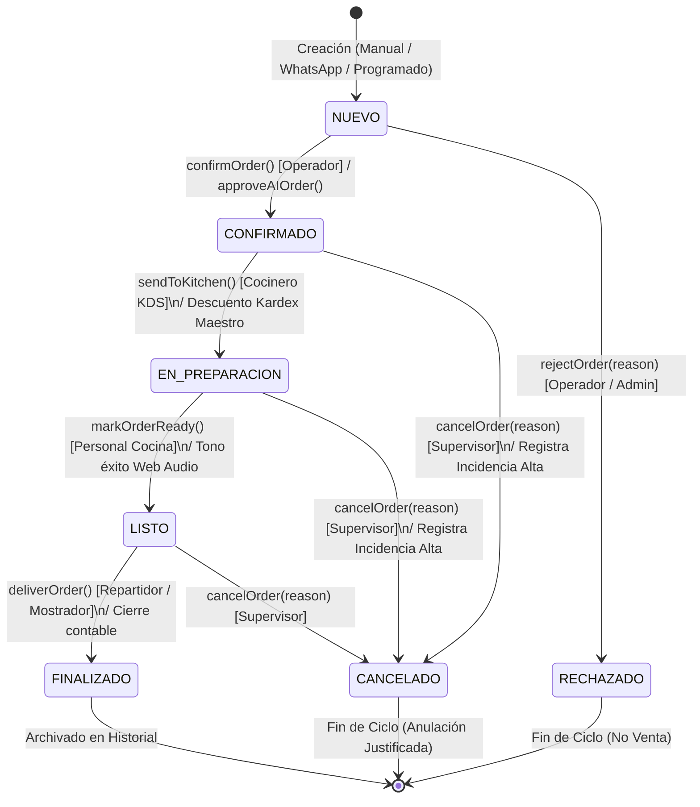
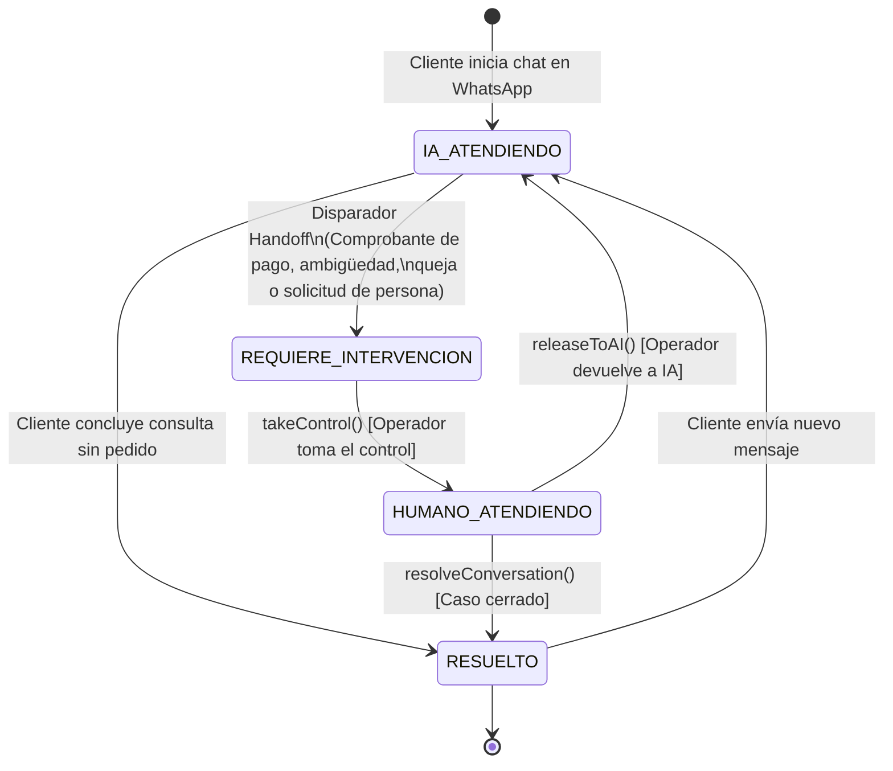
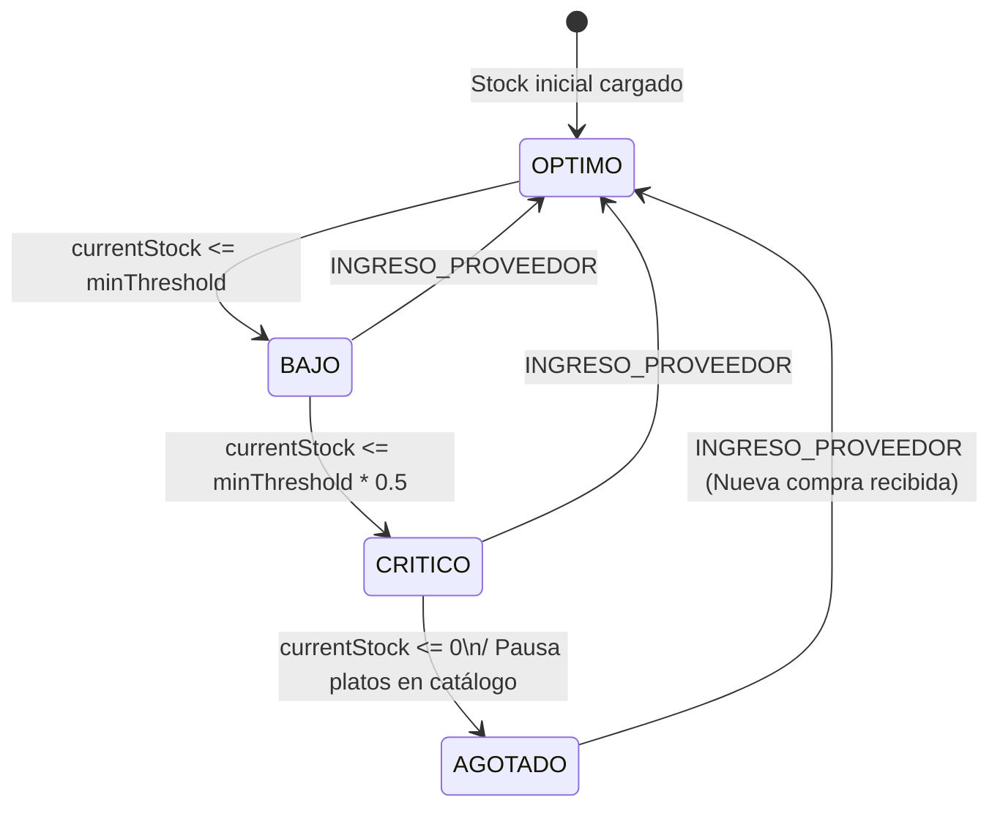

# Diagramas UML de Máquinas de Estados del Módulo Pedidos

Este documento presenta los diagramas de estados UML que rigen el comportamiento dinámico de las tres máquinas de estados concurrentes en **StockFlow (Pedidos)**:
1. Máquina de Estados del **Pedido** (`OrderStatus`).
2. Máquina de Estados de la **Conversación WhatsApp / HITL** (`ConversationStatus`).
3. Máquina de Estados del **Insumo / Stock** (`StockIngredientItem.status`).

---

## 1. Máquina de Estados del Pedido (`OrderStatus`)

### Tabla de Transiciones y Condiciones del Pedido:

| Estado Origen | Evento Desencadenante | Condición / Validación | Estado Destino | Acción Asociada |
|---|---|---|---|---|
| `[*]` | `createManualOrder` / `confirmDraftOrder` | Ítems > 0, total > 0 | `NUEVO` | Alerta sonora `playNewOrderSound()`. |
| `NUEVO` | `confirmOrder` / `approveAIOrder` | Pago validado o crédito | `CONFIRMADO` | Asigna `turnNumber` (1-30) y notifica a WhatsApp. |
| `NUEVO` | `rejectOrder` | `reason` obligatorio | `RECHAZADO` | Guarda `rejectionReason` en historial. |
| `CONFIRMADO` | `sendToKitchen` | Comanda entra a horno | `EN_PREPARACION` | Dispara `consumeStockForOrder` (Kardex ERP). |
| `CONFIRMADO` | `cancelOrder` | `reason` obligatorio | `CANCELADO` | Crea `Incidencia` de severidad `Alta`. |
| `EN_PREPARACION`| `markOrderReady` | Cocción finalizada | `LISTO` | Emite sonido `playSuccessSound()`. |
| `EN_PREPARACION`| `cancelOrder` | `reason` obligatorio | `CANCELADO` | Crea `Incidencia` de severidad `Alta`. |
| `LISTO` | `deliverOrder` | Paquete entregado | `FINALIZADO` | Suma a KPIs del día y notifica a WhatsApp. |

---

## 2. Máquina de Estados de la Conversación WhatsApp (Protocolo HITL)

### Exclusión Mutua en la Conversación:
* Mientras el estado es **`HUMANO_ATENDIENDO`**, el atributo `controlledBy` almacena el nombre del operador y el Asistente IA tiene **prohibido emitir respuestas automáticas**.
* Al invocar **`releaseToAI()`**, `controlledBy` vuelve a `null` y la IA retoma la escucha activa del canal.

---

## 3. Máquina de Estados del Insumo / Materia Prima

Gobierna el escandallo y la prevención de ventas sin stock en cocina (`StockIngredientItem`):

### Regla de Quiebre de Stock (`AGOTADO`):
Si el insumo alcanza el estado `AGOTADO` y está vinculado a platos con la bandera `autoPauseOnStockOut = true`, el sistema ejecuta en tiempo real `toggleProductAvailability` sobre dichos productos en el catálogo para evitar que sigan vendiéndose por WhatsApp o mostrador.
