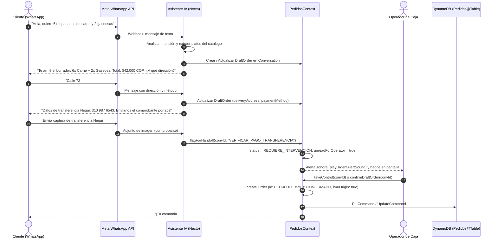
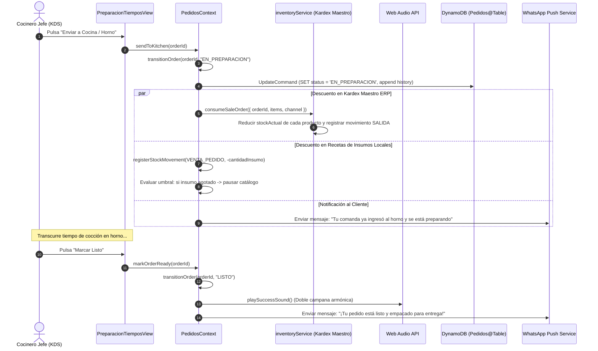
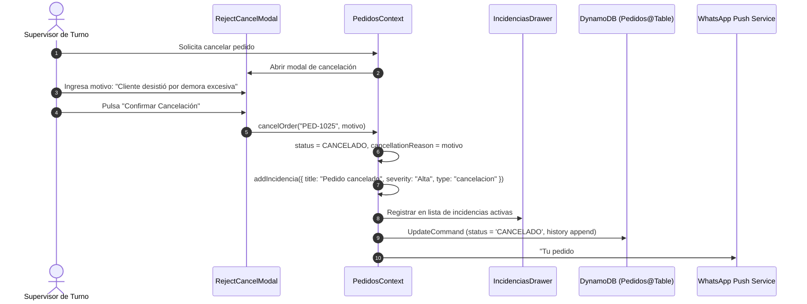
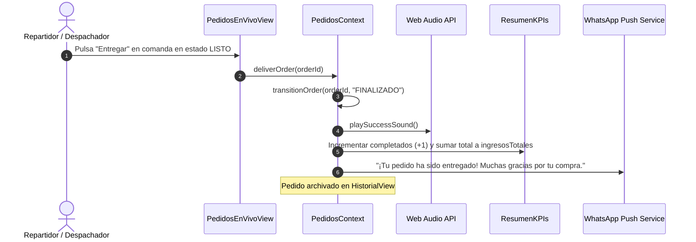
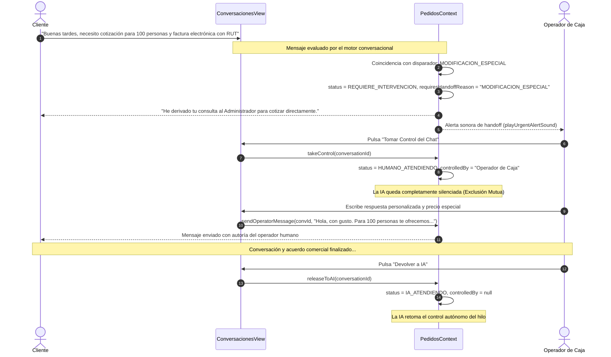

# Diagramas UML de Secuencia del Módulo Pedidos

Este documento presenta los diagramas de secuencia UML para los flujos más relevantes del módulo **Pedidos** en **StockFlow**.

---

## Flujo 1: Creación de Pedido vía WhatsApp con IA y Confirmación

Muestra el flujo desde que el cliente escribe por WhatsApp hasta que la orden se confirma en el Kanban.

---

## Flujo 2: Preparación en Cocina (KDS) y Descuento Automático de Stock

Muestra la interacción cuando el cocinero inicia la cocción y el sistema descuenta las materias primas en el Kardex.

---

## Flujo 3: Cancelación de Pedido con Registro de Incidencia

Muestra la excepción operativa donde un pedido debe anularse justificadamente.

---

## Flujo 4: Finalización y Despacho del Pedido

Muestra el cierre del ciclo de vida y la actualización de los indicadores contables.

---

## Flujo 5: Protocolo Human-in-the-Loop (HITL) en WhatsApp

Muestra la alternancia y exclusión mutua entre el bot de IA y el operador humano.

