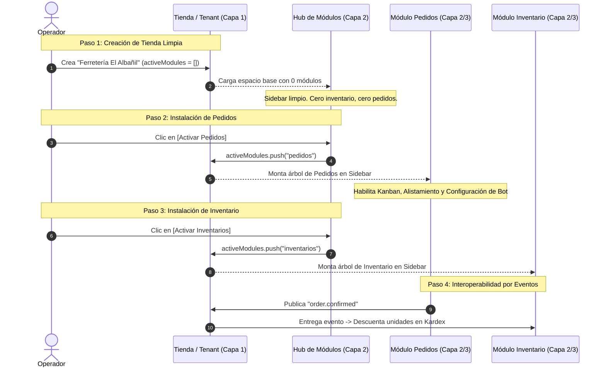

# 01 — Modelo Conceptual: Tenant Contenedor & Módulos Plug & Play

Este documento describe la relación estructural entre el **Tenant (Tienda Contenedor)** y los **Módulos de Negocio** en Necto.

---

## 1. La Tienda como Contenedor Neutral (Tenant Boundary)

En Necto, una **Tienda** no está asociada a ningún tipo de negocio preestablecido. Una tienda es un **límite de aislamiento multi-inquilino (Tenant Boundary)** que provee una infraestructura base para operar:

```
┌─────────────────────────────────────────────────────────────┐
│                       TIENDA / TENANT                       │
│                     "Ferretería El Albañil"                 │
├──────────────────────────────┬──────────────────────────────┤
│ IDENTIDAD                    │ CONFIGURACIÓN BASE           │
│ • Nombre comercial           │ • Estado: Activa / Pausada   │
│ • Logo & Descripción         │ • Horarios de atención       │
│ • Ubicación: País y Ciudad   │ • Días laborales             │
│ • Moneda contable (COP, USD) │ • Configuración regional     │
│ • Teléfono & Correo oficial  │ • Formatos numéricos/fecha   │
│ • Redes sociales & Web       │ • Notificaciones generales   │
├──────────────────────────────┼──────────────────────────────┤
│ EQUIPO & ROLES               │ INTEGRACIONES GENÉRICAS      │
│ • Propietario / Dueño        │ • Conexión oficial WhatsApp  │
│ • Administrador              │ • Webhooks de salida         │
│ • Operador                   │ • Claves de API de la tienda │
│ • Auditor / Consulta         │                              │
└──────────────────────────────┴──────────────────────────────┘
```

---

## 2. Lo que la Tienda Base NO debe Contener

Para preservar el principio de desacoplamiento modular, la tienda base **nunca incluye funcionalidades propias de un módulo**:

- **Sin Catálogo:** La tienda base no almacena productos ni listas de precios (eso corresponde a los módulos de Catálogo/Inventario/Pedidos).
- **Sin Pedidos:** No existen órdenes, carritos, comandas ni pipelines en la base.
- **Sin Stock:** No existen cantidades de existencias, kardex ni almacenes.
- **Sin Mesas ni Citas:** No existen conceptos físicos de rubro en la base.

Si se introdujeran estas entidades en la tienda base, se crearía un módulo disfrazado y se rompería la arquitectura plug & play.

---

## 3. El Espacio Base: 0 Módulos Instalados

Cuando se crea una tienda y se decide **comenzar limpio sin módulos iniciales**, la plataforma se inicia en un estado 100% válido y funcional:

```
Tienda: "Ferretería El Albañil"
Módulos Instalados: 0

Barra Lateral (Sidebar):
└── Módulos de Tienda (Catálogo de Capacidades)

Espacio Central:
┌─────────────────────────────────────────────────────────────┐
│                  Tu tienda está lista                       │
│ Esta tienda es un contenedor limpio e independiente. Agrega │
│ las capacidades que necesita tu negocio desde el catálogo:   │
│                                                             │
│ ┌──────────────────────────┐   ┌──────────────────────────┐ │
│ │ Sistema de Pedidos       │   │ Inventario & Stock       │ │
│ │ Omnicanal (OMS)          │   │ Kardex y reposición      │ │
│ │ [ + Activar Módulo ]     │   │ [ + Activar Módulo ]     │ │
│ └──────────────────────────┘   └──────────────────────────┘ │
│ ┌──────────────────────────┐   ┌──────────────────────────┐ │
│ │ Turnos & Caja            │   │ Reservas & Salón         │ │
│ │ Cuadres y cierres        │   │ Mesas y agendamiento     │ │
│ │ [ + Activar Módulo ]     │   │ [ + Activar Módulo ]     │ │
│ └──────────────────────────┘   └──────────────────────────┘ │
└─────────────────────────────────────────────────────────────┘
```

### Reglas del Espacio Base:
1. **Sidebar Aislado:** No muestra accesos a pedidos, inventario ni turnos. Solo exhibe la identidad del espacio y el acceso al catálogo de módulos.
2. **Cero Suposiciones de Industria:** El sistema no asume vocabulario gastronómico, retail ni ferretero.
3. **Roles Operativos Activos:** Los usuarios asignados a la tienda ya cuentan con permisos de administración o auditoría del contenedor.

---

## 4. Activación Modular e Independencia Operativa

Los módulos son **micro-aplicaciones desacopladas** que se acoplan y desacoplan en tiempo de ejecución modificando el arreglo `activeModules: NectoModuleKey[]` del Tenant.

### Escenario A: Solo Inventario Activo
```
Tienda: "Droguería San Lucas"
└── activeModules: ["inventarios"]
```
- **Operación:** Administra productos, stock físico, bodegas, movimientos de entrada/salida (Kardex), proveedores y valoración contable.
- **Aislamiento:** No conoce el concepto de pedido omnicanal ni interactúa con WhatsApp.
- **Sidebar:** Muestra exclusivamente el menú de Inventario (Kardex, Bodegas, Proveedores).

### Escenario B: Solo Pedidos Activo
```
Tienda: "Zapatería Elegance"
└── activeModules: ["pedidos"]
```
- **Operación:** Gestiona la recepción de ventas (WhatsApp, Web, POS), el tablero Kanban, la estación de alistamiento y empaque, y el cobro.
- **Aislamiento:** Si no hay módulo de inventario instalado, Pedidos opera consultando los artículos configurados para venta sin forzar transacciones de almacén complejas.
- **Sidebar:** Muestra el menú de Pedidos (En Vivo, Historial, Métricas, Despacho).

### Escenario C: Pedidos + Inventario Activos
```
Tienda: "Ferretería El Albañil"
└── activeModules: ["pedidos", "inventarios"]
```
- **Interacción Desacoplada:** Ambos módulos coexisten y se sincronizan mediante **Eventos de Dominio**:
  - Al confirmarse una venta en Pedidos (`order.confirmed`), Inventario reserva o descuenta las unidades del stock en Kardex.
  - Al agotarse una referencia en Inventario (`stock.depleted`), el canal de Pedidos informa al cliente que no hay disponibilidad.

---

## 5. El Escenario Canónico de Prueba (Benchmark de Arquitectura)

Para certificar la integridad de la arquitectura de 3 capas, se ejecuta el siguiente flujo de validación:


