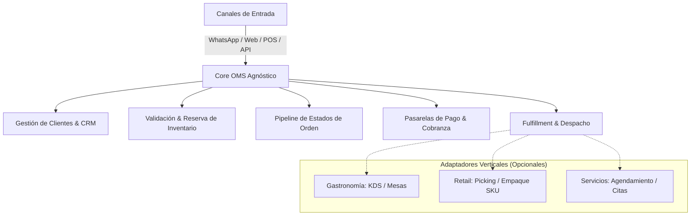

# 01. Visión y Desacoplamiento de Dominio: OMS Agnóstico

## 1. El Diagnóstico Arquitectónico

### El Problema Detectado
El requerimiento original era construir un **Sistema de Gestión de Pedidos (OMS - Order Management System)** omnicanal para la plataforma **StockFlow / NECTO**. 

Sin embargo, durante la evolución del código fuente se produjo una **contaminación de dominio (Domain Coupling)**:
* Los modelos de datos (`Pedido`, `OrderStatus`) y los componentes de interfaz asumieron de forma rígida que el negocio es un **restaurante / dark kitchen** (hamburguesería, mesas, comensales, comanda de cocina, KDS, escandallo de ingredientes y tiempos de cocción).
* Los roles del sistema quedaron fijados en `Cocinero`, `Mesero`, `Admin` y `Propietario`.
* El negocio por defecto en el estado global se bautizó como `Burger House — Sede Principal`.

### El Impacto
Si una tienda de ropa (retail), una ferretería (distribución B2B), un centro de estética (servicios) o una marca de comercio electrónico intenta utilizar StockFlow hoy, el sistema resulta confuso e inoperante porque les exige operar bajo la lógica de una cocina.

---

## 2. Definición del OMS Agnóstico (El Core Verdadero)

Un **Order Management System (OMS)** de clase mundial no sabe ni le importa qué producto o servicio comercializa el tenant. Su responsabilidad arquitectónica se limita a:

### Principios Fundamentales
1. **Agnosticismo del Item**: Una línea de pedido (`OrderLine`) tiene identificador, SKU, nombre, cantidad, precio unitario, atributos (talla, color, extras, observaciones) y reglas tributarias. No asume "ingredientes de cocina".
2. **Canal Centralizado**: El canal de captura (WhatsApp, tienda online, mostrador) es un metadato de origen. Toda orden converge a la misma bandeja de operaciones de NECTO.
3. **Fulfillment Polimórfico**: 
   - En Retail: El pedido pasa a **Picking & Packing** (almacén).
   - En Servicios: El pedido pasa a **Asignación de Especialista / Cita**.
   - En Gastronomía: El pedido pasa a **Preparación en Cocina (KDS)**.

---

## 3. Matriz de Arquetipos de Tienda

El sistema soporta 4 grandes arquetipos definidos en el onboarding, configurando dinámicamente el vocabulario y las vistas del workspace:

| Atributo | Retail & Comercio | B2B & Distribución | Servicios & Citas | Gastronomía (Plantilla) |
|---|---|---|---|---|
| **Ejemplos** | Ropa, calzado, tecnología, accesorios | Repuestos, ferreterías, mayoristas | Salones, talleres, consultorías | Restaurantes, cafeterías, dark kitchens |
| **Canal Principal** | WhatsApp + Catálogo Web | WhatsApp + Vendedor | WhatsApp + Agenda | WhatsApp + Menú QR |
| **Unidad de Venta** | Producto físico con variantes (SKU) | Lotes, bultos, referencias IPN | Servicios, paquetes, horas | Platos, combos, modificadores |
| **Estación Operativa** | Estación de Empaque / Despacho | Almacén / Carga y Facturación | Cuadrante de Turnos | KDS (Kitchen Display System) |
| **Roles Operativos** | Vendedor, Bodeguero, Cajero | Asesor Comercial, Despachador | Especialista, Recepcionista | Cocinero, Mesero, Cajero |
| **Control de Stock** | Kardex por SKU y Ubicación | Kardex multialmacén y precios | Insumos de uso interno | Escandallo por receta |

---

## 4. Fronteras Claras de Responsabilidad

Para evitar volver a acoplar la tienda con el motor de pedidos:

1. **`compositions/pedidos/` (Core OMS)**:
   - Bandeja unificada de órdenes entrantes (Inbox).
   - Chat en vivo y auditoría de conversaciones de WhatsApp.
   - Máquina de estados agnóstica (`received` -> `confirmed` -> `processing` -> `dispatched` -> `completed`).
   - Acciones universales: cobrar, reimprimir ticket, aplicar descuento, cambiar dirección, asignar mensajero.

2. **`ModuloInventario/` (ERP & Kardex)**:
   - Catálogo de productos, listas de precios, existencias y movimientos.
   - Reserva de stock al confirmar el pedido y descarga final al despachar.

3. **Vistas de Estación (Plugins/Adaptadores)**:
   - `FulfillmentView`: Pantalla simplificada para el operario de almacén o cocina. Si el arquetipo es gastronómico, usa temática KDS; si es retail, usa checklist de picking por estante.
