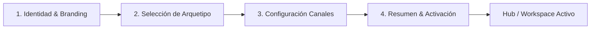

# 02. Onboarding y Configuración Dinámica Multi-Tienda

## 1. Análisis del Flujo Actual de Creación de Tienda

En el frontend de NECTO (`packages/apps/web/modules/app/src/pages/OnboardingPage.tsx`), el usuario pasa por un wizard de 4 pasos para crear su negocio:



### La Brecha Detectada en la Implementación
El paso 2 (`ARCHETYPES`) define 4 modelos (`restaurant_virtual`, `retail_store`, `services`, `ecommerce_direct`). Sin embargo, una vez creado el negocio en `BusinessContext`:
* El arquetipo **no alteraba los roles**. Se seguían creando los mismos roles de gastronomía (`role-cook`, `role-waiter`).
* El arquetipo **no alteraba los términos de la UI**. Se seguía mostrando "KDS Cocina", "Bandeja de Comandas" e "Insumos".
* La navegación interna del sidebar siempre apuntaba a rutas fijas de restaurante (`/app?section=operacion&tab=preparacion`).

---

## 2. Motor de Vocabulario Dinámico (Dynamic Semantic Engine)

Para que el sistema se sienta 100% nativo para una zapatería, una droguería o una barbería, el OMS utiliza un **diccionario semántico parametrizado por arquetipo**:

```typescript
export interface BusinessSemanticConfig {
  archetypeId: BusinessType;
  terms: {
    orderSingle: string;      // "Pedido" | "Orden de Venta" | "Servicio / Cita"
    orderPlural: string;      // "Pedidos" | "Ventas" | "Citas"
    stationName: string;      // "Almacén & Picking" | "Cocina (KDS)" | "Boxes de Atención"
    stationAction: string;    // "Empacar" | "Cocinar" | "Atender"
    catalogItem: string;      // "Producto" | "Artículo" | "Servicio"
    tableOrReference: string; // "Canal / Origen" | "Mesa / Salón" | "Sucursal / Box"
    itemModifiers: string;    // "Variantes (Talla/Color)" | "Modificadores" | "Adicionales"
  };
  operationalViews: {
    showKdsTimer: boolean;        // Solo true en gastronomía
    showSkuBarcode: boolean;       // True en retail y B2B
    showDeliveryTracker: boolean;  // True si maneja domicilios
    showAppointmentSlot: boolean;  // True en servicios
  };
}
```

### Mapeo por Arquetipo

| Término Interno | `retail_store` (Ropa / Ferretería) | `services` (Consultorios / Talleres) | `restaurant_virtual` (Gastronomía) |
|---|---|---|---|
| **`orderSingle`** | Pedido de Venta | Cita / Servicio | Comanda / Orden |
| **`stationName`** | Estación de Picking & Empaque | Cuadrante de Especialistas | Monitor de Cocina (KDS) |
| **`stationAction`** | Preparar para Envío | Iniciar Atención | Empezar Cocción |
| **`catalogItem`** | Referencia / SKU | Servicio / Procedimiento | Plato / Bebida |
| **`tableOrReference`**| Casillero / Punto de Entrega | Box / Cabina / Sillón | Mesa / Salón / Barra |
| **`itemModifiers`** | Talla, Color, Material | Duración, Profesional | Término de carne, Sin cebolla |

---

## 3. Generación Automática de Roles por Arquetipo

Al completar el onboarding, `BusinessContext.createBusiness()` no inyecta roles fijos, sino que despliega el perfil de acceso acorde al modelo operativo:

### Perfiles para `retail_store` y `ecommerce_direct`
1. **Administrador / Dueño**: Control total de analítica, pasarelas, catálogo y configuración.
2. **Encargado de Ventas (Asesor WhatsApp / Mostrador)**: Acceso a chat de WhatsApp, bandeja de pedidos y creación de cotizaciones.
3. **Despachador / Bodeguero**: Acceso exclusivo a la estación de picking, checklist de embalaje, impresión de guías y actualización a "Listo para despacho".

### Perfiles para `services`
1. **Director / Dueño**: Reportes financieros y configuración de turnos.
2. **Recepcionista / Front-Desk**: Gestión del chat de WhatsApp, confirmación de citas y cobros.
3. **Especialista / Profesional**: Visualización exclusiva de su agenda del día y check-in de clientes atendidos.

### Perfiles para `restaurant_virtual` (Vertical Opcional)
1. **Propietario**: Control operativo y financiero global.
2. **Cajero / Capitán**: Recepción de pedidos WhatsApp y cobro.
3. **Cocinero**: Visor táctil KDS con tiempos de cocción.
4. **Mesero**: Toma de pedidos en salón.

---

## 4. Configuración del Canal WhatsApp en el Onboarding

Durante el alta de la tienda, el tenant conecta o configura su canal de WhatsApp:
1. **Número Oficial o Webhook**: Asignación del número de teléfono comercial o enlace vía QR / Meta Cloud API.
2. **Personalidad del Asistente**:
   - Tono comercial: Amigable, Ejecutivo, Dinámico o Especializado.
   - Mensaje de bienvenida y catálogo interactivo.
3. **Modo de Operación del Bot**:
   - **Totalmente Autónomo**: El bot cotiza, toma datos, valida stock y crea la orden en estado `recibido` para que NECTO la procese.
   - **Híbrido (HITL - Human In The Loop)**: El bot califica la intención inicial y si el cliente requiere atención personalizada, transfiere la conversación a la bandeja de NECTO para que un asesor humano tome el control.
