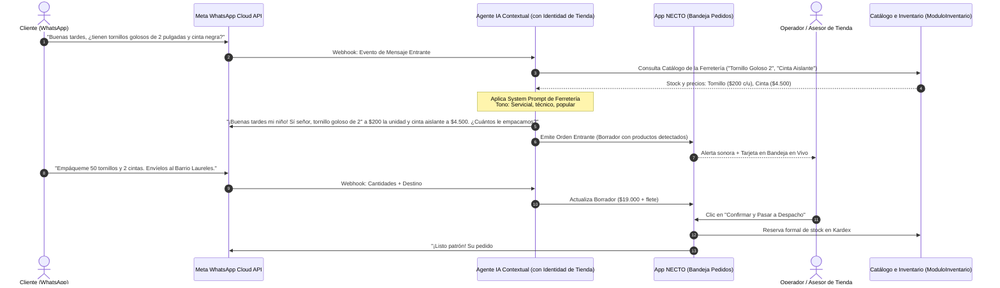

# 03. El Canal Principal: WhatsApp Conversational Commerce & Motor de Identidad

## 1. Visión del Canal

En **NECTO**, WhatsApp no es un simple chat de soporte o notificación posterior: **es el canal primario de captura y conversión de ventas**.

El cliente final no está obligado a descargar una app móvil ni a registrarse en un portal web complejo. Escribe directamente a la línea de WhatsApp de la tienda y la inteligencia conversacional se encarga de guiarlo con la **identidad propia de la tienda**, interpretar qué desea comprar de su **catálogo específico**, capturar sus datos de entrega y estructurar la orden en NECTO.



---

## 2. Motor de Identidad del Bot (Tenant Identity & Context Injection)

Para que el bot no suene genérico ni desubicado, su comportamiento se compone dinámicamente en tiempo de ejecución combinando 4 fuentes de datos de la tienda:

```
┌─────────────────────────────────────────────────────────────────────────────┐
│                       MOTOR DE PROMPT CONTEXTUAL                            │
├──────────────────────────────┬──────────────────────────────────────────────┤
│ 1. Identidad del Tenant      │ Nombre: "Ferretería La Tuerca"               │
│                              │ Ciudad: "Medellín, Colombia"                 │
│                              │ Moneda: "COP ($)"                            │
├──────────────────────────────┼──────────────────────────────────────────────┤
│ 2. Arquetipo de Negocio      │ Tipo: retail_store (Ferretería / Materiales) │
│                              │ Vocabulario: Referencias, metros, unidades   │
├──────────────────────────────┼──────────────────────────────────────────────┤
│ 3. Personalidad & Saludo     │ Configurada en BusinessSettingsModal:        │
│                              │ Tono: "cálido / popular"                     │
│                              │ Saludo: "¡Bienvenido a la ferretería mi niño!│
├──────────────────────────────┼──────────────────────────────────────────────┤
│ 4. Catálogo Activo (Kardex)  │ Inyectado desde ModuloInventario:            │
│                              │ Solo productos de ESTA tienda con stock > 0  │
└──────────────────────────────┴──────────────────────────────────────────────┘
```

### Ejemplos Comparativos de Comportamiento por Negocio

#### Caso A: Ferretería de Barrio (`retail_store`)
* **Prompt del Sistema**: *"Eres el asesor virtual de Ferretería La Tuerca en Medellín. Hablas de forma cordial, servicial y popular ('mi niño', 'patrón', 'con mucho gusto'). Tu catálogo son herramientas, tornillos, tubería y pinturas. Si te piden comida o cosas ajenas a la ferretería, aclara amablemente tu rubro. Ofrece medidas exactas y cantidades."*
* **Respuesta**: *"¡Buenas tardes mi niño! Con mucho gusto, la broca para concreto de 3/8 la tenemos en marca Stanley a $12.000. ¿Le alisto una?"*

#### Caso B: Hamburguesería Gourmet (`restaurant_virtual`)
* **Prompt del Sistema**: *"Eres el asistente de Hamburguesas Doña Estella. Tu tono es alegre, casual y provocativo. Ofreces hamburguesas artesanales, adiciones (tocineta, queso cheddar) y bebidas frías. Preguntas siempre por el término de la carne y salsas especiales."*
* **Respuesta**: *"¡Hola! Bienvenido a Hamburguesas Doña Estella 🍔. La Smash Doble Especial te queda en $28.000 con papas rústicas. ¿La prefieres con tocineta crujiente y qué gaseosa te provoca?"*

#### Caso C: Tienda de Ropa & Moda (`ecommerce_direct`)
* **Prompt del Sistema**: *"Eres el personal shopper de Velvet Studio. Tu tono es sofisticado, moderno y detallista. Asesoras sobre tallas (S, M, L, XL), colores disponibles y tiempos de envío nacional express."*
* **Respuesta**: *"¡Hola! Qué gusto saludarte en Velvet Studio ✨. El vestido midi en color esmeralda nos queda disponible en tallas S y M. ¿Cuál es tu talla habitual para confirmarte medidas?"*

---

## 3. Reutilización y Reordenamiento del Arsenal Existente

No construiremos la experiencia de WhatsApp desde cero. En `packages/apps/web/modules/app/src/compositions/pedidos/` ya existe un conjunto robusto de componentes que vamos a **reutilizar y reorganizar**:

| Componente Existente | Ubicación Actual | Rol en el Nuevo Flujo Agnóstico |
|---|---|---|
| **`ConversationThread.tsx`** | `shared/ConversationThread.tsx` | **Vista Central del Chat**: Burbujas de chat completas, renderizado de mensajes de texto, audios, imágenes de comprobantes y checks de lectura. |
| **`ConversationControlBar.tsx`**| `shared/ConversationControlBar.tsx` | **Barra de Control HITL**: Botones para silenciar bot ("Tomar Chat"), reanudar IA, respuestas rápidas y atajos de teclado. |
| **`CreateOrderFromConversationModal.tsx`** | `shared/CreateOrderFromConversationModal.tsx` | **Generador de Órdenes**: Modal interactivo que toma los ítems sugeridos por el bot y permite al operador confirmar o editar cantidades antes de crear la orden. |
| **`AIInterpretationModal.tsx`** | `shared/AIInterpretationModal.tsx` | **Inspector de IA**: Permite al asesor ver qué entendió el modelo de lenguaje (intención, entidades, confianza y productos detectados). |
| **`ConversacionesView.tsx`** | `operacion/ConversacionesView.tsx` | **Bandeja Multicanal**: Bandeja de entrada estilo WhatsApp Web integrada dentro de NECTO para gestionar múltiples clientes en paralelo. |
| **`OrderDetailDrawer.tsx`** | `shared/OrderDetailDrawer.tsx` | **Ficha de Despacho**: Drawer lateral para revisar datos de envío, asignar transportadora y marcar la entrega. |
| **`ThermalTicketModal.tsx`** | `shared/ThermalTicketModal.tsx` | **Impresión de Comprobante / Guía**: Impresión en formato ticket térmico de 80mm/58mm para pegar en el paquete o entregar al cliente. |
| **`IncidenciasDrawer.tsx`** | `shared/IncidenciasDrawer.tsx` | **Gestión de Novedades**: Registro de problemas de entrega, dirección errada o devoluciones de WhatsApp. |

---

## 4. Protocolo Human-In-The-Loop (HITL)

El operador en NECTO trabaja en una pantalla dividida donde coexisten la conversación en vivo y la orden estructurada:

```
┌─────────────────────────────────────────────────────────────────────────────────┐
│ NECTO — BANDEJA CONVERSACIONAL DE PEDIDOS                                      │
├────────────────────────────────┬────────────────────────────────────────────────┤
│ 💬 Chat WhatsApp en Vivo       │ 📦 Orden de Venta en Tiempo Real               │
│                                │                                                │
│ [Cliente] 16:42                │ Tienda: Ferretería La Tuerca (ID: BIZ-102)     │
│ Buenas, necesito 50 tornillos  │ Cliente: Carlos Gómez (+57 310 1234567)        │
│ de 2 pulgadas y una broca      │ Canal: WhatsApp Oficial                        │
│                                │ ────────────────────────────────────────────── │
│ [Bot NECTO] 16:42              │ Ítems Detectados (desde Catálogo):             │
│ ¡Con gusto mi niño! Tornillo   │ • 50x Tornillo Goloso 2'' ($200)    = $10.000  │
│ a $200 c/u y broca a $12.000.  │ • 1x  Broca Concreto 3/8 ($12.000)  = $12.000  │
│ Total $22.000. ¿Para dónde van?│ • 1x  Envío Local Laureles ($8.000) = $ 8.000  │
│                                │ Total a Cobrar:                      $30.000   │
│ [Cliente] 16:43                │ ────────────────────────────────────────────── │
│ Envíelos a la Cra 70 # 32-10   │ Método de Pago: Nequi (Pendiente de Comprobante│
│ Pago por Nequi ya mismo        │                                                │
│                                │ [ ⏸️ Tomar Control ]  [ ✏️ Editar Ítems ]      │
│ [Comprobante Adjunto 📷]       │ [ 💰 Validar Pago ]   [ 🚀 Pasar a Picking ]   │
└────────────────────────────────┴────────────────────────────────────────────────┘
```

---

## 5. Notificaciones Automáticas hacia WhatsApp

Cada avance en la máquina de estados de NECTO dispara un mensaje formateado al cliente en WhatsApp, adaptando los términos a la identidad del negocio:

| Estado NECTO | Mensaje en Tienda Retail / Ferretería | Mensaje en Gastronomía |
|---|---|---|
| **Confirmado** | *"¡Listo patrón! Recibimos su pago. Su orden #VTA-1048 está confirmada y pasa a alistamiento."* | *"¡Pedido confirmado! Doña Estella ya tiene tu comanda #ORD-1048 lista para la plancha."* |
| **En Empaque** | *"Su mercancía está siendo empacada y rotulada en nuestro almacén."* | *"Tu hamburguesa está en el fuego con todas las salsas listas."* |
| **Despachado** | *"¡Su paquete va en camino! Guía: ENV-8821 con Mensajería Express."* | *"¡El domiciliario ya recogió tu pedido y va en camino a tu dirección!"* |
| **Entregado** | *"Confirmamos la entrega de su pedido. ¡Muchas gracias por preferirnos!"* | *"¡Buen provecho! Que disfrutes tu comida. Gracias por elegirnos."* |
