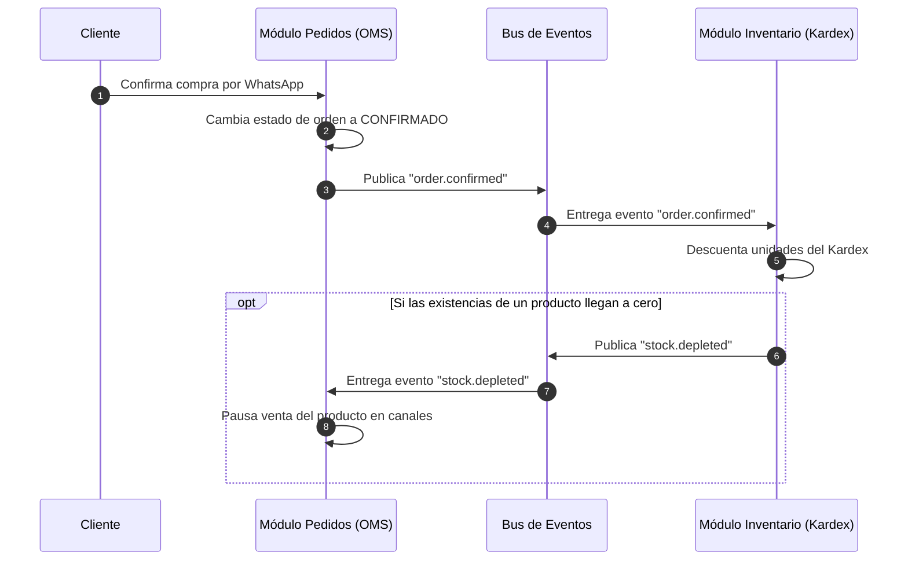

# 03 — Comunicación Inter-Módulos: Eventos & Catálogo

Este documento define cómo interactúan los módulos independientes (**Pedidos**, **Inventario**, etc.) sin acoplar sus bases de código, utilizando el patrón de **Event-Driven Architecture (EDA)** y **Contratos de Dominio (DDD)**.

---

## 1. Desacoplamiento del Catálogo Comercial

En una arquitectura limpia:
- **La Tienda Base no tiene catálogo de productos:** La tienda base es un contenedor puro de identidad y permisos.
- **Inventario administra existencias físicas:** SKUs, cantidades reales, bodegas, costos unitarios y movimientos de Kardex.
- **Pedidos gestiona la transacción comercial:** Carrito, precios de venta, recargos de envío, datos de entrega y cobro.

```
┌─────────────────────────────────────────────────────────────┐
│                       TIENDA / TENANT                       │
│                     (Contenedor Base)                       │
└──────────────────────────────┬──────────────────────────────┘
                               │
            ┌──────────────────┴──────────────────┐
            ▼                                     ▼
┌──────────────────────────────┐       ┌──────────────────────┐
│        MÓDULO PEDIDOS        │       │  MÓDULO INVENTARIOS  │
│        (Capacidad OMS)       │       │   (Capacidad Stock)  │
├──────────────────────────────┤       ├──────────────────────┤
│ • Órdenes de venta           │       │ • Kardex de entradas │
│ • Clientes & Destinatarios   │       │ • Existencias reales │
│ • Canales (WhatsApp, POS)    │       │ • Costos & Bodegas   │
└──────────────┬───────────────┘       └──────────┬───────────┘
               │                                  │
               └────────► [ EVENT BUS ] ◄─────────┘
```

---

## 2. Flujo de Interoperabilidad mediante Eventos

En lugar de que el código de Pedidos invoque funciones internas de Inventario (por ejemplo `inventoryService.deductStock(...)`), ambos módulos se comunican exclusivamente publicando y escuchando **Eventos de Dominio**:



---

## 3. Contratos Formales de Eventos

### Eventos Emitidos por el Módulo de Pedidos:

```typescript
export interface OrderCreatedEvent {
  type: "order.created";
  tenantId: string;
  orderId: string;
  channel: "whatsapp" | "web" | "pos";
  customer: {
    name: string;
    phone?: string;
  };
  items: Array<{
    productId: string;
    sku?: string;
    name: string;
    quantity: number;
    unitPrice: number;
  }>;
  total: number;
  currency: string;
  timestamp: string;
}

export interface OrderConfirmedEvent {
  type: "order.confirmed";
  tenantId: string;
  orderId: string;
  items: Array<{
    productId: string;
    sku?: string;
    quantity: number;
  }>;
  fulfillmentType: "pickup" | "delivery";
  timestamp: string;
}

export interface OrderCancelledEvent {
  type: "order.cancelled";
  tenantId: string;
  orderId: string;
  reason: string;
  items: Array<{
    productId: string;
    sku?: string;
    quantity: number;
  }>;
  timestamp: string;
}
```

### Eventos Emitidos por el Módulo de Inventarios:

```typescript
export interface StockReservedEvent {
  type: "stock.reserved";
  tenantId: string;
  orderId: string;
  success: boolean;
  reservedItems: Array<{
    sku: string;
    quantity: number;
  }>;
  timestamp: string;
}

export interface StockDepletedEvent {
  type: "stock.depleted";
  tenantId: string;
  sku: string;
  productId: string;
  timestamp: string;
}

export interface StockReplenishedEvent {
  type: "stock.replenished";
  tenantId: string;
  sku: string;
  productId: string;
  newQuantity: number;
  timestamp: string;
}
```

---

## 4. Beneficios del Diseño Desacoplado

1. **Tolerancia a Fallos:** Si el módulo de Inventarios se desinstala o se encuentra en mantenimiento, el módulo de Pedidos sigue recibiendo órdenes y operando sin provocar excepciones de ejecución.
2. **Escalabilidad Horizontal:** Los módulos pueden desplegarse en contenedores, microfrontends o lambdas independientes sin compartir base de datos.
3. **Mantenibilidad:** Modificar la lógica interna de cálculo de existencias en Kardex jamás impacta el pipeline de atención por WhatsApp de Pedidos.
