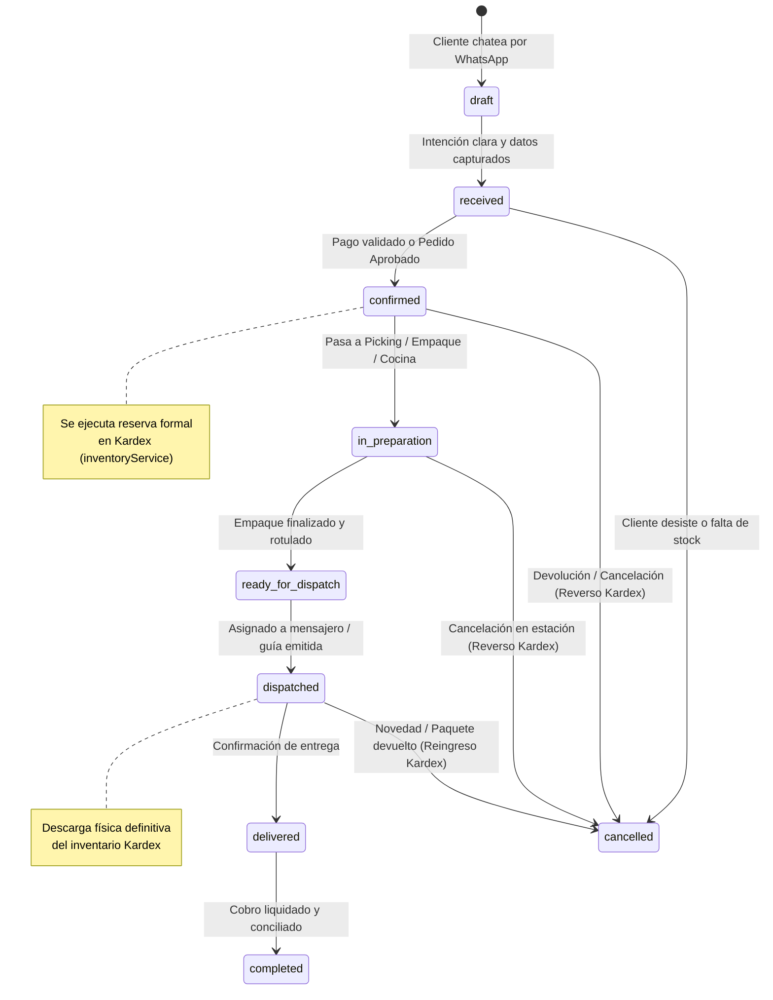

# 04. Modelo de Datos Agnóstico y Máquina de Estados

## 1. El Modelo de Dominio Agnóstico

El nuevo esquema de datos desacopla el núcleo de órdenes de cualquier vertical de negocio. Todas las órdenes comparten la misma estructura base en TypeScript y DynamoDB:

```typescript
// ═══════════════════════════════════════════════════════════════════════════
// CANALES Y MÉTODOS DE PAGO
// ═══════════════════════════════════════════════════════════════════════════

export type OrderChannel = "whatsapp" | "web" | "pos" | "api" | "phone";

export type PaymentMethod = 
  | "nequi" 
  | "daviplata" 
  | "bancolombia_transfer" 
  | "cash_on_delivery" 
  | "card_terminal" 
  | "wompi" 
  | "credit_store";

export type PaymentStatus = "pending" | "partial" | "paid" | "refunded";

// ═══════════════════════════════════════════════════════════════════════════
// MÁQUINA DE ESTADOS UNIVERSAL DEL OMS
// ═══════════════════════════════════════════════════════════════════════════

export type OrderLifecycleStatus =
  | "draft"              // Borrador en conversación / cotización
  | "received"           // Ingresado formalmente a la bandeja
  | "confirmed"          // Validado por asesor o bot (reserva Kardex)
  | "in_preparation"     // En estación operativa (picking, confección, cocina)
  | "ready_for_dispatch" // Empacado, embalado y rotulado con guía
  | "dispatched"         // En tránsito con mensajero / transportadora
  | "delivered"          // Entregado al cliente final
  | "completed"          // Liquidado y cerrado contablemente
  | "cancelled";         // Cancelado (liberación de Kardex)

// ═══════════════════════════════════════════════════════════════════════════
// ENTIDADES CORE
// ═══════════════════════════════════════════════════════════════════════════

export interface OrderCustomer {
  id?: string;
  name: string;
  phone: string;              // Número WhatsApp (formato E.164, ej: +573001234567)
  email?: string;
  documentId?: string;        // Cédula / NIT para facturación
  shippingAddress: {
    street: string;
    city: string;
    neighborhood?: string;
    notes?: string;           // "Piso 3, dejar en portería"
    coordinates?: { lat: number; lng: number };
  };
}

export interface OrderLineModifier {
  name: string;               // Ej: "Talla", "Color", "Término", "Garantía"
  value: string;              // Ej: "L", "Azul Marino", "Bien Asado", "12 meses"
  priceDelta: number;         // Sobrecosto si aplica (0 si está incluido)
}

export interface OrderLineItem {
  id: string;
  productId: string;          // ID foráneo en Kardex / inventoryService
  sku: string;                // Código único de referencia
  name: string;
  quantity: number;
  unitPrice: number;
  discount: number;
  total: number;
  modifiers?: OrderLineModifier[];
  notes?: string;             // Observaciones particulares del cliente
}

export interface Order {
  id: string;                 // "ORD-2026-0041"
  businessId: string;         // Tenant / Sede dueña de la orden
  channel: OrderChannel;
  status: OrderLifecycleStatus;
  
  // Cliente y Destino
  customer: OrderCustomer;
  
  // Líneas de Venta
  items: OrderLineItem[];
  
  // Liquidación Financiera
  subtotal: number;
  shippingFee: number;
  discountTotal: number;
  taxTotal: number;
  totalAmount: number;
  
  // Pagos
  paymentMethod: PaymentMethod;
  paymentStatus: PaymentStatus;
  paymentProofUrl?: string;   // Captura de transferencia enviada por WhatsApp
  
  // Asignación de Despacho
  fulfillmentType: "delivery" | "pickup" | "on_premise";
  courierName?: string;       // Nombre del domiciliario o empresa (ej: "Coordinadora")
  trackingNumber?: string;    // Número de guía
  
  // Trazabilidad Temporal
  createdAt: string;
  updatedAt: string;
  estimatedDeliveryTime?: string;
  
  // Metadatos Conversacionales
  whatsappConversationId?: string;
  isAiManaged: boolean;       // True si el bot está respondiendo; false si HITL
}
```

---

## 2. Diagrama de Transición de Estados (Statechart)



---

## 3. Integración Idempotente con Kardex e Inventario

El motor de pedidos no gestiona almacenes físicos; delega la existencia en el módulo `inventoryService`:

1. **Al pasar a `confirmed`**:
   - Se invoca `reserveStock(items)`. Las unidades pasan al estado `comprometido` o `reservado` para evitar ventas duplicadas (over-selling) en otros canales simultáneos.
2. **Al pasar a `dispatched`**:
   - Se invoca `consumeSaleOrder(orderId, items)`. Se genera el movimiento oficial de salida en el Kardex (`SALE_DISPATCH`) con el costo promedio ponderado de cada SKU.
3. **Al pasar a `cancelled`**:
   - Si la orden estaba `confirmed` o `in_preparation`, se ejecuta `releaseReservation(orderId)`.
   - Si ya estaba `dispatched`, se genera un movimiento de entrada por devolución (`RETURN_RESTOCK`).
