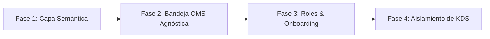

# 05. Plan Táctico de Refactor y Migración

## 1. Estrategia de Refactorización Progresiva

Para desacoplar el sistema sin romper la funcionalidad existente ni introducir regresiones en la compilación de Vite, la refactorización se organiza en **4 fases incrementales**:

---

## 2. Detalle de Fases de Ejecución

### Fase 1: Abstracción Semántica y Vocabulario (Quick Wins)
* **Objetivo**: Eliminar strings hardcodeados de gastronomía en componentes generales.
* **Archivos Afectados**:
  - `packages/apps/web/modules/app/src/context/BusinessContext.tsx`:
    - Cambiar el negocio por defecto (`DEFAULT_BUSINESS`) de "Burger House" a un nombre neutral como "Store Central — Sede Principal" con tipo parametrizable.
    - Exponer el helper `getBusinessSemantics(businessType)` para proveer los términos de la UI.
  - `packages/apps/web/modules/app/src/compositions/shell/StockFlowSidebar.tsx`:
    - Renombrar el enlace "KDS Cocina" a "Preparación & Despacho" (o cambiar su etiqueta dinámicamente según el arquetipo de la tienda).

### Fase 2: Unificación de la Bandeja de Operaciones OMS
* **Objetivo**: Hacer que la bandeja de pedidos en vivo (`PedidosEnVivoView.tsx`) procese pedidos de cualquier industria.
* **Acciones Clave**:
  - Generalizar las tarjetas de pedido:
    - En lugar de mostrar "Mesa 4", mostrar el canal de origen ("WhatsApp", "Mostrador POS", "Tienda Web").
    - En lugar de "Ingredientes / Sin cebolla", mostrar "Variantes / Notas" (ej: "Talla L / Negro", "Dejar en portería").
  - Enlazar directamente el chat de WhatsApp con la tarjeta de la orden para que el operador atienda y confirme cotizaciones sin cambiar de pantalla.

### Fase 3: Conexión del Onboarding con Roles Dinámicos
* **Objetivo**: Que al crear una tienda de Retail, Servicios o D2C en el wizard de onboarding, se creen los roles pertinentes.
* **Acciones Clave**:
  - Actualizar `OnboardingPage.tsx` y `BusinessContext.tsx`:
    - Si el arquetipo es `retail_store`: inyectar roles `role-owner`, `role-sales-rep`, `role-fulfillment`.
    - Si el arquetipo es `services`: inyectar roles `role-owner`, `role-receptionist`, `role-specialist`.
    - Si el arquetipo es `restaurant_virtual`: inyectar roles `role-owner`, `role-admin`, `role-cook`, `role-waiter`.
  - Actualizar `RoleSelectionModal.tsx` para leer los roles dinámicos del negocio en lugar de una lista estática con iconos de comida.

### Fase 4: Aislamiento del KDS como Vista Especializada
* **Objetivo**: No borrar el visor KDS (es valioso para quien venda comida), sino convertirlo en un **adaptador condicional**:
* **Acciones Clave**:
  - Si el negocio tiene activo el módulo gastronómico, la pestaña de preparación renderiza el cronómetro y tickets KDS.
  - Si el negocio es Retail o B2B, la pestaña de preparación renderiza una **Lista de Picking & Empaque** con checkboxes por SKU y botón para imprimir etiqueta de envío.

---

## 3. Matriz de Verificación y Criterios de Aceptación (DoD)

| Escenario de Prueba | Resultado Esperado |
|---|---|
| **Crear Tienda de Ropa (Retail)** | El onboarding genera la tienda sin menciones a comida. La barra lateral muestra "Picking & Despacho". Los roles no incluyen "Cocinero". |
| **Recibir Pedido por WhatsApp** | El mensaje del cliente ingresa a NECTO, genera una tarjeta de pedido con SKUs, talla/color y dirección de entrega. |
| **Intervención HITL** | El operador pulsa "Tomar Chat", edita la orden, aplica un descuento y confirma el pedido. El cliente recibe confirmación en WhatsApp. |
| **Reserva en Kardex** | Al confirmar la orden en NECTO, las unidades de inventario se descuentan o reservan automáticamente en `ModuloInventario`. |
| **Crear Tienda Gastronómica** | Si el usuario elige "Restaurante", el sistema activa la plantilla gastronómica con KDS y comandas de forma opcional. |
