# Especificación de Casos de Uso — Módulo de Inventarios Necto

Documento formal de Casos de Uso para el **Módulo de Inventarios** de la Plataforma Necto, conforme a la arquitectura multi-industria (*Gastronomía*, *Equipamiento*, *SST & Seguridad*, *Retail*).

---

## 1. Diagrama General de Casos de Uso

```mermaid
flowchart TD
    %% Actores
    Operador(["👤 Operador de Campo / Cocina"])
    Analista(["👤 Analista / Administrador"])
    MotorIA(["🤖 Motor IA Necto"])
    ModuloPedidos(["📦 Módulo de Pedidos (Ventas)"])

    %% Casos de Uso - Operador
    subgraph CU_Operador ["Rol Operador (Captura Multimodal en Piso)"]
        CU01["CU-01: Seleccionar Sucursal / Sede"]
        CU02["CU-02: Seleccionar Plantilla por Rubro"]
        CU03["CU-03: Capturar Evidencia Fotográfica (OCR)"]
        CU04["CU-04: Dictar Registro por Audio (ASR)"]
        CU05["CU-05: Clasificar Estado & Condición del Ítem"]
        CU06["CU-06: Asignar Ubicación Física (Cámara / Sector)"]
        CU07["CU-07: Confirmar y Sincronizar Ficha"]
    end

    %% Casos de Uso - Analista
    subgraph CU_Analista ["Rol Analista (Supervisión & Control)"]
        CU08["CU-08: Monitorear Dashboard & KPIs de Stock"]
        CU09["CU-09: Auditar Alertas Críticas & Vencimientos FIFO"]
        CU10["CU-10: Consultar Historial & Trazabilidad"]
        CU11["CU-11: Gestionar Directorio de Sedes / Clientes"]
        CU12["CU-12: Crear & Configurar Plantillas Maestras"]
        CU13["CU-13: Exportar Reportes HD (Excel, PDF, CSV)"]
    end

    %% Casos de Uso - Sistema e Integraciones
    subgraph CU_Sistema ["Automatización & Motor IA"]
        CU14["CU-14: Transcribir y Parsear Entidades de Voz/Foto"]
        CU15["CU-15: Sincronizar Stock con Catálogo de Pedidos"]
        CU16["CU-16: Disparar Alerta de Punto de Reorden"]
    end

    %% Trazabilidad Operador
    Operador --> CU01
    Operador --> CU02
    Operador --> CU03
    Operador --> CU04
    Operador --> CU05
    Operador --> CU06
    Operador --> CU07

    %% Trazabilidad Analista
    Analista --> CU08
    Analista --> CU09
    Analista --> CU10
    Analista --> CU11
    Analista --> CU12
    Analista --> CU13

    %% Trazabilidad IA y Pedidos
    CU03 -.->|procesa imagen| CU14
    CU04 -.->|procesa audio| CU14
    CU14 --> MotorIA
    CU07 --> CU15
    CU15 --> ModuloPedidos
    CU05 --> CU16
    CU16 -.->|notifica| CU09
```

---

## 2. Detalle de Casos de Uso

### CU-01: Seleccionar Sucursal / Sede
* **Actor Principal**: Operador de Campo / Cocina.
* **Precondición**: El operador ha iniciado sesión en la plataforma.
* **Flujo Principal**:
  1. El sistema lista las sucursales asignadas (*Empanadas Necto Centro, Sucursal Norte, Acme Logistics, etc.*).
  2. El operador selecciona la sede donde realizará el relevamiento o recepción.
  3. El sistema carga el contexto operativo de la sede seleccionada.

---

### CU-02: Seleccionar Plantilla por Rubro
* **Actor Principal**: Operador de Campo / Cocina.
* **Precondición**: Sede seleccionada.
* **Flujo Principal**:
  1. El sistema presenta las plantillas activas según la industria (*Control de Insumos & Perecederos*, *Bebidas & Packaging*, *Equipamiento & Hornos*, *SST & Extintores*, *Stock Retail*).
  2. El operador escoge la plantilla correspondiente al tipo de bien a relevar.
  3. La interfaz inicializa los campos y tags rápidos específicos.

---

### CU-03 / CU-04: Captura Multimodal (Foto OCR / Dictado Voz ASR)
* **Actores**: Operador de Campo / Cocina, Motor IA Necto.
* **Flujo Principal**:
  1. El operador toma una fotografía del remito/etiqueta o graba un audio describiendo el insumo/equipo.
  2. El sistema envía los datos multimedia al motor IA.
  3. El motor IA extrae automáticamente: Código, Nombre, Lote, Vencimiento y Cantidad.
  4. La pantalla pre-llena los campos para revisión del operador.

---

### CU-05 / CU-06: Diagnóstico de Condición y Ubicación Física
* **Actor Principal**: Operador de Campo / Cocina.
* **Flujo Principal**:
  1. El operador verifica o ajusta el estado (*Activo, En Mantenimiento, Baja*) y la condición (*Buena, Requiere Revisión, Crítica*).
  2. Asigna la ubicación precisa (*Cámara Frigorífica 1, Estante B, Cocina Caliente*).
  3. Agrega notas u observaciones si corresponde.

---

### CU-07 / CU-15: Confirmación y Sincronización con Pedidos
* **Actores**: Operador, Módulo de Pedidos.
* **Flujo Principal**:
  1. El operador presiona "Guardar Registro".
  2. El sistema persiste la ficha en la base de datos de inventarios.
  3. Si el ítem pertenece a Gastronomía, el sistema actualiza el stock disponible en el Catálogo de Pedidos para evitar quiebres de venta.

---

### CU-08 / CU-09: Monitoreo en Dashboard & Auditoría de Alertas
* **Actor Principal**: Analista / Administrador.
* **Flujo Principal**:
  1. El analista visualiza métricas consolidadas, semáforo de criticidad y gráficos de rotación.
  2. Filtra alertas por vencimiento FIFO próximo o descalibración de equipamiento.
  3. Accede directamente a la ficha técnica o genera orden de compra/mantenimiento.

---

### CU-13: Exportación de Reportes HD
* **Actor Principal**: Analista / Administrador.
* **Flujo Principal**:
  1. El analista selecciona el rango de fechas y filtros por sucursal.
  2. Elige el formato de salida (*Excel XLSX, Reporte Auditoría PDF, CSV plano*).
  3. El sistema compila y descarga el informe con validez operativa y legal.
