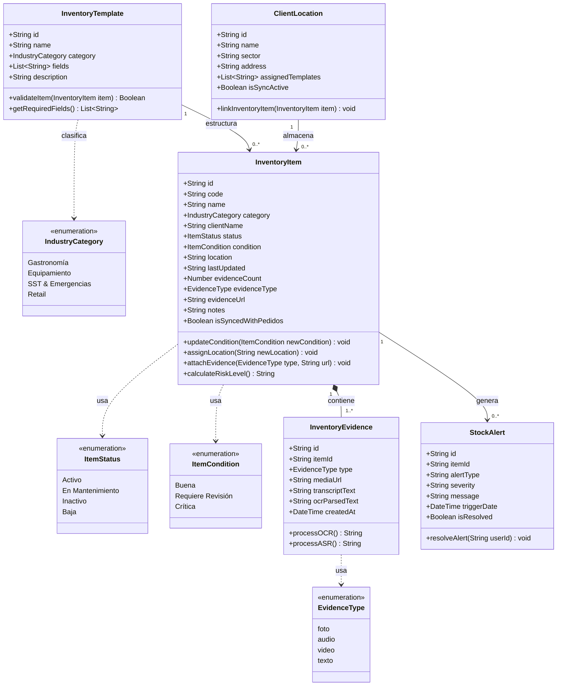
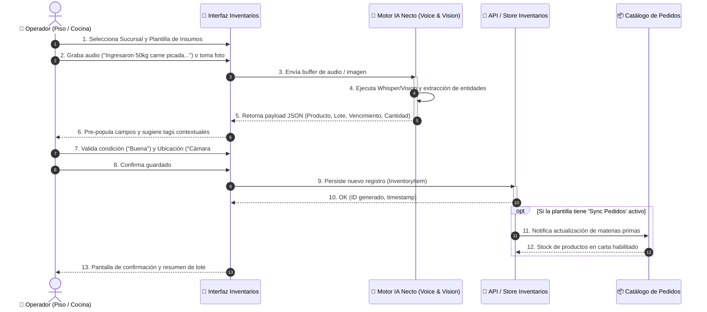
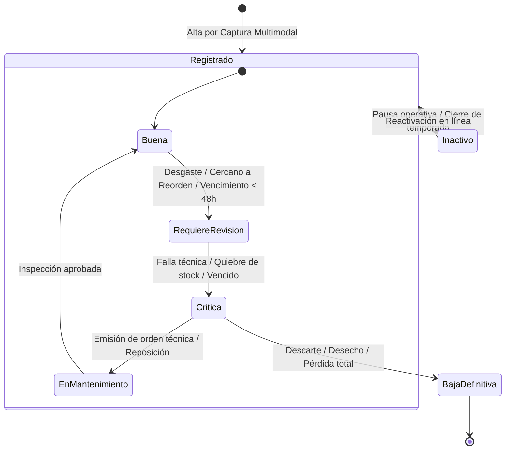
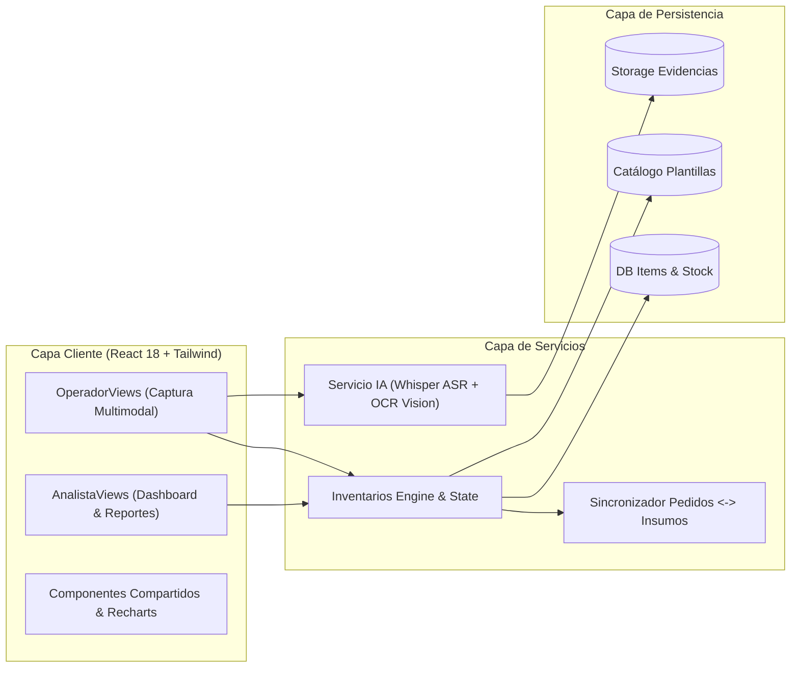

# Diagramas de Arquitectura UML — Módulo de Inventarios Necto

Especificación y modelos UML para el **Módulo de Inventarios** de la Plataforma Necto (*Gastronomía*, *Equipamiento*, *SST*, *Retail*).

---

## 1. Diagrama de Clases UML (Class Diagram)

Modelo de dominio orientado a objetos con jerarquía de tipos, atributos, métodos y asociaciones.

---

## 2. Diagrama de Secuencia (Sequence Diagram)

Ciclo de vida de una **Captura Multimodal Asistida por IA** y su posterior sincronización con el Catálogo de Pedidos:

---

## 3. Diagrama de Estados (State Diagram)

Máquina de estados finitos que modela las transiciones de condición y mantenimiento de cualquier elemento en el inventario:

---

## 4. Diagrama de Componentes del Sistema

